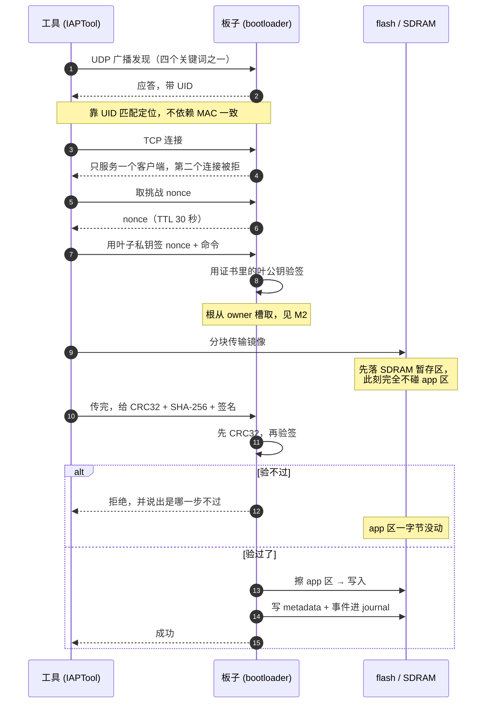
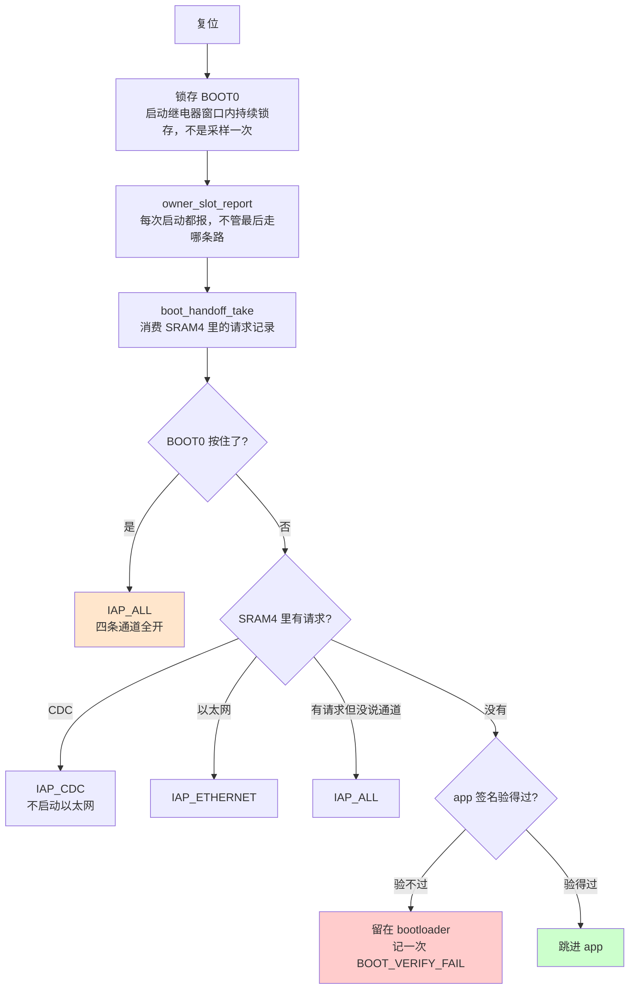

# M1 · 固件升级

**外面的人能让这块板做什么**：把一份新固件装进去，装不坏 —— 找得到板子、只让有授权的人装、
装到一半断电也不变砖、装完能自己判断装进去的东西能不能跑。

**这个模块管到哪为止**：从工具在网上找到板子，到板子决定「这次复位跑 app 还是留在 bootloader」。
**谁有资格装**不在这里，在 [M2 归属与信任](M2-ownership.md)。

---

## 1 · 一次上传是怎么走完的



> ⚠️ **「先落 SDRAM 再擦 app」是这张图里最要紧的一件事。** 它是 `R1-25`（校验失败的上传不破坏已装好的 app）
> 存在的全部理由，也是为什么掉电测试要拆成两条：传输期间断电（`T1-21`）和擦写窗口断电（`T1-22`）。

### 八步，每步认证到什么程度

**这张表回答的是「哪一步挡住了什么」。** 三种程度写在第二列，不要混：

| 步 | 做什么 | 程度 |
|---|---|---|
| **0** | `sha256_selftest()` 拿 FIPS 180-4 已知向量跑一遍，**每次上电一次** | 自检。⚠️ **它不检查 bootloader 或 app 的完整性**。不过 ⇒ **此后一切验签结论一律当作失败** —— 验证器自己都不可信，它的结论没有意义 |
| **1** | `server_decide()` 现算 app 区的 SHA-256，拿它核对最后一条被接受的 metadata | **认证**。每次启动都重问两件事：① 这张证书是板子当前信任的根签的吗 ② 证书里的叶公钥签过这个镜像吗 |
| **2** | UDP 发现回一个「设备名_UID_角色_版本」 | **刻意不认证**。要密钥才能发现设备是循环论证，而且这一步不改变任何设备状态 |
| **3** | 进入上传模式 | **两个触发器两套标准**，见下一节 |
| **4** | `flash「size · crc32 · 镜像签名 · 证书 · nonce 签名」` | **认证**。失败**在擦 flash 之前**就被拒 ⇒ 一个坏请求不会白白毁掉一个能用的 app |
| **5** | 收全之后对整个镜像算一遍 CRC32 | **只有完整性**。⚠️ 它对「谁发的」「有没有被故意改过」**什么都不证明** —— 改完重算一个 CRC 是白送的 |
| **6** | 和第 1 步**同一个** `iap_cert_verify_image()` 调用，但对象是**暂存在 SDRAM 里**那份 | **认证**。它问的和第 4 步**不是同一个问题**：不是「这个会话有没有被授权」，而是「**这个确切的二进制**是不是被证书指名的那把钥匙签的」⇒ 一个**已授权**的会话上传一个被篡改的镜像，照样在这里被拒 |
| **7** | 追加 metadata + 一条链式防篡改日志，然后**重启回第 0/1 步从零重验** | 不相信这次会话自己的成功报告 |

**第 1 步和第 6 步是同一个调用、不同对象** —— 这是刻意的：同一份验证代码只有一处，不可能出现「启动时严、上传时松」。

### 会话认证：签名到底盖在什么上面

```
sha256( nonce ‖ "flash <size> <crc32hex> <signature_hex>" )
```

**命令文本被逐字节重建后参与签名**，所以改动其中任何一个参数都会让签名失效。

**证书刻意不折进签名消息** —— 它不是秘密、不是会话相关，自身的有效性由 `root_sig` 锚定。塞进去只会让消息更长，不增加任何保证。

⚠️ **两步都必须做**：一张有效证书不说明谁签了这个 nonce；某个叶子的有效签名不说明那个叶子被认证过。

**16 字节 nonce 的构成**（`iap_auth.c`）：

| 偏移 | 长度 | 内容 | 从哪来 |
|---|---|---|---|
| 0 | 4 B | counter | **RTC 备份寄存器 DR1**，靠 VBAT 跨掉电存活 |
| 4 | 4 B | UID w0 | 本板唯一，跨设备不撞 |
| 8 | 4 B | `HAL_GetTick()` | 本次启动内递增 |
| 12 | 4 B | 0 | 保留 |

**counter 为什么必须跨掉电存活**：它每次上电归零的话，攻击者只要**断电重启板子**就能让板子重新发出一个它之前发过的 nonce —— 于是一条截获过的 `flash` 命令可以被原样重放。

**另有一个见证值存 DR3**：备份域整个丢失过的话，启动时明说 `replay protection is weakened`，而不是**静默**地少一层保护。⚠️ 用 DR3 不用 DR2 是因为 DR2 被 app 侧占了、撞过车 —— 备份寄存器是三个仓库共享且没有统一分配机制的资源，分配表在 `$PROD/docs/repo/ARCHITECTURE.md`。

**挑战的四条性质**：

| | |
|---|---|
| **一次性** | **无论验成功还是失败**，这个 nonce 都被消费掉。失败也消费，是为了不给攻击者拿同一个 nonce 反复试的机会 |
| **TTL 30 秒** | 发出超过 30 秒的挑战一律不再接受。把「截获一个签名后慢慢用」的窗口压到半分钟 |
| **自检没过就一律拒** | SHA-256 自检失败时不拿一个已知坏的原语算摘要。宁可拒绝一切，也不给出一个不知道对不对的「通过」 |
| ⚠️ **全局单 nonce** | 同时只能有一个挑战在飞，CDC 和以太网并发会互相冲掉。**这是可用性怪癖，不是安全洞** —— nonce 不可能被双重消费，也不可能在被覆盖后仍被接受 |

## 2 · 每次复位，板子怎么决定跑哪个

照 `$BOOT/IAPServer/IAP_server.c` 的 `server_decide()` 画。



**三条在代码里写死、改动前必须知道的顺序**：

| 顺序 | 为什么不能换 |
|---|---|
| `boot_handoff_take()` 要在读复位原因**之前** | 它同时负责读并清 `RCC->RSR`，换了顺序复位原因就读不到了 |
| BOOT0 由调用方**锁存**，不在这里采样 | 在这里读一次引脚，等于要求操作员在复位后几毫秒就已经按住 —— 那不是人的反应时间 |
| `owner_slot_report()` 在分支**之前** | 「这块板信哪把根」不能只在有人正好在看的时候才可见 |

> ⚠️ **BOOT0 按住压倒一切** —— 不看请求记录，也不看签名。那是物理逃生口，
> 谁在继电器窗口里按住了按钮，谁就说了算。

### 四条进入上传模式的路，各自的门槛

**门槛高低不一样，这是刻意的** —— 物理接触本身就是一个更高的信任层级，不必再叠一层密码学。

| 路 | 怎么触发 | 门槛 | 结果 |
|---|---|---|---|
| ① **BOOT0 按住** | 复位后按住 PG9 穿过继电器窗口 | ✋ 物理 | `IAP_ALL`（不知道操作者会用哪条通道，全开）。同时 latch `s_boot0_held` 供整个会话里的认领使用 |
| ② **USB CDC 1200 bps** | 打开串口设 1200 波特再关掉 | ⚠️ **无认证可能** | `IAP_CDC` |
| ③ **网络请求重启** | `openplc_server_reboot_challenge` → `openplc_server_reboot` | 要签名 | 回答这条的是**正在跑的 app**，不是 bootloader |
| ④ **没有可跑的 app** | 第 1 步验签没过，或压根没有 metadata | 派生结果 | `IAP_ALL`，停在 bootloader 等人来重传 |

⚠️ **② 为什么不能加认证**：1200 bps 的 magic touch 是**单向的波特率信号，没有回程通道**，做不了挑战应答。接受它是因为摸到这条路已经需要**物理 USB 访问**，比把一个 UDP 包路由到某个 IP 高一个信任层级 —— 而且它只武装「等上传」状态，**真正的授权仍在第 4 步**。

⚠️ **④ 一连串失败只记第一次**：这条路不需要任何凭证，每次上电都记等于让**任何有电源开关的人把旧证据挤出日志**。记第一次，就够回答「从什么时候开始不对的」。

⚠️ **这条不对称是刻意接受的，不是缺口** —— 写出来就是为了**不被后来的人当成 bug 去「修」**。

### 交接记录为什么住在 SRAM4 而不是 RTC 备份寄存器

② 和 ③ 都写同一条交接记录然后复位。记录在 **SRAM4 起始 32 字节（`0x38000000`），魔数 `"PLC!"`** —— `boot_handoff_request()` 是唯一写入口，`boot_handoff_take()` 是唯一读出口，**读即消费**。

⚠️ **为什么不用 RTC 备份寄存器**：写它在 `PWR_CR1.DBP` 没置位时会**静默什么都不做**，编译器和 HAL 返回值都不会告诉你。**以太网上传路径就是这么静默坏掉的** —— `iap_auth` 的 nonce 计数器把 DBP 清了，几毫秒后那次标志写入没落地，板子直接重启回 app。**普通内存没有这种隐藏门。**

另外三个理由：不需要初始化（USB / 以太网 / FMC 都还没起来就能读）；**生命周期正好** —— RAM 扛热复位但不扛掉电，而「进一次上传模式」正是热复位范围的请求；不依赖 VBAT。

**两个链接脚本的 `RAM_D3` 都从 `0x38000020` 开始** ⇒ 链接器**不可能**把东西放进那 32 字节。这是保证，不是约定。

## 3 · 板上的东西住在哪、格式是什么

### 地址布局

| 起始 | 大小 | 内容 | 谁写 | 能不能擦 |
|---|---|---|---|---|
| `0x08000000` | 120 KiB | **bootloader 代码**，内置根公钥在它的 rodata 里 | ST-Link | 整扇区 |
| `0x0801E000` | 8 KiB | **owner 记录区**，51 条 × 160 字节 | bootloader | **只追加，永不擦除** |
| `0x08020000` | 1792 KiB | **app 区**，第 1 步每次启动现算这块的 SHA-256 | bootloader | 提交时 |
| `0x081E0000` | 128 KiB | **state 扇区 / journal**，4096 格 × 32 字节 | bootloader | **全代码唯一会擦的地方** |
| `0xC0000000` | 2 MiB | **SDRAM 暂存区** | bootloader | — |
| `0x38000000` | 32 B | 交接记录（SRAM4） | bootloader / app | 读即消费 |

⚠️ **前两行同属扇区 0（一个 128 KiB 扇区）** —— **那是 owner 区选址的全部理由**：寄生在 bootloader 扇区尾部，净增 0 个扇区。为什么不能放进 state 扇区、三个候选怎么比的，见 [M2 归属与信任](M2-ownership.md)。

⚠️ **SDRAM 暂存区刻意不在任何链接脚本的 MEMORY 块里** ⇒ 工具链不可能把东西放到这。

### 三个 on-flash 格式

**都是固定偏移，没有 parser。**

`iap_cert_t` · **132 字节**：

| 偏移 | 长度 | 字段 |
|---|---|---|
| 0 | 64 B | `leaf_pubkey` |
| 64 | 4 B | `serial`（u32 LE） |
| 68 | 64 B | `root_sig` —— 根对 `sha256(前 68 字节)` 的签名 |

`IAP_CERT_SIGNED_LEN = 68`。**自签证书固定用 `0xFFFFFFFF`，不吃号** —— 编号存在的意义是「将来能被撤销点名」，而根没法把自己撤销掉。

`iap_fw_metadata_t` · **248 字节，占 8 个 journal 格**（`IAP_METADATA_SLOTS = 8`）：

| 偏移 | 长度 | 字段 |
|---|---|---|
| 0 | 4 B | `app_size` |
| 4 | 32 B | `sha256` |
| 36 | 64 B | `signature` |
| 100 | 132 B | `cert` —— **整张存进来** |
| 232 | 16 B | 保留 |

**为什么存整张证书而不是缓存叶公钥**：每次启动要**重验 `root_sig`**。缓存叶公钥会让「换 owner 追溯作废固件」这条性质**静默失效**。M 记录从 4 格涨到 8 格就是为了这个，**一次更新因此占 9 格：8 格 metadata + 1 格日志**（`R1-28`），约 455 次更新触发一次回收。

⚠️ **`meta.sha256` 写进去了，但全代码没有任何地方读它。** **不是 bug** —— 签名已经绑定了哈希，再比一次存的副本不增加任何安全性。将来要给工具加个核对用的命令，字段现成就在。（2026-08-16 核实）

**日志记录 · 1 格 = 32 字节**：`event` · `method`（哪条通道）· `peer_ip`（**只有 TCP 有，CDC 恒为 0** —— USB 不携带任何地址等价的身份可记）· `tick_ms` · `auth_counter` · `detail` · `prev_hash`。

`auth_counter` 把一条 `AUTH_FAIL` / `SIG_FAIL` **系到某一次具体的挑战尝试上**，而不只是「某个时刻发生过一次失败」。

### 日志的四条规则，全都偏向保住 metadata

**journal 不是日志系统，是出生证明的存放处。事件日志只是搭便车住在同一个扇区。** 下面每条只有从这个前提出发才讲得通。机制细节见 `$PROD/docs/modules/M1/JOURNAL.md`。

| 规则 | 为什么 |
|---|---|
| **链式防篡改** | 每条日志存的哈希覆盖**上一条记录的完整原始字节** ⇒ 删改中间任何一条，后面整条链都对不上。截断到 96 位是为了给其他字段留空间 —— 它只需要「能不能察觉被动过」，不需要抗碰撞到签名那个级别 |
| **认证失败只记在 RAM 里** | 最近 32 条被拒的尝试，**刻意不落 flash**。未认证的调用者**必须完全碰不到 flash**，否则一串被拒的命令就能磨损 state 扇区、逼出 reclaim |
| **写 metadata 是全代码唯一会擦的地方** | 这一刻新镜像**已经写进 app 区了**，旧证明描述的东西已经不存在 ⇒ 擦掉它不损失任何有效信息。而且在这里掉电最坏是「需要重刷」，**那个结论从擦 app 区的那一刻起就已经成立了** ⇒ reclaim **不引入任何新的失败模式** |
| **写日志满了也绝不擦** | 擦一次只为记一行日志，会连带烧掉**当前有效的 metadata** —— 等于拿「app 还能不能启动」去换一行日志 |

⚠️ **代价要知道**：格式认不出的时候，「检测到旧格式」**这件事本身也写不进日志**。要等下一次成功上传、reclaim 之后才有痕迹 ⇒ **事后查得到「擦过一次」，查不到「从哪次启动开始报的」**。

**八种事件**：`UPDATE_OK` · `CRC_FAIL` · `SIG_FAIL` · `AUTH_FAIL` · `OVERFLOW_ABORT` · `BOOT_VERIFY_FAIL` · `JOURNAL_RECLAIMED` · `FLASH_WRITE_FAIL`。

**`FLASH_WRITE_FAIL` 和 `SIG_FAIL` 分开是刻意的**：「镜像是好的，flash 写坏了」和「镜像不对」诊断方向完全不同，合成一个就等于把两类故障混成一类。

## 4 · 功能表

**一行一条需求，紧挨着写明谁证明它。** 判据和跑法不挤进这张表，在下一节。

| # | 阶段 | 要做到什么 | 谁证明 | 状态 |
|---|---|---|---|---|
| **R1-01** | 入口通道 | 通过 USB CDC 能把 app 烧进板子并正常启动 | `T1-23` | ✅ |
| **R1-02** | 入口通道 | 通过以太网能烧写**停在 bootloader** 的板子 | 手工 + `T1-09` | ✅ |
| **R1-03** | 入口通道 | 通过以太网能烧写**正在跑 app** 的板子 | `T1-23` | ✅ |
| **R1-04** | 入口通道 | 按住 BOOT0 复位能强制进入上传模式 | 手工 | ✅ |
| **R1-05** | 入口通道 | 从 CDC 请求进上传模式时**不启动**以太网 | `T1-25` | ✅ |
| **R1-06** | 入口通道 | app 请求进上传模式的通道只有一条（SRAM4 `boot_handoff_t`） | P2（查不分叉，非本功能） | 🟡 |
| **R1-07** | 入口通道 | 同一台主机上的多个工具不会互相打断上传 | 手工 + P2（查不分叉，非本功能） | 🟡 |
| **R1-08** | 发现 | 四个发现关键词都应答 | `T1-01` | ✅ |
| **R1-09** | 发现 | 连续多轮发现都应答 | `T1-02` | ✅ |
| **R1-10** | 发现 | 发现回复落在工具的 2s 超时之内 | `T1-03` | ✅ |
| **R1-11** | 发现 | 长时间浸泡下发现不丢 | `T1-04` | ✅ |
| **R1-12** | 发现 | 发现被泛洪时限流，**且限流不打死正常发现** | `T1-05` | ✅ |
| **R1-13** | 发现 | 设备定位靠 UDP 广播 + UID 匹配，不依赖 MAC 一致 | 手工 | ✅ |
| **R1-14** | 发现 | 每块板的 MAC 互不相同（从 UID 派生） | P2（查算法一致，非本功能） | 🟡 |
| **R1-15** | 会话 | 设备一次只服务一个 TCP 客户端 | `T1-06` | ✅ |
| **R1-16** | 会话 | 空闲客户端约 60s 后被踢 | `T1-07` | ✅ |
| **R1-17** | 会话 | 50s 内的空闲客户端**不**被踢 | `T1-08` | ✅ |
| **R1-18** | 会话 | 传输进行中闯入的第二个连接不打断传输 | `T1-09` | ✅ |
| **R1-19** | 会话 | 第一个连接正常关闭后能再连 | `T1-10` | ✅ |
| **R1-20** | 认证 | 会话认证：签名挑战应答，nonce 跨掉电不重复 | `T1-15` `T1-16` `T1-17` | ✅ |
| **R1-21** | 认证 | 工具在传输前就能判断「这块板收不收我的签名」 | `T1-18a`–`T1-18g` | ✅ |
| **R1-22** | 传输与校验 | 镜像先过 CRC32 | `T1-24` | ✅ |
| **R1-23** | 传输与校验 | 镜像的 SHA-256 + ECDSA 签名在**上传时**被校验 | `T1-11` `T1-12` | ✅ |
| **R1-24** | 传输与校验 | 签名的编码在签方和验方之间一致 | `T1-19` `T1-20` | ✅ |
| **R1-25** | 传输与校验 | **校验失败的上传不破坏已装好的 app** | `T1-14` | ✅ |
| **R1-26** | 启动切换 | app 的签名在**每次启动时**被重新校验 | `T1-13` | ✅ |
| **R1-27** | 启动切换 | 掉电中断升级后板子仍可恢复 | `T1-21` `T1-22` | ✅ |
| **R1-28** | 记录与诊断 | metadata 和事件记在 journal 里，一次成功升级 = 9 槽 | `T1-26` | ✅ |
| **R1-29** | 记录与诊断 | journal 扇区满了能 reclaim 并恢复 | 手工 | ✅ |
| **R1-30** | 记录与诊断 | 复位原因能正确报出（PIN / SOFT / POR） | 手工 | ✅ |
| **R1-31** | 记录与诊断 | RTC 备份域失效（VBAT 没电）时能被发现 | 手工 | ✅ |
| **R1-32** | 记录与诊断 | 任何丢包 / 拒绝路径都能说出自己为什么 | 代码审查 | ✅ |

**共 32 条。其中 18 条有测试用例直接测它，14 条没有。**

| 「谁证明」是什么 | 条数 | 哪些 |
|---|---|---|
| 有 `T1-xx` 用例直接测 | **18** | `R1-02` `R1-08`–`R1-12` `R1-15`–`R1-21` `R1-23`–`R1-27` |
| 纯手工 | **10** | `R1-01` `R1-03` `R1-04` `R1-05` `R1-13` `R1-22` `R1-28`–`R1-31` |
| 只有静态检查 P2 | **2** | `R1-06` `R1-14` |
| 手工 + 静态检查 P2 | **1** | `R1-07` |
| 代码审查 | **1** | `R1-32` |

**这 14 条写出来，因为不写就会被当成有测试覆盖。**

⚠️ 说「没有测试用例」不等于说「没有自动化」：静态检查 P2 本身是自动跑的，
但它查的是**跨仓镜像没分叉**，不是这条功能本身。**没有一条测试用例直接测它们。**

### 「手工」的意思是步骤没有写下来

那 10 条纯手工的需求，**在 `docs/engineering/HOW-TO-RUN-TESTS.md` 里一条条目都没有**。
所以这里的「手工」= **有人当时操作过一遍并判定通过，但步骤和判据没有写在任何地方** ——
换句话说，这 10 个 ✅ 复现不了。

少数几条在 `docs/tables/STATUS.md` 的备注里留了判据碎片，那些是可用的起点，
比如 `R1-04`（按住 BOOT0 强制进上传模式）留了日志原文 `** UPLOAD Mod ... (BOOT0 held)`。

> ✅ **2026-09-17 定了判据**：一个检查能不能当某条需求的证据，**看它测的是不是这条需求本身**，
> 不看它是静态还是动态。`P2` 测的是「代码两边没分叉」，它证明不了「通道只有一条」「两块板 MAC 真的不同」，
> 所以这三条是 🟡。（反过来，`ENG-02` 那类「跨仓镜像不分叉」的需求，`P2` 测的就是它本身，那是 ✅。）

¹ **正向对照不是可选的。** 反向用例（「板子应该沉默」）没有对照就分不清「以太网栈没起」和「板子死了」——2026-09-17 实测时对照组失败过一次，脚本正确地报了「这一轮什么都没证明」而不是通过。

² **两头必须用 ST-Link 复位，不能走 IAP。** 任何经过 IAP 的路径（包括被拒绝的上传）自己都会写 journal 事件，那样测出来的差值含测量本身的开销。

## 5 · 测试怎么跑

| # | 对应需求 | 测什么 | 判据 | 跑法 | 条件 | 状态 |
|---|---|---|---|---|---|---|
| `T1-01` | `R1-08` | 四个发现关键词都应答 | 四个关键词逐个发，都要有应答 | `$TOOL:TestCase/udp_discovery.go` | 真板子 | ✅ |
| `T1-02` | `R1-09` | 连续多轮发现 | 连发多轮不丢 | 同上 | 真板子 | ✅ |
| `T1-03` | `R1-10` | 发现回复够快 | 回复落在工具的 2s 超时之内 | 同上 | 真板子 | ✅ |
| `T1-04` | `R1-11` | 发现长时间浸泡 | 10 分钟连续发现，0 失败 | 同上 | 真板子 | ✅ |
| `T1-05` | `R1-12` | 发现泛洪限流 | 限流生效，**且正常发现仍然答得出** | 同上 | 真板子 | ✅ |
| `T1-06` | `R1-15` | 一次只服务一个客户端 | 第二条连接被拒 | `$TOOL:TestCase/tcp_session.go` | 真板子 | ✅ |
| `T1-07` | `R1-16` | 空闲连接被踢 | 约 60s 后断开 ¹ | 同上 | 真板子 | ✅ |
| `T1-08` | `R1-17` | 空闲连接不被误踢 | 50s 时仍然连着（反向用例） | 同上 | 真板子 | ✅ |
| `T1-09` | `R1-02` `R1-18` | 传输中闯入不打断 | 第二条连接被 RST 拒，传输照走完 | 同上 | 真板子 | ✅ |
| `T1-10` | `R1-19` | 拒绝状态不卡死 | 第一条正常关闭后能再连（反向用例） | 同上 | 真板子 | ✅ |
| `T1-11` | `R1-23` | 无效签名被拒 | 「没有任何密钥能产生的签名」上传被拒 | `$TOOL:TestCase/signature.go` | 真板子 | ✅ |
| `T1-12` | `R1-23` | 签方不对被拒 | 「格式完全正确但签方不对」被拒 ² | `$TOOL:TestCase/signature_wrongkey.go` | 真板子 | ✅ |
| `T1-13` | `R1-26` | 启动时重新验签 | 直接改坏已装好的 app，下次启动必须拒绝启动它 ² | `python tools/run_s3.py` | 真板子 | ✅ |
| `T1-14` | `R1-25` | 失败上传不伤 app | 上传失败后 app 区**一字节没动** | `python tools/run_case.py --case T1-11 --then-reset` | 真板子 | ✅ |
| `T1-15` | `R1-20` | 主机侧密码学 | 证书签发、序列号计数、挑战签名三组断言 | `go test ./TestCase/...` | 主机侧 | ✅ |
| `T1-16` | `R1-20` | bootloader 单元测试 | 拿真实 bootloader 源码跑板子侧的判断逻辑 | `host/bootloader_unit/build.py` | 主机侧 | ✅ |
| `T1-17` | `R1-20` | nonce 跨掉电不重复 | 真断电后计数器不归零，本轮 nonce 全不同 | `python tools/run_au1.py` | **真板子 + 人工断电** | ✅ |
| `T1-18a` | `R1-21` | 签名密钥就是这块板收的那把 | 板子答的公钥 = 工具签名用的，工具报 `Signing key matches this board` | `host/fakeboard/run_cases.py` | 主机侧 | ✅ |
| `T1-18b` | `R1-21` | 签名密钥不对，工具自己拦 | 板子答另一把公钥，工具拒并说 `verifies against a different signing key` | 同上 | 主机侧 | ✅ |
| `T1-18c` | `R1-21` | 老 bootloader 不认这条命令时不卡住 | 板子答 `Unknown command`，工具照走并说 `skipping key match check` | 同上 | 主机侧 | ✅ |
| `T1-18d` | `R1-21` ³ | 委托证书由这块板的根签发 | 板子答签发根，工具报 `Certificate was issued by this board's root` | 同上 | 主机侧 | ✅ |
| `T1-18e` | `R1-21` ³ | 证书的签发根不是这块板的根 | 工具拒并说 `was not issued by this board's root` | 同上 | 主机侧 | ✅ |
| `T1-18f` | `R1-21` ³ | 证书覆盖的是别人的密钥 | 工具拒并说 `was issued for a different key` | 同上 | 主机侧 | ✅ |
| `T1-18g` | `R1-21` | 一把密钥都没有 | 工具拒并说 `no signing key found` | 同上 | 主机侧 | ✅ |
| `T1-19` | `R1-24` | SHA-256 编码交叉验证 | 独立第三实现逐向量比对 | `host/crypto_ref/run_checks.py` | 主机侧 | ✅ |
| `T1-20` | `R1-24` | ECDSA 编码交叉验证 | 同上 | 同上 | 主机侧 | ✅ |
| `T1-21` | `R1-27` | 掉电落在传输期 | 断电后重新上电，**旧 app 照常启动** | `python tools/run_s4.py` ⁴ | **真板子 + 人工断电** | ✅ |
| `T1-22` | `R1-27` | 掉电落在擦写窗口 | 报 `App signature invalid or absent`，重传能救回 | 同上 ⁴ | **真板子 + 人工断电** | ✅ |
| `T1-23` | `R1-01` `R1-03` | 一次真实上传走完，且擦除在验证之后 | 日志出现 `Staging in SDRAM`，且 `Erasing application region` 在 `Transfer complete, verifying` **之后** | `python tools/upload_and_watch.py --bin <app.bin> --ip <IP>`（或 `--cdc <COM>`） | 真板子 | ✅ |
| `T1-24` | `R1-22` | 坏 CRC 必须在验签之前被拒 | 板子回 `Checksum Failed` 而**不是** `Signature Failed` —— 「先」过 CRC32 这半句正是它证明的 | `python tools/run_case.py --case T1-24 --bin <app.bin>` | 真板子 | ✅ |
| `T1-25` | `R1-05` | CDC 上传模式下以太网栈不起来 | 板子进 CDC 模式后不应答 UDP 发现，**且同一轮的正向对照答得出** ¹ | `python tools/run_cdc_does_not_start_ethernet.py --cdc <COM> --ip <IP> --ports <日志口>` | 真板子 | ✅ |
| `T1-26` | `R1-28` | 一次成功升级消耗 9 个 journal 槽 | 上传前后各复位一次读 `Bootloader state: N/M journal slots used`，差值 **= 9** ² | `python tools/run_journal_slot_accounting.py --bin <app.bin>` | 真板子 + ST-Link | ✅ |

**共 28 条**（`T1-18a`–`T1-18g` 是一族七种情况，原先压成一个 `T1-18`）。

¹ **「约 60s」本身就是判据的一部分**，不是判据写得含糊。实测过 1m01s 和 1m02s，两次都算过 —— 把它收紧成一个确定值会让一次正常的抖动变成假失败。

² `T1-11`（无效签名被拒）**证明不了** `T1-13`（启动时重新验签）。SDRAM 暂存做完之后，失败的上传根本不碰 app 区，所以它碰不到「启动时验签」这条路径。`T1-13` 是直接改坏已装好的 app 来测的。

³ **这一族七种情况（旧编号 `T1-18a`–`T1-18g`）全部服务 `R1-21`**，判据出处是
`$TOOL:TestCase/host/fakeboard/KEY-MATCH.md`（贴着代码放的那份）。
标 ³ 的三条（`T1-18d` `T1-18e` `T1-18f`）**同时**是 [M2 归属与信任](M2-ownership.md) 证书链需求的证据 ——
它们验的是「这块板信的根有没有为这张证书背书」。**一族测试同时服务两个模块怎么归，还没定** ——
已记进地图的迷雾。

⚠️ **`docs/tables/STATUS.md` 里 `R1-21` 写的用例是 `T1-18a`–`T1-18f`、`R2-03` 写的是 `T1-18a`–`T1-18g`，
和上面对不上。** 按 `run_cases.py` 的实际顺序，`T1-18g` 是「一把密钥都没有」——
那是最典型的传输前预判，不是证书链；证书链那三种是 `T1-18d`–`T1-18f`。
**这处矛盾要在需求归模块那张票里一起解掉。**

⁴ 要**人工断电**，脚本靠板子停止应答来判断电真的断了，不用人回来按回车。

⚠️ **要人工断电的是三条，不是两条**：`T1-17`（nonce 跨掉电不重复）也要 ——
`tools/run_au1.py` 自己的头注释写着 `prompts you to pull the plug`。

## 6 · 为什么这里没有「证据日期」和「最近结果」

**这份文档只写 ✅ / 🟡 / ⬜ 一个状态，不写日期、不写「最近一次跑出来多少」。**

理由：那些数字每跑一次就变，**用文档去维护会漂，而漂的时候没有任何东西会报警**。
它们该跟着测试脚本的输出走 —— 要数字就跑一次上面那一列命令。
判据和跑法是稳定的，所以它们留在文档里。

⚠️ 上面脚注里确实出现了几个实测数字（1m01s / 1m02s、10 分钟、221→223），
**那些是一次性的观察，用来说明判据为什么这么定**，不是要维护的当前值。
区别在于：**判据变了要改这份文档，测试结果变了不用。**

## 7 · 板子起不来怎么查

**串口打出来的那行就是索引。**

| 串口打的是 | 说明什么 | 怎么确认 | 怎么恢复 |
|---|---|---|---|
| `metadata absent` | **出厂空板**，从来没成功上传过 | journal 第一格就是 `0xFF`；UDP 发现回的角色是 `BOOTLD-INVALID` | 第一次上传就正常了 |
| `unrecognised record at slot 0` | **换过 bootloader**，journal 里是旧格式的字节 | 多出这一行；而且 `s_format_unknown` 为真时新事件全丢，日志停止增长 | 重传一次 app → reclaim 整扇区。⚠️ **owner 记录也一起被擦过，要重新认领** |
| `App signature invalid or absent` + 前面有 `metadata present` | 上传中断，或验签不过 | 看有没有 `SIG_FAIL` / `CRC_FAIL` 日志；app 区内容和 metadata 对不上 | 重传 |
| 同上，**而且你刚做过 `setowner`** | **换根把现有 app 追溯作废了。这是设计行为，不是故障** | metadata 里那张 cert 是旧根签的，`root_sig` 在新根下验不过 | 用新根（或新根签的证书）重传 |
| `** BOOT0 held **` | **不是故障**。有人按住了 BOOT0，物理逃生口赢过一切 | 模式是 `IAP_ALL`，reason 打的是 `BOOT0 held` | 松开 BOOT0 再复位 |
| `flash command failed authentication` | 工具版本不对，或证书不是这块板信的根签的 | ⚠️ **0.1.2 的 IAPTool 刷 0.1.3 的板必然到这里，而且失败得很安静** —— 没有一句话说版本不对 | 换新版 IAPTool；用 `getpubkey` 查板子信哪把根 |
| `replay protection is weakened` | **RTC 备份域丢过**（VBAT 断过），nonce 计数器归零了 | DR3 里的见证值不见了 | 不影响上传。**刻意打这行而不是静默少一层保护** |
| 启动就有不设防告警，**但你确定认领过** | owner 记录链断了，或被 ST-Link 重烧擦掉了 | `getowner` 回 0 = 未认领；回 n 但仍告警 = 当前根恰好等于公开根 | 重新认领，见 [M2 归属与信任](M2-ownership.md) |

## 8 · 这个模块的边界

**挡得住什么**：没有有效签名的镜像装不进去；装一半断电不变砖；没授权的人连不上。

**挡不住什么**（写出来，因为不写就会有人以为挡得住）：

- 能物理接触板子的人按住 BOOT0 十秒就能恢复出厂 —— **那是设计，不是漏洞**（丢了私钥的板子否则会变砖）
- 没上 flash 写保护（WRP），所以跑起来的 app 理论上能写 bootloader 区 —— 见 [M2](M2-ownership.md) 的边界一节
- `R1-14`（每块板 MAC 不同）是 🟡：**「两块板真的不同」从来没观察过**，只有一块板。派生算法有缺陷的话，量产时表现为同网段大面积 IP 冲突

**这套设计抄了谁、避开了谁**（UEFI / Android / Chromebook / ESP32 的逐条对照）——
见 [M2 归属与信任](M2-ownership.md)，那些选择都是信任模型层面的，住在那一份里。

**和其他模块的关系**：

| 关系 | 去哪看 |
|---|---|
| 「谁有资格装固件」—— 信任根、证书链、owner 槽 | [M2 归属与信任](M2-ownership.md) |
| 装完之后 app 拿到的是一块什么状态的板子 | [M3 应用运行环境](M3-app-runtime.md) |

> **引用别的模块一律只写指针，不抄内容。** 这是「一个事实只有一个家」的落地方式，
> `check_doc_dupes.py`（P8，一个说法不许写进两份文档）会抓抄过来的段落，**指针不算**。

## 7 · 这个模块的细节文档

主文档是骨架，下面这些是深度。**它们在 `M1/` 子目录里，一个事实只有一个家 —— 这里是指针，不是摘要。**

| 文档 | 讲什么 |
|---|---|
| [BOOT-SEQUENCE.md](M1/BOOT-SEQUENCE.md) | 每次复位走完的完整流程：谁被读、谁被初始化、外设以什么状态交给 app |
| [JOURNAL.md](M1/JOURNAL.md) | journal 扇区的记录格式、回收机制、三种「读不到 metadata」的情况 |
| [CHALLENGE-AUTH.md](M1/CHALLENGE-AUTH.md) | 挑战应答的全部细节：nonce 怎么造、一次性消费、证书是独立一步 |
