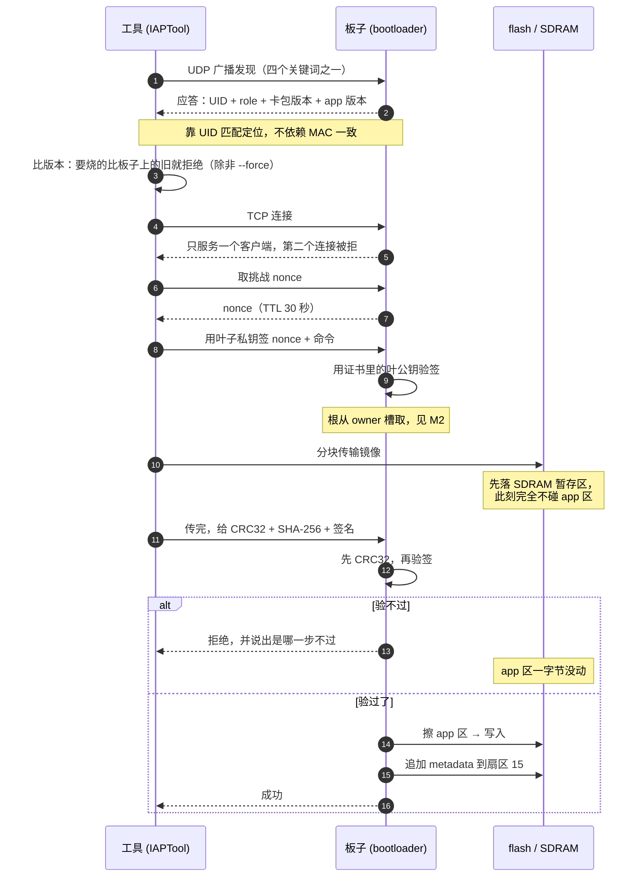
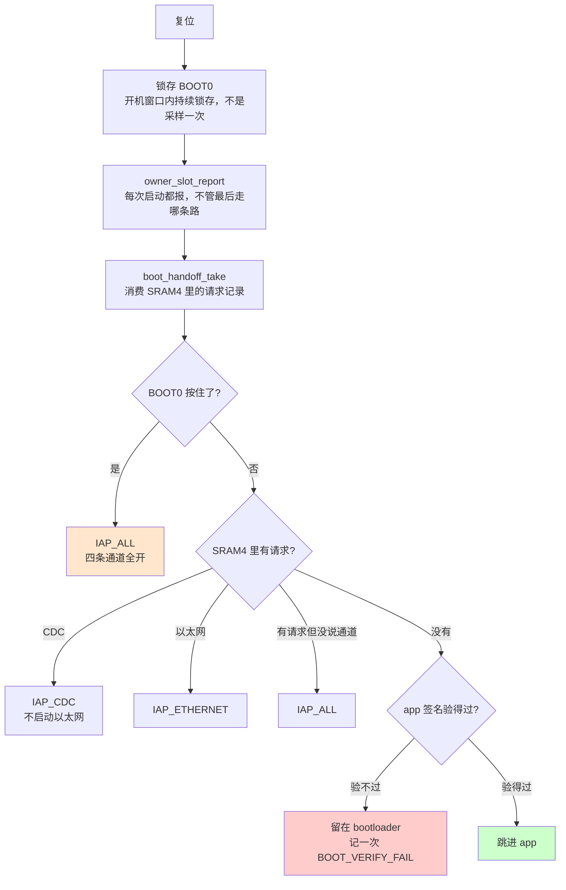

# M1 · 固件升级

**外面的人能让这块板做什么**：把一份新固件装进去，装不坏 —— 找得到板子、只让有授权的人装、
装到一半断电也不变砖、装完能自己判断装进去的东西能不能跑。

**这个模块管到哪为止**：从工具在网上找到板子，到板子决定「这次复位跑 app 还是留在 bootloader」。
**谁有资格装**不在这里，在 [M2 归属与信任](M2-ownership.md)。

---

## 1 · 一次上传是怎么走完的


```mermaid
sequenceDiagram
    autonumber
    participant T as 工具 (IAPTool)
    participant B as 板子 (bootloader)
    participant F as flash / SDRAM

    T->>B: UDP 广播发现（四个关键词之一）
    B-->>T: 应答：UID + role + 卡包版本 + app 版本
    Note over T,B: 靠 UID 匹配定位，不依赖 MAC 一致
    T->>T: 比版本：要烧的比板子上的旧就拒绝（除非 --force）

    T->>B: TCP 连接
    B-->>T: 只服务一个客户端，第二个连接被拒
    T->>B: 取挑战 nonce
    B-->>T: nonce（TTL 30 秒）
    T->>B: 用叶子私钥签 nonce + 命令
    B->>B: 用证书里的叶公钥验签
    Note over B: 根从 owner 槽取，见 M2

    T->>F: 分块传输镜像
    Note over F: 先落 SDRAM 暂存区，<br/>此刻完全不碰 app 区
    T->>B: 传完，给 CRC32 + SHA-256 + 签名
    B->>B: 先 CRC32，再验签
    alt 验不过
        B-->>T: 拒绝，并说出是哪一步不过
        Note over F: app 区一字节没动
    else 验过了
        B->>F: 擦 app 区 → 写入
        B->>F: 追加 metadata 到扇区 15
        B-->>T: 成功
    end
```

> ⚠️ **「先落 SDRAM 再擦 app」是这张图里最要紧的一件事。** 它是 `R1-25`（校验失败的上传不破坏已装好的 app）
> 存在的全部理由，也是为什么掉电测试要拆成两条：传输期间断电（`T1-21`）和擦写窗口断电（`T1-22`）。

### 版本闸门：烧录前比一次版本

✅ **2026-09-21 代码已实现（core / bootloader / IAPTool 三侧）并上板验收通过** —— identity 五段、降级被拒、强制烧录一次性、改回「否」后重置，四项都在真板子上走过真实的 Arduino 上传路径。 定稿见[烧录前比版本 + 校准值住进扇区 15](../../maps/version-gate-and-calibration/map.md) 和 `DECISIONS.md` 第 62 条。

**这是一道防呆闸，不是安全机制** —— 它挡的是「自己人误推旧版本」。
对有物理接触的人、对拿到叶私钥还能自己造固件的人都无效，那两类由证书链和撤销机制管。

| | |
|---|---|
| **谁比** | 上位机（IAPTool）。板子不参与，也不记录 |
| **比什么** | sketch 里 `OPENPLC_APP_VERSION(maj, min, pat)` 声明的版本，对 identity 第 5 段 |
| **什么时候比** | **请板子进 bootloader 之前**那一次 UDP 发现。⚠️ 这是约束不是选择 —— 板子进了 bootloader，第 5 段就是 `-`，取不到 app 版本了 |
| **怎么比** | 逐段数值比较，三段各 0–255。**严格小于才算更旧**，相等放行（重烧同一版是日常操作） |
| **拿不到版本怎么办** | `CUSAPP` 才比；`BOOTLD` / `BOOTLD-INVALID` **放行**（没有「当前版本」可言）；**发现超时则拒绝** —— 未知不等于没有 |
| **怎么强制** | IDE 菜单 `低版本强制烧录`（默认「否」）⇒ IAPTool 收到 `--force`。**一次性**：标记只在烧成功后写，再烧一次会被拒，把菜单拨回「否」即重置 |
| **挡不住哪条路** | ⚠️ **只有 ETH Transfer 挡得住**。**CDC Transfer 挡不住** —— app 在跑时 `cdcIdentify` 拿不到任何应答（sketch 占着 CDC 数据管道），等它进了 bootloader，第 5 段已经是 `-`，**CDC 路径上不存在能读到已装版本的时刻**。**SWD / Serial 直连**同样挡不住，唯一手段 RDP Level 2 不可逆且会废掉 BOOT0 恢复出厂和 ST-Link 救砖 ⇒ 不做，留给客户 |

⚠️ **sketch 不声明版本号就编译不过** —— core 只声明 `extern const char openplc_app_version[]` 不定义，
`prebuild.sh` 先粗查给出可读报错，链接器兜底。**这会让所有现存 sketch 在换上新板卡包后第一次编译失败**，是故意的。

### 八步，每步认证到什么程度

**这张表回答的是「哪一步挡住了什么」。** 三种程度写在第二列，不要混：

| 步 | 做什么 | 程度 |
|---|---|---|
| **0** | `sha256_selftest()` 拿 FIPS 180-4 已知向量跑一遍，**每次上电一次** | 自检。⚠️ **它不检查 bootloader 或 app 的完整性**。不过 ⇒ **此后一切验签结论一律当作失败** —— 验证器自己都不可信，它的结论没有意义 |
| **1** | `server_decide()` 现算 app 区的 SHA-256，拿它核对最后一条被接受的 metadata | **认证**。每次启动都重问两件事：① 这张证书是板子当前信任的根签的吗 ② 证书里的叶公钥签过这个镜像吗 |
| **2** | UDP 发现回一个「设备名_UID_角色_版本」 | **刻意不认证**。要密钥才能发现设备是循环论证，而且这一步不改变任何设备状态 |
| **3** | 进入上传模式 | **两个触发器两套标准**，见下一节 |
| **4** | `flash「size · crc32 · 镜像签名 · 证书 · nonce 签名」` | **认证**。失败**在擦 flash 之前**就被拒 ⇒ 一个坏请求不会白白毁掉一个能用的 app |
| **5** | 收全之后对整个镜像算一遍 CRC32 | **只有完整性**。⚠️ 它对「谁发的」「有没有被故意改过」**什么都不证明** —— 改完重算一个 CRC 是白送的 |
| **6** | 和第 1 步**同一个** `iap_cert_verify_image()` 调用，但对象是**暂存在 SDRAM 里**那份 | **认证**。它问的和第 4 步**不是同一个问题**：不是「这个会话有没有被授权」，而是「**这个确切的二进制**是不是被证书指名的那把钥匙签的」⇒ 一个**已授权**的会话上传一个被篡改的镜像，照样在这里被拒 |
| **7** | 追加 metadata + 一条链式防篡改日志，然后**重启回第 0/1 步从零重验** | 不相信这次会话自己的成功报告 |

**第 1 步和第 6 步是同一个调用、不同对象** —— 这是刻意的：同一份验证代码只有一处，不可能出现「启动时严、上传时松」。

### 会话认证：签名到底盖在什么上面

```
sha256( nonce ‖ "flash <size> <crc32hex> <signature_hex>" )
```

**命令文本被逐字节重建后参与签名**，所以改动其中任何一个参数都会让签名失效。

**证书刻意不折进签名消息** —— 它不是秘密、不是会话相关，自身的有效性由 `root_sig` 锚定。塞进去只会让消息更长，不增加任何保证。

⚠️ **两步都必须做**：一张有效证书不说明谁签了这个 nonce；某个叶子的有效签名不说明那个叶子被认证过。

**16 字节 nonce 的构成**（`iap_auth.c`）：

| 偏移 | 长度 | 内容 | 从哪来 |
|---|---|---|---|
| 0 | 4 B | counter | **RTC 备份寄存器 DR1**，靠 VBAT 跨掉电存活 |
| 4 | 4 B | UID w0 | 本板唯一，跨设备不撞 |
| 8 | 4 B | `HAL_GetTick()` | 本次启动内递增 |
| 12 | 4 B | 0 | 保留 |

**counter 为什么必须跨掉电存活**：它每次上电归零的话，攻击者只要**断电重启板子**就能让板子重新发出一个它之前发过的 nonce —— 于是一条截获过的 `flash` 命令可以被原样重放。

**另有一个见证值存 DR3**：备份域整个丢失过的话，启动时明说 `replay protection is weakened`，而不是**静默**地少一层保护。⚠️ 用 DR3 不用 DR2 是因为 DR2 被 app 侧占了、撞过车 —— 备份寄存器是三个仓库共享且没有统一分配机制的资源，分配表在 `$PROD/docs/repo/ARCHITECTURE.md`。

**挑战的四条性质**：

| | |
|---|---|
| **一次性** | **无论验成功还是失败**，这个 nonce 都被消费掉。失败也消费，是为了不给攻击者拿同一个 nonce 反复试的机会 |
| **TTL 30 秒** | 发出超过 30 秒的挑战一律不再接受。把「截获一个签名后慢慢用」的窗口压到半分钟 |
| **自检没过就一律拒** | SHA-256 自检失败时不拿一个已知坏的原语算摘要。宁可拒绝一切，也不给出一个不知道对不对的「通过」 |
| ⚠️ **全局单 nonce** | 同时只能有一个挑战在飞，CDC 和以太网并发会互相冲掉。**这是可用性怪癖，不是安全洞** —— nonce 不可能被双重消费，也不可能在被覆盖后仍被接受 |

## 2 · 每次复位，板子怎么决定跑哪个

照 `$BOOT/IAPServer/IAP_server.c` 的 `server_decide()` 画。


```mermaid
flowchart TD
    A[复位] --> B[锁存 BOOT0<br/>开机窗口内持续锁存，不是采样一次]
    B --> C[owner_slot_report<br/>每次启动都报，不管最后走哪条路]
    C --> D[boot_handoff_take<br/>消费 SRAM4 里的请求记录]
    D --> E{BOOT0 按住了?}

    E -->|是| F[IAP_ALL<br/>四条通道全开]
    E -->|否| G{SRAM4 里有请求?}

    G -->|CDC| H[IAP_CDC<br/>不启动以太网]
    G -->|以太网| I[IAP_ETHERNET]
    G -->|有请求但没说通道| J[IAP_ALL]
    G -->|没有| K{app 签名验得过?}

    K -->|验不过| L[留在 bootloader<br/>记一次 BOOT_VERIFY_FAIL]
    K -->|验得过| M[跳进 app]

    style F fill:#ffe6cc
    style L fill:#ffcccc
    style M fill:#ccffcc
```

**三条在代码里写死、改动前必须知道的顺序**：

| 顺序 | 为什么不能换 |
|---|---|
| `boot_handoff_take()` 要在读复位原因**之前** | 它同时负责读并清 `RCC->RSR`，换了顺序复位原因就读不到了 |
| BOOT0 由调用方**锁存**，不在这里采样 | 在这里读一次引脚，等于要求操作员在复位后几毫秒就已经按住 —— 那不是人的反应时间 |
| `owner_slot_report()` 在分支**之前** | 「这块板信哪把根」不能只在有人正好在看的时候才可见 |

> ⚠️ **BOOT0 按住压倒一切** —— 不看请求记录，也不看签名。那是物理逃生口，
> 谁在开机窗口里按住了按钮，谁就说了算。

### 四条进入上传模式的路，各自的门槛

**门槛高低不一样，这是刻意的** —— 物理接触本身就是一个更高的信任层级，不必再叠一层密码学。

| 路 | 怎么触发 | 门槛 | 结果 |
|---|---|---|---|
| ① **BOOT0 按住** | 复位后按住 PG9 穿过开机窗口（系统指示灯快闪那 2 秒） | ✋ 物理 | `IAP_ALL`（不知道操作者会用哪条通道，全开）。同时 latch `s_boot0_held` 供整个会话里的认领使用 |
| ② **USB CDC 1200 bps** | 打开串口设 1200 波特再关掉 | ⚠️ **无认证可能** | `IAP_CDC` |
| ③ **网络请求重启** | `openplc_server_reboot_challenge` → `openplc_server_reboot` | 要签名 | 回答这条的是**正在跑的 app**，不是 bootloader |
| ④ **没有可跑的 app** | 第 1 步验签没过，或压根没有 metadata | 派生结果 | `IAP_ALL`，停在 bootloader 等人来重传 |

⚠️ **② 为什么不能加认证**：1200 bps 的 magic touch 是**单向的波特率信号，没有回程通道**，做不了挑战应答。接受它是因为摸到这条路已经需要**物理 USB 访问**，比把一个 UDP 包路由到某个 IP 高一个信任层级 —— 而且它只武装「等上传」状态，**真正的授权仍在第 4 步**。

⚠️ **④ 一连串失败只记第一次**：这条路不需要任何凭证，每次上电都记等于让**任何有电源开关的人把旧证据挤出日志**。记第一次，就够回答「从什么时候开始不对的」。

⚠️ **这条不对称是刻意接受的，不是缺口** —— 写出来就是为了**不被后来的人当成 bug 去「修」**。

### 交接记录为什么住在 SRAM4 而不是 RTC 备份寄存器

② 和 ③ 都写同一条交接记录然后复位。记录在 **SRAM4 起始 32 字节（`0x38000000`），魔数 `"PLC!"`** —— `boot_handoff_request()` 是唯一写入口，`boot_handoff_take()` 是唯一读出口，**读即消费**。

⚠️ **为什么不用 RTC 备份寄存器**：写它在 `PWR_CR1.DBP` 没置位时会**静默什么都不做**，编译器和 HAL 返回值都不会告诉你。**以太网上传路径就是这么静默坏掉的** —— `iap_auth` 的 nonce 计数器把 DBP 清了，几毫秒后那次标志写入没落地，板子直接重启回 app。**普通内存没有这种隐藏门。**

另外三个理由：不需要初始化（USB / 以太网 / FMC 都还没起来就能读）；**生命周期正好** —— RAM 扛热复位但不扛掉电，而「进一次上传模式」正是热复位范围的请求；不依赖 VBAT。

**两个链接脚本的 `RAM_D3` 都从 `0x38000020` 开始** ⇒ 链接器**不可能**把东西放进那 32 字节。这是保证，不是约定。

## 3 · 板上的东西住在哪、格式是什么

### 地址布局

| 起始 | 大小 | 内容 | 谁写 | 能不能擦 |
|---|---|---|---|---|
| `0x08000000` | 128 KiB | **bootloader 代码**，只放代码（决策 72） | ST-Link / `flashboot` | 整扇区 |
| `0x08020000` | 1792 KiB | **app 区**，第 1 步每次启动现算这块的 SHA-256 | bootloader | 提交时 |
| `0x081E0000` | 128 KiB | **扇区 15** —— 校准值 8 KiB + **根区** 8 KiB（owner 链和撤销）+ metadata 约 112 KiB（511 条）+ 完整标记，见 [SECTOR-15.md](M1/SECTOR-15.md) | bootloader / 工装 | 只在回收时，先暂存进备份 SRAM |
| `0xC0000000` | 2 MiB | **SDRAM 暂存区** | bootloader | — |
| `0x38000000` | 32 B | 交接记录（SRAM4） | bootloader / app | 读即消费 |

⚠️ **前两行同属扇区 0（一个 128 KiB 扇区）** —— **那是 owner 区选址的全部理由**：寄生在 bootloader 扇区尾部，净增 0 个扇区。为什么不能放进 state 扇区、三个候选怎么比的，见 [M2 归属与信任](M2-ownership.md)。

⚠️ **SDRAM 暂存区刻意不在任何链接脚本的 MEMORY 块里** ⇒ 工具链不可能把东西放到这。

### 三个 on-flash 格式

**都是固定偏移，没有 parser。**

`iap_cert_t` · **128 字节**：

| 偏移 | 长度 | 字段 |
|---|---|---|
| 0 | 64 B | `leaf_pubkey` |
| 64 | 64 B | `root_sig` —— 根对 `sha256(前 64 字节)` 的签名 |

`IAP_CERT_SIGNED_LEN = 64`。**撤销按叶公钥点名，不按流水号** —— 见 [撤销记录点名的是序号还是公钥](../../maps/owner-revoke-and-boot-upgrade/issues/OWN-01-revoke-by-serial-or-by-pubkey.md)。

`iap_fw_metadata_t` · **216 字节，占 7 格**（`IAP_METADATA_SLOTS = 7`；一格 = 一个 32 字节 flash word）：

| 偏移 | 长度 | 字段 |
|---|---|---|
| 0 | 4 B | `app_size` |
| 4 | 64 B | `signature` |
| 68 | 128 B | `cert` —— **整张存进来** |
| 196 | 20 B | 保留 |

**为什么存整张证书而不是缓存叶公钥**：每次启动要**重验 `root_sig`**。缓存叶公钥会让「换 owner 追溯作废固件」这条性质**静默失效**。M 记录从 4 格涨到 7 格就是为了这个。⚠️ **事件日志删掉之后一次更新只占 7 格**（`R1-28` 已定重写），metadata 区 3840 格 ⇒ **548 次更新触发一次回收**。

### 扇区 15 的三条规则

布局、写入路径、过渡期差异全在 [扇区 15 设计说明](M1/SECTOR-15.md)，这里只留支撑需求的那三条。

| 规则 | 为什么 |
|---|---|
| **校准值和 metadata 诉求相反，所以分区** | 校准值**必须能覆盖**（重新标定要改得掉），metadata **只追加**。在 NOR flash 上「能覆盖」最终要擦整扇区 ⇒ 把校准值钉在最前 8 KiB 固定地址，让 547/548 次升级完全不碰它 |
| **写 metadata 时才可能擦，而且要先搬校准值** | 这一刻新镜像**已经写进 app 区了**，旧证明描述的东西已经不存在 ⇒ 擦掉不损失有效信息；在这里掉电最坏是「需要重刷」，**那个结论从擦 app 区的那一刻起就已经成立**。⚠️ 但**校准值不一样，重刷固件救不回来** ⇒ 擦之前先读出那 8 KiB，且**工装要按板子 UID 留副本** |
| **认证失败只记在 RAM 里** | 最近 32 条被拒的尝试，**刻意不落 flash**。未认证的调用者**必须完全碰不到 flash**，否则一串被拒的命令就能磨损这个扇区、逼出一次擦除 |

⚠️ **八种事件日志已定全部删除**（`R1-28` 已定重写）。代价：「换了新 bootloader 读到旧布局」这种情况
**不再有独立的痕迹可查**，它会表现成「出厂空板」。

## 4 · 功能表

**一行一条需求，紧挨着写明谁证明它。** 判据和跑法不挤进这张表，在下一节。

| # | 阶段 | 要做到什么 | 谁证明 | 状态 |
|---|---|---|---|---|
| **R1-01** | 入口通道 | 通过 USB CDC 能把 app 烧进板子并正常启动 | `T1-23` | ✅ |
| **R1-02** | 入口通道 | 通过以太网能烧写**停在 bootloader** 的板子 | 手工 + `T1-09` | ✅ |
| **R1-03** | 入口通道 | 通过以太网能烧写**正在跑 app** 的板子 | `T1-23` | ✅ |
| **R1-04** | 入口通道 | 按住 BOOT0 复位能强制进入上传模式 | `T1-27` | ✅ |
| **R1-05** | 入口通道 | 从 CDC 请求进上传模式时**不启动**以太网 | `T1-25` | ✅ |
| **R1-06** | 入口通道 | app 请求进上传模式的通道只有一条（SRAM4 `boot_handoff_t`） | P2（查不分叉，非本功能） | 🟡 |
| **R1-07** | 入口通道 | 同一台主机上的多个工具不会互相打断上传 | 手工 + `T1-09`/`T1-18a`–`T1-18g`（间接，见下） | 🟡 |
| **R1-08** | 发现 | 四个发现关键词都应答 | `T1-01` | ✅ |
| **R1-09** | 发现 | 连续多轮发现都应答 | `T1-02` | ✅ |
| **R1-10** | 发现 | 发现回复落在工具的 2s 超时之内 | `T1-03` | ✅ |
| **R1-11** | 发现 | 长时间浸泡下发现不丢 | `T1-04` | ✅ |
| **R1-12** | 发现 | 发现被泛洪时限流，**且限流不打死正常发现** | `T1-05` | ✅ |
| **R1-13** | 发现 | 设备定位靠 UDP 广播 + UID 匹配，不依赖 MAC 一致 | 手工 | ✅ |
| **R1-14** | 发现 | 每块板的 MAC 互不相同（从 UID 派生） | P2（查算法一致，非本功能）+ 2026-09-28 两块板实测不同，见 [ACCEPTANCE-CHECKLIST.md](../tables/ACCEPTANCE-CHECKLIST.md#chk-c--单板出厂) | ✅ |
| **R1-15** | 会话 | 设备一次只服务一个 TCP 客户端 | `T1-06` | ✅ |
| **R1-16** | 会话 | 空闲客户端约 60s 后被踢 | `T1-07` | ✅ |
| **R1-17** | 会话 | 50s 内的空闲客户端**不**被踢 | `T1-08` | ✅ |
| **R1-18** | 会话 | 传输进行中闯入的第二个连接不打断传输 | `T1-09` | ✅ |
| **R1-19** | 会话 | 第一个连接正常关闭后能再连 | `T1-10` | ✅ |
| **R1-20** | 认证 | 会话认证：签名挑战应答，nonce 跨掉电不重复 | `T1-15` `T1-16` `T1-17` `P20` | ✅ |
| **R1-21** | 认证 | 工具在传输前就能判断「这块板收不收我的签名」 | `T1-18a`–`T1-18g` | ✅ |
| **R1-22** | 传输与校验 | 镜像先过 CRC32 | `T1-24` | ✅ |
| **R1-23** | 传输与校验 | 镜像的 SHA-256 + ECDSA 签名在**上传时**被校验 | `T1-11` `T1-12` | ✅ |
| **R1-24** | 传输与校验 | 签名的编码在签方和验方之间一致 | `T1-19` `T1-20` | ✅ |
| **R1-25** | 传输与校验 | **校验失败的上传不破坏已装好的 app** | `T1-14` `P16` ⁶ | ✅ |
| **R1-26** | 启动切换 | app 的签名在**每次启动时**被重新校验 | `T1-13` | ✅ |
| **R1-27** | 启动切换 | 掉电中断升级后板子仍可恢复 | `T1-21` `T1-22` | ✅ |
| **R1-28** | 记录与诊断 | metadata 记在扇区 15 的 metadata 区，**一次成功升级 = 7 槽** ⁵ | `T1-26` | ✅ |
| **R1-29** | 记录与诊断 | 扇区满了能 reclaim 并恢复。⚠️ **已定重写** ⁵ —— **reclaim 不会消失**：metadata 区 548 条满时仍要擦整扇区，只是擦之前要先把校准值那 8 KiB 读出来再写回 | `T1-28` | ✅ |
| **R1-30** | 记录与诊断 | 复位原因能正确报出（PIN / SOFT / POR） | 手工 | ✅ |
| **R1-31** | 记录与诊断 | RTC 备份域失效（VBAT 没电）时能被发现 | 手工 | ✅ |
| **R1-32** | 记录与诊断 | 任何丢包 / 拒绝路径都能说出自己为什么 | 代码审查 | ✅ |
| **R1-33** | 启动切换 | app 的起始地址满足向量表的对齐要求 | `P15` ⁷ | ✅ |
| **R1-34** | bootloader 自升级 | `flashboot` 能把新 bootloader 写进扇区 0，板子重启后跑新的 | `T1-29` | ✅ |
| **R1-35** | bootloader 自升级 | `flashboot` 的镜像签名**只接受 owner 根**，叶证书签的被拒 | `T1-30` | ✅ |
| **R1-36** | bootloader 自升级 | 换完 bootloader 后**所有权还在**（根区在扇区 15，`flashboot` 不碰它）；根区在扇区 15 回收时**压缩** | `T1-31` `T1-33` | ✅ |
| **R1-37** | bootloader 自升级 | **未认领**的板子上 `flashboot` 要按住 BOOT0，否则被拒 | `T1-32` | ✅ |
| **R1-38** | 入口通道 | 从 Arduino IDE 的 Upload（`upload_method=ethMethod`，不传任何参数）烧**正在跑 app** 的板子：用用户配置目录里的密钥（没有根的出厂板在 bootloader 里，第一次上传自动认领，见 [M2 归属与信任](M2-ownership.md)）；密钥不是板子信的那把时报「板子拒绝了重启请求」（找密钥的顺序见 [IDE-13](../../maps/arduino-examples-and-ide-flow/issues/IDE-13-where-does-the-ide-upload-key-live.md)） | `T1-34` `T1-35` | ✅ |
| **R1-39** | 启动切换 | 从 bootloader 第一批语句到 sketch 第一次写之前，DO 全断开、AO 0 mA、继电器断开（决策 81），KNX 发送脚 PB14 为低、不占总线 | `T1-36`（上板待验） | 🟡 |

**共 38 条。其中 30 条有测试用例直接测它，8 条没有。**

| 「谁证明」是什么 | 条数 | 哪些 |
|---|---|---|
| 有 `T1-xx` 用例直接测 | **30** | `R1-01`–`R1-05` `R1-08`–`R1-12` `R1-15`–`R1-29` `R1-34`–`R1-38`（`R1-34`–`R1-37` 2026-09-22 在真板子上跑过；`R1-38` 只在 bootloader 替身上（真代码，跑在 PC 上），见 ¹⁰） |
| 纯手工 | **3** | `R1-13` `R1-30` `R1-31` |
| 只有静态检查 P2 | **1** | `R1-06` |
| 静态检查 P2 + 两块板实测 | **1** | `R1-14` |
| 只有静态检查 `P15` | **1** | `R1-33` |
| 手工 + 间接（`T1-09`/`T1-18` 测的是别的需求） | **1** | `R1-07` |
| 代码审查 | **1** | `R1-32` |

**这 8 条写出来，因为不写就会被当成有测试覆盖。**

⚠️ **这张表 2026-09-18 之前是错的**：它写着 18 / 10，把 `R1-01` `R1-03` `R1-05` `R1-22` `R1-28`
仍然算作「纯手工」，而同一份文档的功能表里它们的「谁证明」早已是 `T1-23`–`T1-26`。
**加了用例之后没有回头改这张小结。**

⚠️ 说「没有测试用例」不等于说「没有自动化」：静态检查 P2 本身是自动跑的，
但它查的是**跨仓镜像没分叉**，不是这条功能本身。**没有一条测试用例直接测它们。**

⚠️ **`R1-07` 2026-09-19 改过一次判据，但仍是 🟡**：`RunEther_TCP` 原来一次上传要开两条
TCP 连接（`etherPreflight` 验完签名身份就关掉，`RunEther_TCP` 自己再连一次传文件），中间
有一段没有连接存在的空档——那是 2026-08-15 加降级确认时留下的：确认要等操作员回答，
而板子会踢空闲连接，所以那次等待不能发生在马上要传文件的连接上。后来降级检查整段删掉
（见 commit `382086d`），**等人回答那一步已经不存在，但两条连接的结构没有跟着收回**。
已合并成一条连接（`IAP_Ether.go`），空档本身消失。**仍标 🟡**：`T1-09`/`T1-18` 测的是
「传输进行中闯入的第二个连接不打断传输」，用的是合成的第二条连接，不是两个真实
`IAPTool` 进程互相抢——**没有脚本直接验证过后者**，间接证据不等于直接证据。决策见
`DECISIONS.md` 第 54 条。

**`T1-23` 2026-09-18 合并后重跑过一遍，通过**：`python tools/upload_and_watch.py
--bin ../Output/iap_probe_app.bin --ip 192.168.0.3`，`erase happened AFTER
verification`，`IAPTool exit 0`，板子重启后正常起了 app（`[NET] ip=192.168.0.3`）。
确认合并成一条连接没有破坏这条通道本身，但这条重跑证明不了 `R1-07`——理由同上一段。

### 「手工」的意思是步骤没有写下来

那 3 条纯手工的需求里，`R1-31` 2026-09-19 已在 `docs/engineering/HOW-TO-RUN-TESTS.md` 里留下实地证据（不写脚本，理由写在那）；**另外两条一条条目都没有**。
所以这里的「手工」= **有人当时操作过一遍并判定通过，但步骤和判据没有写在任何地方** ——
换句话说，另外那 2 个 ✅ 复现不了。

⚠️ **其中两条 2026-09-18 在真板子上重新做过一遍，步骤留在了别处但还没进用例表**：
`R1-13`（定位靠 UID 不依赖 MAC）的复现配方写在
`$TEST/onboard/iap_probe/iap_probe.ino` 的文件头注释里；
`R1-30`（复位原因）的三个取值分别靠认证重启、ST-Link 的 `-rst`、真断电触发。
**它们仍算「复现不了」，因为没有脚本把判定接到退出码上。**

少数几条在 `docs/tables/STATUS.md` 的备注里留了判据碎片，那些是可用的起点，
比如 `R1-04`（按住 BOOT0 强制进上传模式）留了日志原文 `** UPLOAD Mod ... (BOOT0 held)`。

> ✅ **2026-09-17 定了判据**：一个检查能不能当某条需求的证据，**看它测的是不是这条需求本身**，
> 不看它是静态还是动态。`P2` 测的是「代码两边没分叉」，它证明不了「通道只有一条」「两块板 MAC 真的不同」，
> 所以这三条是 🟡。（反过来，`ENG-02` 那类「跨仓镜像不分叉」的需求，`P2` 测的就是它本身，那是 ✅。）

¹ **正向对照不是可选的。** 反向用例（「板子应该沉默」）没有对照就分不清「以太网栈没起」和「板子死了」——2026-09-17 实测时对照组失败过一次，脚本正确地报了「这一轮什么都没证明」而不是通过。

² **两头必须用 ST-Link 复位，不能走 IAP。** 改动前任何经过 IAP 的路径（包括被拒绝的上传）自己都会写一条事件，差值会含测量本身的开销。事件日志删掉之后只有成功的升级才写，但**这条约束仍然照旧**：走 IAP 复位会多绕一遍上传路径。

## 5 · 测试怎么跑

M1 的上板用例和契约用例在 `$TEST` 跑；部件测试的命令前写了仓名（决策 78）。

| # | 对应需求 | 测什么 | 判据 | 跑法 | 条件 | 状态 |
|---|---|---|---|---|---|---|
| `T1-01` | `R1-08` | 四个发现关键词都应答 | 四个关键词逐个发，都要有应答 | `$TEST/udp_discovery.go` | 真板子 | ✅ |
| `T1-02` | `R1-09` | 连续多轮发现 | 连发多轮不丢 | 同上 | 真板子 | ✅ |
| `T1-03` | `R1-10` | 发现回复够快 | 回复落在工具的 2s 超时之内 | 同上 | 真板子 | ✅ |
| `T1-04` | `R1-11` | 发现长时间浸泡 | 10 分钟连续发现，0 失败 | 同上 | 真板子 | ✅ |
| `T1-05` | `R1-12` | 发现泛洪限流 | 限流生效，**且正常发现仍然答得出** | 同上 | 真板子 | ✅ |
| `T1-06` | `R1-15` | 一次只服务一个客户端 | 第二条连接被拒 | `$TEST/tcp_session.go` | 真板子 | ✅ |
| `T1-07` | `R1-16` | 空闲连接被踢 | 约 60s 后断开 ¹ | 同上 | 真板子 | ✅ |
| `T1-08` | `R1-17` | 空闲连接不被误踢 | 50s 时仍然连着（反向用例） | 同上 | 真板子 | ✅ |
| `T1-09` | `R1-02` `R1-18` | 传输中闯入不打断 | 第二条连接被 RST 拒，传输照走完 | 同上 | 真板子 | ✅ |
| `T1-10` | `R1-19` | 拒绝状态不卡死 | 第一条正常关闭后能再连（反向用例） | 同上 | 真板子 | ✅ |
| `T1-11` | `R1-23` | 无效签名被拒 | 「没有任何密钥能产生的签名」上传被拒 | `$TEST/signature.go` | 真板子 | ✅ |
| `T1-12` | `R1-23` | 签方不对被拒 | 「格式完全正确但签方不对」被拒 ² | `$TEST/signature_wrongkey.go` | 真板子 | ✅ |
| `T1-13` | `R1-26` | 启动时重新验签 | 直接改坏已装好的 app，下次启动必须拒绝启动它 ² | `python tools/run_s3.py` | 真板子 | ✅ |
| `T1-14` | `R1-25` | 失败上传不伤 app | 上传失败后 app 区**一字节没动** | `python tools/run_case.py --case T1-11 --then-reset` | 真板子 | ✅ |
| `T1-15` | `R1-20` | 主机侧密码学 | 证书签发、序列号计数、挑战签名三组断言 | `$TOOL`：`go test ./tests/...` | 主机侧 | ✅ |
| `T1-16` | `R1-20` | bootloader 单元测试 | 拿真实 bootloader 源码跑板子侧的判断逻辑 | `$BOOT/tests`：`ctest --preset local -R T1-16` | 主机侧 | ✅ |
| `T1-17` | `R1-20` | nonce 跨掉电不重复 | 真断电后计数器不归零，本轮 nonce 全不同 | `python tools/run_au1.py` | **真板子 + 人工断电** | ✅ |
| `T1-18a` | `R1-21` | 签名密钥就是这块板收的那把 | 板子答的公钥 = 工具签名用的，工具报 `Signing key matches this board` | `host/fakeboard/run_cases.py` | bootloader 替身（主机） | ✅ |
| `T1-18b` | `R1-21` | 签名密钥不对，工具自己拦 | 板子答另一把公钥，工具拒并说 `verifies against a different signing key` | 同上 | bootloader 替身（主机） | ✅ |
| `T1-18c` | `R1-21` | ~~老 bootloader 不认这条命令时不卡住~~ | 决策 79（测试阶段不做向后兼容）取消：IAPTool 遇到不认识 `getpubkey` 的 bootloader 改为报错，替身里假扮老 bootloader 的开关已删 | — | — | ⛔ 已作废 |
| `T1-18d` | `R1-21` ³ | 委托证书由这块板的根签发 | 板子答签发根，工具报 `Certificate was issued by this board's root` | 同上 | bootloader 替身（主机） | ✅ |
| `T1-18e` | `R1-21` ³ | 证书的签发根不是这块板的根 | 工具拒并说 `was not issued by this board's root` | 同上 | bootloader 替身（主机） | ✅ |
| `T1-18f` | `R1-21` ³ | 证书覆盖的是别人的密钥 | 工具拒并说 `was issued for a different key` | 同上 | bootloader 替身（主机） | ✅ |
| `T1-18g` | `R1-21` | 一把密钥都没有 | 工具拒并说 `no signing key found` | 同上 | bootloader 替身（主机） | ✅ |
| `T1-19` | `R1-24` | SHA-256 编码交叉验证 | 独立第三实现逐向量比对 | `$TOOL`：`python tests/crypto_ref/run_checks.py` | 主机侧 | ✅ |
| `T1-20` | `R1-24` | ECDSA 编码交叉验证 | 同上 | 同上 | 主机侧 | ✅ |
| `T1-21` | `R1-27` | 掉电落在传输期 | 断电后重新上电，**旧 app 照常启动** | `python tools/run_s4.py` ⁴ | **真板子 + 人工断电** | ✅ |
| `T1-22` | `R1-27` | 掉电落在擦写窗口 | 报 `App signature invalid or absent`，重传能救回 | 同上 ⁴ | **真板子 + 人工断电** | ✅ |
| `T1-23` | `R1-01` `R1-03` | 一次真实上传走完，且擦除在验证之后 | 日志出现 `Staging in SDRAM`，且 `Erasing application region` 在 `Transfer complete, verifying` **之后** | `python tools/upload_and_watch.py --bin <app.bin> --ip <IP>`（或 `--cdc <COM>`） | 真板子 | ✅ |
| `T1-24` | `R1-22` | 坏 CRC 必须在验签之前被拒 | 板子回 `Checksum Failed` 而**不是** `Signature Failed` —— 「先」过 CRC32 这半句正是它证明的 | `python tools/run_case.py --case T1-24 --bin <app.bin>` | 真板子 | ✅ |
| `T1-25` | `R1-05` | CDC 上传模式下以太网栈不起来 | 板子进 CDC 模式后不应答 UDP 发现，**且同一轮的正向对照答得出** ¹ | `python tools/run_cdc_does_not_start_ethernet.py --cdc <COM> --ip <IP> --ports <日志口>` | 真板子 | ✅ |
| `T1-26` | `R1-28` | 一次成功升级消耗 7 个 metadata 槽 | 上传前后各复位一次读 `Bootloader state: N/M metadata slots used`，差值 **= 7** ² | `python tools/run_journal_slot_accounting.py --bin <app.bin>` | 真板子 + ST-Link | ✅ |
| `T1-27` | `R1-04` | 按住 BOOT0 复位强制进上传模式 | 日志同时出现 `** UPLOAD Mod ... (BOOT0 held)` 和 `** Reset cause: PIN` ³ | `python tools/run_boot0_upload_mode.py` | **真板子 + 人按住 BOOT0** | ✅ |
| `T1-28` | `R1-29` | metadata 区满了能 reclaim 并恢复，**且校准值那 8 KiB 原样搬过去** ⁹ | 灌满后板子报 `** Metadata area full - the next successful update reclaims it. **`，一次上传后日志出现 `Reclaiming metadata area (<n> slots discarded)`，且板子照常启动 app | `python tools/run_journal_reclaim.py --bin <app.bin>` | 真板子 + ST-Link | ✅ |
| `T1-29` | `R1-34` | `flashboot` 换掉 bootloader | 升级后板子报新的 `Boot Loader <版本>`，且照常启动已装的 app | `python tools/run_flashboot.py --bin <boot.bin> --key <owner.pem>` | 真板子 | ✅ |
| `T1-30` | `R1-35` | 叶证书签的 bootloader 镜像被拒 | 用叶密钥签同一个镜像，板子回 `Signature Failed`，**扇区 0 一个字节没动** | `python tools/run_flashboot.py --bin <boot.bin> --key <leaf.pem> --sign-with-leaf` | 真板子 | ✅ |
| `T1-31` | `R1-36` | 换完 bootloader 所有权还在 | 升级前后各跑一次 `IAPTool getowner`，generation 和根公钥完全一致 | 同 `T1-29`，脚本自带前后对比 | 真板子 | ✅ |
| `T1-32` | `R1-37` | 未认领的板子上 `flashboot` 要按 BOOT0 | 恢复出厂后不按 BOOT0 发 `flashboot` → `Refused`；按住再来 → 成功 | `python tools/run_flashboot.py --bin <boot.bin> --key <owner.pem> --unclaimed`（先恢复出厂）| **真板子 + 人按 BOOT0** | ✅ |
| `T1-33` | `R1-36` | **压缩留对了东西**：只留当前生效那条和还生效的作废 | 喂一块故意乱掉的根区（合法首条 + 一条坏格式 + 一条签名换主 + 一条**无签名**的高 generation），跑**真实**的 `owner_slot_build_carry()`：留下的只有签名换主那条（**签名被剥掉**），**无签名那条没有被压缩扶正**；点名当任根的 `'R'`（R4 忽略的那种）被丢掉，另两条保留。**再把结果写进擦过的区重扫一遍**，根、generation、作废名单全部不变 ⁸ | `$BOOT/tests`：`ctest --preset local -R T1-33` | 主机侧（要 gcc/clang） | ✅ |
| `T1-34` | `R1-38` | IDE 那条上传命令在 bootloader 替身上走通：板子在跑 app，未认领 / 已认领 / 密钥不对各一次 | `arduino-cli upload -l network -p <本机网卡 IP> --discovery-timeout 10s`（`upload_method=ethMethod`）上传编好的 `OpenPLC_Ports/DO_Outputs`：①未认领（出厂板，在 bootloader 里）、用户目录里没有密钥 → 在用户目录生成密钥并认领，退出码 0，输出有 `Claimed.`（决策 72）；②已认领、owner 密钥放在用户目录 → 退出码 0；③用户目录里是另一把密钥 → 替身里 app 一侧拒绝重启请求，退出码非 0，输出有 `did not accept the reboot request`。①②还要**替身那边验过整个镜像**（`Checksum and signature OK`），且收完镜像后真的复位、回到 app ¹⁰ | `python host/fakeboard/run_ide_upload.py` | bootloader 替身（本机），**手工跑，不进 selfcheck** ¹⁰ | ✅ |
| `T1-35` | `R1-38` | IAPTool 自己的主机侧单元测试：密钥查找顺序、串口层、协议常量与绑物理网卡拨号 | 全部 `go test` 通过；密钥按「`--key` → `local_config.json` → 用户配置目录 → exe 旁边」的顺序找到 | `$TOOL`：`go test . ./internal/... ./iapproto/... ./netiface/...` | 主机侧，进 selfcheck | ✅ |
| `T1-36` | `R1-39` | 开机输出置 0 | `safe_outputs_init()` 之后 11 个脚（DO1–DO8、PA4、PA5、PB14）都是推挽输出、电平为低，同端口其他脚不变，对应 GPIO 时钟已开 | `$BOOT/tests`：`ctest --preset local -R T1-36` | 主机侧（假 GPIO 寄存器），测不到真引脚电平和时序 | ✅ |

**共 42 条**（`T1-18a`–`T1-18g` 是一族七种情况，原先压成一个 `T1-18`；`T1-18c` 2026-10-03 作废）。

✅ **`T1-29`–`T1-32` 2026-09-22 在真板子上全部通过** —— `flashboot` 第一次真的换掉了一次
bootloader：`.RamFunc` 里那段「擦掉自己所在的扇区再写回来」的例程执行了，板子复位后起来，
所有权和已装的 app 都在。关键证据：
`** owner area compacted: 1 of 1 owner record(s) and 6 of 6 revocation(s) kept **`、
`flashboot: erasing and rewriting sector 0 (106336 bytes)`、升级前后 `getowner` 同为
generation 1 同一把根。当天一共换了五次 bootloader，五次都成功。

⚠️ **`T1-30` 第一次判失败，问题在工具不在板子。** 板子拒绝得干干净净且扇区 0 一字节未动，
但 `IAPTool` 把拒绝报成了成功 —— 镜像签名是整包传完才验的，而工具传完就不再读应答。
缺陷当天修掉（`$TOOL` 的 `IAP_Ether.go`），`T1-30` 随后通过。

⚠️ **这个数 2026-09-20 之前写着「共 30 条」，和上表对不上。** 数字是按上表重数的 ——
补用例的时候没有回头改小结，这类漂移没有任何检查看得见。

³ **复位必须由人按，不能由 ST-Link 驱动。** BOOT0 是启动模式引脚：按住它的时候复位，芯片去启动 ST 自带的 DFU，我们的 bootloader 根本不执行，串口全程静默。正确顺序是**先复位、再按住**，系统指示灯快闪的那 2 秒就是窗口。⚠️ **长按超过 10 秒会武装恢复出厂**，在已认领的板子上会抹掉 owner 密钥。

¹ **「约 60s」本身就是判据的一部分**，不是判据写得含糊。实测过 1m01s 和 1m02s，两次都算过 —— 把它收紧成一个确定值会让一次正常的抖动变成假失败。

² `T1-11`（无效签名被拒）**证明不了** `T1-13`（启动时重新验签）。SDRAM 暂存做完之后，失败的上传根本不碰 app 区，所以它碰不到「启动时验签」这条路径。`T1-13` 是直接改坏已装好的 app 来测的。

³ **这一族七种情况（旧编号 `T1-18a`–`T1-18g`）全部服务 `R1-21`**，判据出处是
`$TEST/host/fakeboard/KEY-MATCH.md`（贴着代码放的那份）。
标 ³ 的三条（`T1-18d` `T1-18e` `T1-18f`）**同时**是 [M2 归属与信任](M2-ownership.md) 证书链需求的证据 ——
它们验的是「这块板信的根有没有为这张证书背书」。**一族测试同时服务两个模块怎么归，还没定** ——
已记进地图的迷雾。

⚠️ **`docs/tables/STATUS.md` 里 `R1-21` 写的用例是 `T1-18a`–`T1-18f`、`R2-03` 写的是 `T1-18a`–`T1-18g`，
和上面对不上。** 按 `run_cases.py` 的实际顺序，`T1-18g` 是「一把密钥都没有」——
那是最典型的传输前预判，不是证书链；证书链那三种是 `T1-18d`–`T1-18f`。
**这处矛盾要在需求归模块那张票里一起解掉。**

⁴ 要**人工断电**，脚本靠板子停止应答来判断电真的断了，不用人回来按回车。

⚠️ **要人工断电的是三条，不是两条**：`T1-17`（nonce 跨掉电不重复）也要 ——
`tools/run_au1.py` 自己的头注释写着 `prompts you to pull the plug`。

⁹ **校准值搬运 2026-09-22 第一次真的跑到了。** 在校准值区写一段可辨认的字节、
灌满 metadata、触发一次 reclaim，擦完之后那段字节逐字节还在。
⚠️ **这条以前跑不出来，原因在测试脚本自己**：`STM32_Programmer_CLI -w` 写扇区任一部分
都会先擦整个扇区，所以「只写 metadata 那一半」的填充步骤**先把校准值毁了**，
reclaim 再怎么正确也看不出来。脚本已改成整扇区读写。

⁸ **`T1-33` 在主机上跑，不上板** —— 压缩只在扇区 15 回收时执行，一旦留错东西，板子就此不认主人。
主机侧跑的是**真实的 `owner_slot.c`**，喂一块 RAM 假 flash。**回收本身和中途掉电**由 `T2-34`（M2）盖。

⁵ ⚠️ **2026-09-21 改定，推翻了 2026-09-20 那一版**：**metadata 留在扇区 15**（不搬进 header）、八种事件日志全部删除、扇区**最前 8 KiB 划给校准值**。见 `DECISIONS.md` 第 61 条和[烧录前比版本 + 校准值住进扇区 15](../../maps/version-gate-and-calibration/map.md)。
`R1-28` 因此重写（槽仍然有，一次升级从 8 槽变 7 槽），**`R1-29` 保留** —— reclaim 没有消失，
metadata 区 548 条满时仍要擦整扇区，只是擦之前要先把校准值那 8 KiB 读出来再写回。
✅ **代码已改并上板验收**：实测 `21/3840` → `28/3840`。

⁶ **`P16` 证的是结构，不是某一次运行。** flash 写入中途失败时，若从循环里直接 return，
`HAL_FLASH_Lock()` 和 `SCB_EnableICache()` 都会被跳过 —— **flash 就一直开着锁**，
此后任何走飞的写入都能改掉已装好的 app。制造一次失败写入只走通其中一条出口，
证不了另外几条；静态检查覆盖全部出口。⚠️ **它证不到的**：运行时 I-cache 真的是开的，
以及这次改动有没有把烧写本身弄坏 —— 那两条归 `T1-23` / `T1-24` 的上板回归。

¹⁰ **`T1-34` 测的是 PC 这一侧**：arduino-cli → discovery → 板卡包里那份 IAPTool → 找密钥 → 重启握手 → 传输 → 判决。脚本把 IAPTool 拷到临时目录再用（`--upload-property path=`），因为包里 `keys\` 可能已有 `fw_signing_key.pem`，会挡住要测的那条查找路径；`APPDATA` / `TEMP` 也指到临时目录，真实的用户密钥和上传锁都不碰。**不进 selfcheck**：一遍要几分钟（密钥不对那种要等 IAPTool 问满三次重启），超出 selfcheck 一分钟的预算。
**测不到**：真 lwIP / MAC / PHY 和时序、复位时 MAC 一起被拉掉（真板子烧写成功收不到 `OK`）、板子在另一台机器上的真实局域网、IDE 图形界面（只走 arduino-cli）、Linux / macOS。板子侧的校验（镜像签名、证书链、nonce、CRC）在替身里是真代码跑的，但跑在 PC 上；同一段在真板子上仍归 `T1-23`、`T1-11`。替身见 [BOOTLOADER-STAND-IN.md](../engineering/BOOTLOADER-STAND-IN.md)。详见 [IDE-04-findings.md](../../maps/arduino-examples-and-ide-flow/IDE-04-findings.md)「这条模拟测不到什么」。

⁷ **`P15` 守的是一个链接期不变式，不是一次运行。** app 的向量表就在 FLASH 起点，
所以 VTOR 的对齐要求落在 `LD_FLASH_OFFSET` 上；而 `ldscript.ld` 对 `.isr_vector`
只有 `ALIGN(4)`，**偏移写错了会链接成功、烧得进、校验也过，然后跳转时跑飞**，
只能按 BOOT0 救。1024 = 向量表 664 字节向上取整到 2 的幂（架构要求）；
**硬件本身只强制 128**，2026-09-21 在真板子上量过。

## 6 · 为什么这里没有「证据日期」和「最近结果」

**这份文档只写 ✅ / 🟡 / ⬜ 一个状态，不写日期、不写「最近一次跑出来多少」。**

理由：那些数字每跑一次就变，**用文档去维护会漂，而漂的时候没有任何东西会报警**。
它们该跟着测试脚本的输出走 —— 要数字就跑一次上面那一列命令。
判据和跑法是稳定的，所以它们留在文档里。

⚠️ 上面脚注里确实出现了几个实测数字（1m01s / 1m02s、10 分钟、221→223），
**那些是一次性的观察，用来说明判据为什么这么定**，不是要维护的当前值。
区别在于：**判据变了要改这份文档，测试结果变了不用。**

## 7 · 板子起不来怎么查

**串口打出来的那行就是索引。**

| 串口打的是 | 说明什么 | 怎么确认 | 怎么恢复 |
|---|---|---|---|
| `metadata absent` | **出厂空板 / 刚被擦过**，没有有效的 metadata | metadata 区第一格就是 `0xFF`；UDP 发现回的角色是 `BOOTLD-INVALID` | 第一次上传就正常了 |
| `unrecognised record at slot 0` | **换过 bootloader**，metadata 区里是旧格式的字节 | 多出这一行，且该区转为只读 | 重传一次 app → reclaim 整扇区。⚠️ **owner 记录也一起被擦过，要重新认领** |
| `App signature invalid or absent` + 前面有 `metadata present` | 上传中断，或验签不过 | 看有没有 `SIG_FAIL` / `CRC_FAIL` 日志；app 区内容和 metadata 对不上 | 重传 |
| 同上，**而且你刚做过 `setowner`** | **换根把现有 app 追溯作废了。这是设计行为，不是故障** | metadata 里那张 cert 是旧根签的，`root_sig` 在新根下验不过 | 用新根（或新根签的证书）重传 |
| `** BOOT0 held **` | **不是故障**。有人按住了 BOOT0，物理逃生口赢过一切 | 模式是 `IAP_ALL`，reason 打的是 `BOOT0 held` | 松开 BOOT0 再复位 |
| `flash command failed authentication` | 工具版本不对，或证书不是这块板信的根签的 | ⚠️ **0.1.2 的 IAPTool 刷 0.1.3 的板必然到这里，而且失败得很安静** —— 没有一句话说版本不对 | 换新版 IAPTool；用 `getpubkey` 查板子信哪把根 |
| `Backup domain was lost` | **RTC 备份域丢过**，RTC 从固定时间重新起。⚠️ **不一定是电池** —— 两边 RTC 时钟源不一致也会清空它，见 [DECISIONS.md 第 57 条](../tables/DECISIONS.md) | DR3 里的见证值不见了 | 不影响上传，也不影响认证（决议 66 起 nonce 由 TRNG 出）。影响的是走时 |
| 启动打 `no root`，**但你确定认领过** | 扇区 15 被重建过（旧布局、回收时断电且电池没电），或整片被 ST-Link 擦过 | 启动日志里有 `rebuilt with calibration only`，或 `getpubkey` 回 `none` | 再上传一次即自动认领，见 [M2 归属与信任](M2-ownership.md) |

## 8 · 这个模块的边界

**挡得住什么**：没有有效签名的镜像装不进去；装一半断电不变砖；没授权的人连不上。

**挡不住什么**（写出来，因为不写就会有人以为挡得住）：

- 能物理接触板子的人按住 BOOT0 十秒就能恢复出厂 —— **那是设计，不是漏洞**（丢了私钥的板子否则会变砖）
- 没上 flash 写保护（WRP），所以跑起来的 app 理论上能写 bootloader 区 —— 见 [M2](M2-ownership.md) 的边界一节

**这套设计抄了谁、避开了谁**（UEFI / Android / Chromebook / ESP32 的逐条对照）——
见 [M2 归属与信任](M2-ownership.md)，那些选择都是信任模型层面的，住在那一份里。

**和其他模块的关系**：

| 关系 | 去哪看 |
|---|---|
| 「谁有资格装固件」—— 信任根、证书链、owner 槽 | [M2 归属与信任](M2-ownership.md) |
| 装完之后 app 拿到的是一块什么状态的板子 | [M3 应用运行环境](M3-app-runtime.md) |

> **引用别的模块一律只写指针，不抄内容。** 这是「一个事实只有一个家」的落地方式，
> `check_doc_dupes.py`（P8，一个说法不许写进两份文档）会抓抄过来的段落，**指针不算**。

## 9 · 这个模块的细节文档

主文档是骨架，下面这些是深度。**它们在 `M1/` 子目录里，一个事实只有一个家 —— 这里是指针，不是摘要。**

| 文档 | 讲什么 |
|---|---|
| [BOOT-SEQUENCE.md](M1/BOOT-SEQUENCE.md) | 每次复位走完的完整流程：谁被读、谁被初始化、外设以什么状态交给 app |
| [SECTOR-15.md](M1/SECTOR-15.md) | 扇区 15 的切法、metadata 记录格式、回收机制、三种「读不到 metadata」的情况 |
| [FLASHBOOT.md](M1/FLASHBOOT.md) | `flashboot` 原地升级：命令形状、谁能授权、为什么擦写必须在 RAM 里跑、断在哪会怎样 |
| [CHALLENGE-AUTH.md](M1/CHALLENGE-AUTH.md) | 挑战应答的全部细节：nonce 怎么造、一次性消费、证书是独立一步 |
| [IAP-PROTOCOL.md](M1/IAP-PROTOCOL.md) | 线上命令一览：bootloader 和 app 各认哪些命令、要什么认证、回什么 |
