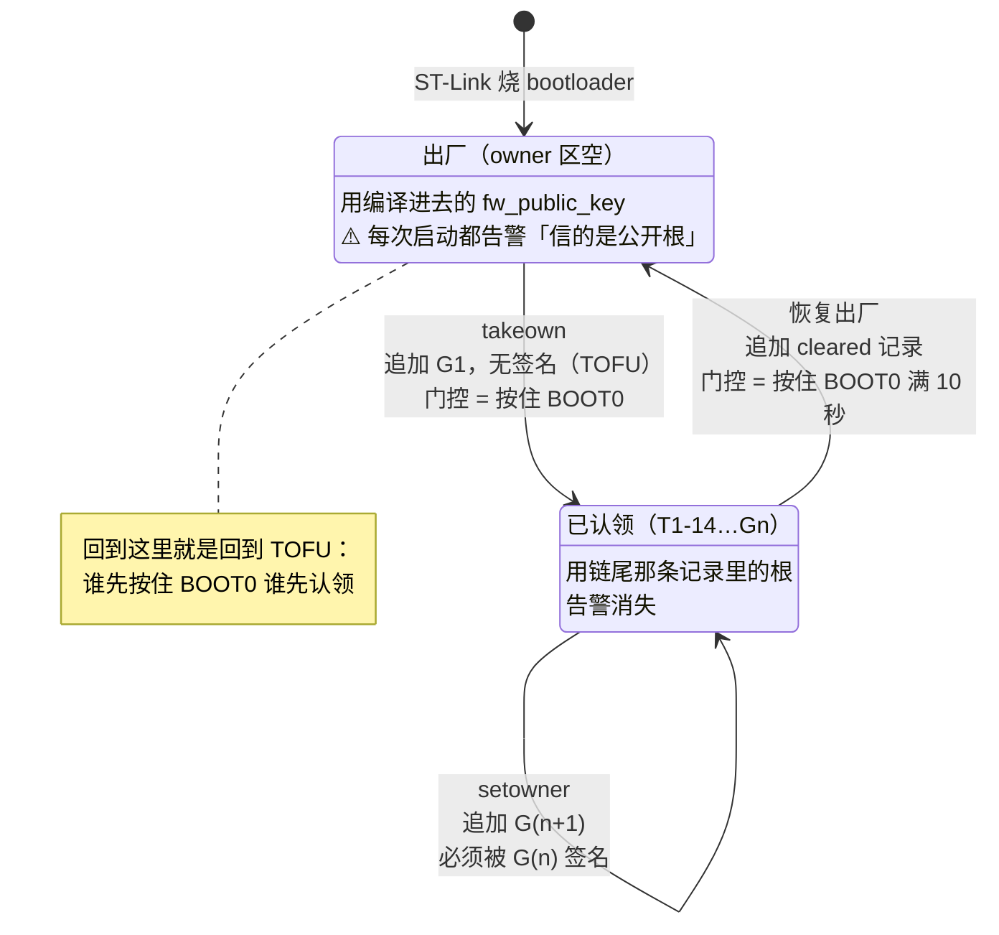
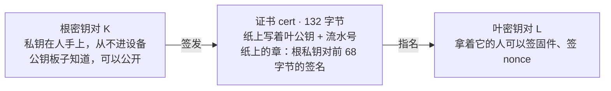
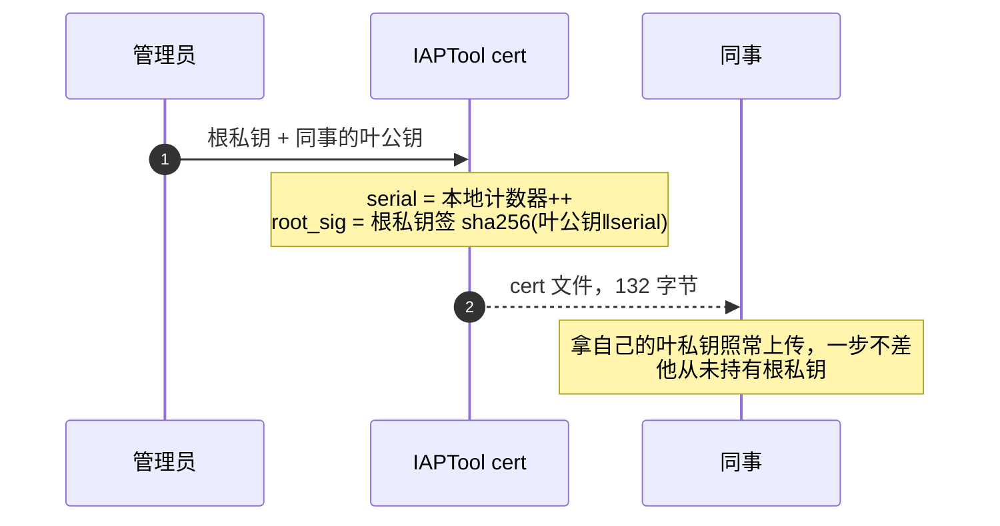
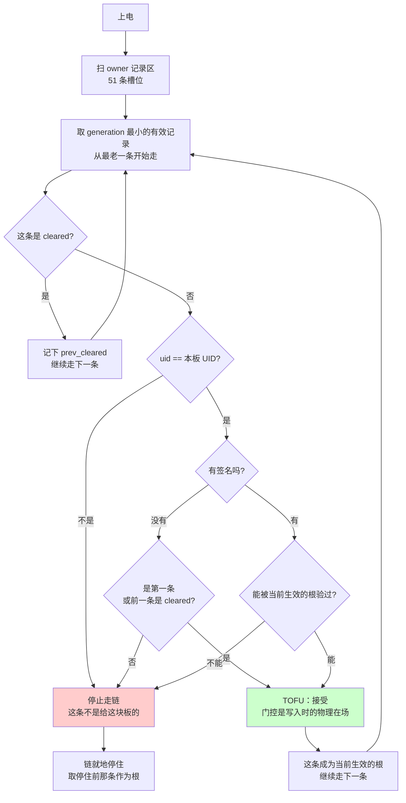
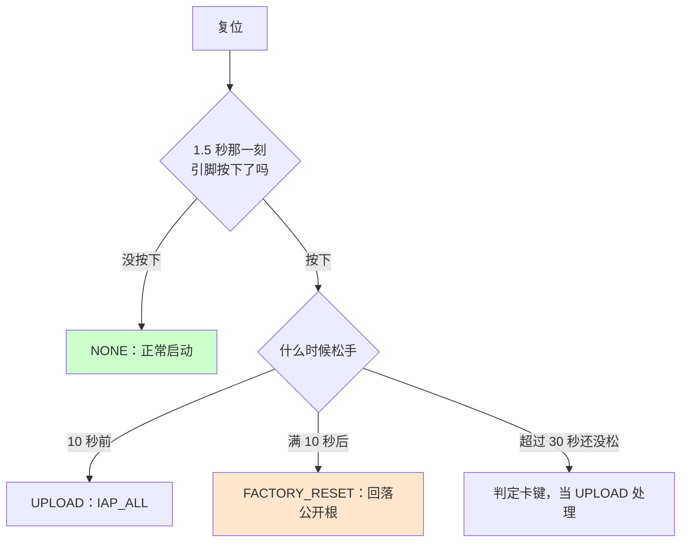

# M2 · 归属与信任

**外面的人能让这块板做什么**：把它绑到自己的钥匙上，从此只有自己能往里装固件；
把这个权力交给别人；丢了钥匙时把板子收回来重新开始 —— **全程不需要 ST-Link**。

**这个模块管到哪为止**：从「这块板现在信哪把根」这个问题，到「这张证书是不是那把根签的」这个回答。
**拿到答案之后怎么装固件**不在这里，在 [M1 固件升级](M1-firmware-upgrade.md)。

---

## 1 · 信任根的一生



**三个操作都不擦除** —— 这个扇区里还住着 bootloader 自己，记录区**只追加、永不擦除**。

| | 操作 | 对记录区做什么 |
|---|---|---|
| ① | 认领 `takeown` | 往空区追加 T1-14。**没有前任可以签它 = TOFU** |
| ② | 换 owner `setowner` | 追加 G(n+1)，**必须被 G(n) 签名**，否则 bootloader 忽略 |
| ③ | 恢复出厂 | 追加一条 `cleared` 记录。链尾是 cleared → 回落内置根，回到 TOFU |

**② 是这套东西真正安全的原因**：攻击者即使能往 flash 写字节，写出来的记录也过不了 G(n) 的签名校验。

出货工具入口：`IAPTool getowner / takeown / setowner`。

### 一把钥匙，两个问题

**整个系统里只有一种秘密：一把 ECDSA P-256 私钥，而且它永远不在设备上。** 板子持有的东西全是公开的 —— 一把根公钥，加上命令随手带来的证书。



**绑定关系只有那个章** —— 没有目录、没有注册表、没有名字匹配。

板子只用这一条链回答两个问题：

| 问题 | 在哪一步问 | 怎么答 |
|---|---|---|
| **谁能上传** | 进上传模式 + 会话授权 | 他递上一张**根认可的证书**，并且用那张证书**指名的私钥签了一个新鲜 nonce** ⇒ 证明他握着某个被信任根授权过的私钥。**不是**证明他握着共享密钥 —— 板子没有共享密钥 |
| **哪个镜像能跑** | 启动验签 + 传输后验签 | **同一张证书**的叶公钥签过这个镜像。每次启动重问一遍，不是烧完问一次 —— flash 会退化，也可能事后被改 |

**证书买到的到底是什么**：让这两个问题**随时间指向不同人的密钥**，而板子不需要学任何新东西。简单模式下 **L 就是 K**（自签证书），团队模式下每个同事一把、管理员不交出根私钥 —— **板子对这两种情况没有分支**。

### 发证书：全程不碰板子



⚠️ **这条流程完全不碰板子。** 板子从第一版就懂证书链，它只问「我信任的根，签过眼前这张纸吗」—— 纸上写的公钥是不是根自己，板子不关心，**所以没有自签特例分支**。

⚠️ **也可以直接把根私钥拷给同事** —— 能用，但想收回其中一个人的权限时只能换根，等于所有人一起重来。**人多就用证书，不要拷私钥。**

### 四条规则，各自挡住什么

| | 内容 | 挡住 | 挡不住 |
|---|---|---|---|
| **R1** | 认领必须按住 BOOT0 | 远程顺手接管出厂板子 | 出厂状态下上传恶意 sketch 直接写这片区域 |
| **R2** | 换 owner 必须由当前 owner 根签名 | 已认领板子被夺走，**包括有 flash 写权限的代码** | — |
| **R3** | 恢复出厂必须物理动作 | 远程把别人的板子降级回公开根 | 有物理接触的人恢复出厂后接管 |
| **R4** | 撤销只针对叶子编号，**永不能撤到一个有效根都不剩** | 把自己撤成永久变砖 | — |

**R3 挡不住的那条必须接受** —— 反过来不给恢复出厂，客户丢了根就是永久变砖，而他恰恰没有 ST-Link。

**R4 不是假想。** ESP32 Secure Boot v2 的 aggressive revoke 是真实反面教材，Espressif 自己的文档写着签名校验失败触发撤销时
"could also brick the device permanently if all the keys are revoked"。

### 一切的起点：出厂默认根的私钥必然是公开的

1. 客户下载 Arduino 包，**写自己的 PLC 程序**并上传
2. 上传要签名 → 签名要私钥 → 私钥得在客户机器上
3. 项目开源，不给客户发任何专属材料
4. ⇒ **那把私钥必须在开源仓库里 ⇒ 公开**

反过来假设：如果出厂根私钥是厂商的秘密，客户就只能跑官方签的固件、不能跑自己的 sketch —— 产品没了。

> **⚠️ 所以出厂状态必然不设防。这不是妥协，是产品定位的直接推论。**

真正要设计的只剩两件事：客户**知不知道**自己不设防；客户想加固时**有没有一条不用 ST-Link 的路**。

### 双模式：简单和授权链走同一条代码路径

板子**从第一版就懂证书链**，工具默认发**自签证书**（叶 = 根，K 给自己作证）。
用户体验等同单密钥；要切授权链时一条命令，**板子一个字节都不用改**。

```
简单模式（K 给自己作证）              授权链（K 签 L）
板子里: K_pub                        板子里: K_pub  ← 一个字节没变
   │ 验证书签名                          │ 验证书签名
   ▼                                     ▼
cert{ pubkey=K_pub, sig=K签 }        cert{ pubkey=L_pub, sig=K签 }
   │ 取出 K_pub                          │ 取出 L_pub
   ▼                                     ▼
镜像签名 = K 签                       镜像签名 = L 签
```

让这件事成立的三个机制，缺一条就不成立：

1. **板子里的公钥从一开始就当「根」看**，不是当「固件签名者」看 —— 升级时 K 原地升格为根，它没变，所以板子不用动
2. **简单模式也走验证书的路径**，只是那张证书自签。板子的检查恒为「这张纸的章，是我认的根能核对的吗」，**没有自签特例分支**
3. 工具**每次上传都把证书一起发**

**第 2 条是全部价值**：简单模式不是「绕过验证」，而是「验一张恰好自签的证书」，所以**不存在高级分支没人走、悄悄烂掉**。

**代价要有意识地买**：那张自签证书在安全上不增加任何东西，纯粹是 132 字节（`iap_cert.h` 的 `IAP_CERT_SIZE`）+ 一次验签，唯一作用是保住升级通道。

**客户不需要额外建根** —— 第一次跑 `rotate_keys.sh` 生成的那把就是他的根，
简单模式下他只是同时也用它直接签固件。「升级到授权链」不是建新根，
而是**停止用根直接签，改用根签发的叶子来签**。

**绑定关系只有一样东西：根私钥对证书的签名。** 没有目录、没有注册表、没有名字匹配。
板子的代码两种情况完全一样，它只问「这张纸是 K 签的吗」—— 纸上写的公钥是不是 K 自己，板子不关心。

⚠️ 升级之后那张自签证书**仍然有效**（它还是 K 签的），所以**根依然可以直接签固件**。
这不是缺陷 —— 根持有者本来就是最终权威 —— 但别指望「升级后根就不能直接签了」。

### 这和 UEFI Secure Boot 是同构的

独立推出来的，事后才发现撞上了。**建议直接借用 UEFI 的术语**，读者有现成心智模型。

| 这里 | UEFI |
|---|---|
| owner 区为空 → 默认根 R0 | **Setup Mode**（没有 Platform Key，谁都能写） |
| T1-14 认领 | 写入 PK → 进 **User Mode** |
| 换 owner 必须被当前 owner 签名 | 改 PK 必须被 PK 签名 |
| 追加 cleared 记录，物理门控 | 删除 PK 回 Setup Mode，需进固件设置界面 |

| 避开 | 原因 |
|---|---|
| Android 的「**追加**一把根」（OEM 根 + 用户根并存） | Android 的 OEM 根私钥保密，多信任一把不掉安全性。**我们的默认根私钥是公开的，只能覆盖不能追加** |
| ESP32 的 aggressive revoke | 见上面 R4 |

另外两条是**抄过来的**：每次启动常驻告警（不是一次性提示）抄 Android Verified Boot；
物理存在由固件在交权前判定，抄 Chromebook。

⚠️ **但 Chromebook 背后有 TPM，这块板子没有。** 所以这一条**只借到了做法，借不到保证** ——
Chromebook 的物理存在由 TPM 背书，别人拆开机器也伪造不了；这里的物理存在只是「固件在交权前读了一次引脚」，**能接触到板子的人本来就能按那个引脚**。
这不是缺陷，是这条借用的**已知边界**：R1 和 R3 挡不住有物理接触的人，见上面那张规则表。

## 2 · 生效的那把根是怎么选出来的

照 `$BOOT/IAPServer/owner_slot.c` 的 `resolve_chain()` 画。



### ⚠️ `generation` 不是用来选赢家的

**生效的那把根靠从最老一条沿链走出来，不是取 generation 最大的那条。**

「最大的获胜」是个洞：一块已被 T1-14 认领的板子上，**任何能追加记录的人都可以写一条
generation 更高的无签名记录把板子夺走**。权威必须来自链，不来自「谁排最后」。

| 这一条记录 | 要不要签名 |
|---|---|
| 第一条 | 可以没有 —— 那是初次认领，靠写入时的物理在场门控（TOFU） |
| cleared 记录 | 可以没有 —— 恢复出厂同样靠物理门控；**要求现任 owner 签名会让丢了私钥的板子变砖** |
| 紧跟在 cleared 之后的一条 | 可以没有 —— 板子已经回到 TOFU，这是又一次「第一条」 |
| 其余任何一条 | **必须由当前生效的那把根签名**，不是板子内置的那把 |

**验不过的一条会让整条链就地停住，不是跳过它继续走** —— 跳过等于让攻击者废掉一环，
就能让后面的环（在别的 owner 手下写的）静默生效。

**uid 检查排在签名/TOFU 分支之前，两边都管。** TOFU 的全部意义就是没有签名可查，
所以 uid 是「这块板的首次认领」和「别人的首次认领、字节拷过来的」之间唯一的东西。

### 记录格式（**已实现，就是这个**）

```
偏移  长度  字段            说明
  0     1   type            'O' = owner 记录，0xFF = 空
  1     1   slots           5
  2     2   format_ver      2
  4     4   generation      单调递增。⚠️ **不是「最大的获胜」**，见上
  8     4   flags           bit0 = cleared
 12    64   root_pubkey     secp256r1 X‖Y；cleared 记录里全 0
 76    12   uid             本板的 HAL_GetUIDw2‖w1‖w0；cleared 记录里全 0
 88    64   prev_sig        上一代根对前 88 字节的签名
                            T1-14 和 cleared 都是全 0（靠物理动作门控）
152     8   reserved
                            160 字节 = 5 × 32 字节 flash word
```

`_Static_assert` 锁死尺寸。**160 字节 = 5 个 32 字节 flash 字，这个整除关系是硬要求** ——
H7 一次编程一个 256 位字，一条不是整数个字的记录没法在不读-改-写邻居的情况下追加。

四条字段设计的理由，改格式之前必须知道：

| 字段 | 为什么是这样 |
|---|---|
| `uid` 落在签名覆盖范围内（`OWNER_SIGNED_PREFIX_LEN = 88`） | 签名管不到的字段谁都能改。这也是它放在 `prev_sig` 之前、而不是塞进偏移 152 的 `reserved` 的原因 |
| 签名覆盖 `generation` | 挡重放。一条被抓到的记录，如果 generation 不在签名范围内，就能被重放进后面的槽 |
| `format_ver` 从第一版就存在 | 有了它，以后的格式变更是一次升级，不是一次破坏性迁移 |
| v1 **没有**兼容路径 | `record_is_structurally_valid()` 见到 `format_ver != 2` 直接判无效 —— v1 记录没有 uid 字段，拿它没有任何安全的事可做。现场没有 v1 记录，所以这是硬切不是迁移 |

⚠️ **签名必须覆盖板子最终写进去的那几个字节，一个不差。** `uid` 那 12 字节是**板子自己从硬件 UID 填进记录的**，
不是工具送过来的 —— 上位机构造签名时必须预先算出板子将要写成什么样。差一个字节，板子重算时当场验不过。

### 记录区为什么寄生在 bootloader 扇区尾部

H743 的擦除粒度是**整个 128K 扇区**，没有更小的。所以任何「独立生命周期」的 flash 区域最少要 128K ——
除非它寄生在一个已经被占用、但没用满的扇区里。

| 候选 | 结论 |
|---|---|
| 现有 state 扇区 | ❌ `journal_reclaim()` 整扇区擦。搬运再写回的话掉电窗口 = 擦除耗时，丢了就**静默**退回默认根 |
| 新开专用扇区 | 可行但白付 128K |
| **bootloader 扇区尾部** | ✅ **净增 0 扇区** |

关键性质：ST-Link 烧 bootloader 时整扇区被擦过一次，镜像之后的字节全是 `0xFF` —— 正好是一片可追加的空地。

扇区 131,072 B，链接器只拿到 120K（122,880 B），尾部 8K 留给 owner 记录。

| 保留 | `FLASH LENGTH` | owner 区起点 | 可存记录 |
|---|---|---|---|
| 4K | 124K | `0x0801F000` | 25 条 |
| **8K（选的这个）** | **120K** | **`0x0801E000`** | **51 条** |
| 16K | 112K | `0x0801C000` | 102 条 |

⚠️ `STM32H743IIKX_FLASH.ld` 的 `FLASH LENGTH` 必须是 120K 不是 128K，否则链接器会把代码放进这 8K。
**这是个已知易失守的点**，在[工程约束](../engineering/README.md)的「改代码时」一节里。

⚠️ **这条路恰好绕开了 `RESERVED_TAIL_SECTORS` 那个地雷** —— owner 区寄生在已占扇区里，根本不加尾部扇区。
但真要加尾部扇区的人得知道：**三处地址守卫全锚在 `IAP_STATE_SECTOR_ADDR` 上，一个都不看 `RESERVED_TAIL_SECTORS`**，
改那个常量保护不了任何东西，只会静默弄坏 reclaim，而且不会编译报错。

### 告警的触发条件是「用的是那把公开根」，不是「槽空」

编译期那把根**是不是公开的，取决于谁编译了 bootloader**：

| 谁编译 | 编译进去的根 | 私钥 | 开箱状态 |
|---|---|---|---|
| 厂商（出厂烧录） | 仓库里那把 | **公开** | 🔴 不设防 |
| 客户自己编译（跑 `rotate_keys.sh` 换掉 `keys/fw_pubkey.inc`） | 他自己的 | 保密 | 🟢 **开箱就安全** |

所以「owner 槽空 → 每次启动告警」这个规则**对自己编译的客户是纯误报** ——
他的板子明明安全，却一直被告知「任何人都能刷写」。**会训练用户忽略这行告警，规则就废了。**

**做法：bootloader 里存一份公开根的 SHA-256，启动时比对当前信任的根，只有相等才告警。**
代价是 32 字节常量 + 启动时对 64 字节根公钥算一次 SHA-256 再比 32 字节摘要。**零配置，三种情况自动都对。**

### 这些东西住在哪

| 东西 | 住在哪 | 谁读 | 谁写 | core 要改吗 |
|---|---|---|---|---|
| 默认根 R0 公钥 | bootloader rodata | boot | 编译期 | 不用 |
| **owner 根记录链** | `0x0801E000` boot 扇区尾部 | boot | boot | 不用 |
| 撤销状态 | 同上（也要免疫 reclaim） | boot | boot | 不用 |
| 证书 | `0x081E0000` M 记录里 | boot | boot | 不用 |

> **最后一列全是「不用」。owner 槽完全活在 bootloader 里，Arduino core 一行都不用改** ——
> 认领要求 BOOT0 物理按键，那时 app 根本没在跑。不涉及跨仓镜像、不用重新分发板卡包。

**证书为什么可以留在 journal 里**：它只需要验证*当前那个* app，而 `journal_reclaim()` 只发生在
`save_metadata()` 内部 —— 擦完立刻就有一条新 M 记录带着新证书写进去。
**只有 owner 根和撤销状态需要免疫 reclaim。** journal 本身见 [M1 固件升级](M1-firmware-upgrade.md)（DR-05 把 JOURNAL.md 判给了 M1）。

⚠️ **撤销状态不要放 RTC 备份域。** 备份寄存器看着很适合放「撤销到第几号」这种小状态 ——
掉电能活、不用擦扇区。**不要**：它是三个仓库共享、且没有任何机制统一分配的资源，**已经撞过一次车**。
谁占了哪个、那次撞车的经过，在 `$PROD/docs/repo/ARCHITECTURE.md` 的寄存器分配表。

### `IAPServer/keys/` 这个目录里有什么

**板子上没有任何共享秘密。** 编进固件的只有一把根公钥，公开无妨。

| 文件 | 作用 | 提交？ |
|---|---|---|
| `fw_pubkey.inc` | 固件签名**公钥**，即出厂内置根。决定**哪个镜像可以被执行** | 是（本来就公开） |
| `fw_signing_key.TEST_ONLY.pem` | 占位签名私钥 | 是 —— 因此等同公开 |
| `fw_signing_key.pem` | 真实签名私钥 | 否（gitignore） |
| `*.pem.certserial` | 该私钥的证书发号计数器 | 是（不是秘密） |
| `rotate_keys.sh` | 换签名密钥的**唯一入口** | 是 |

**没有生成器，也没有生成文件。** 公钥被 `#include` 成 C 数组（`fw_pubkey.c`）—— 改文件、重编译，机制就这些。
换密钥跑 `./rotate_keys.sh`（先 `--dry-run` 看一眼），细节看 `$BOOT/IAPServer/keys/README.md`，那份是准的。

**两个坑**：

- ⚠️ **换完必须用 ST-Link 或 DFU 重烧 bootloader** —— 公钥是编译进去的，而 IAP 只写 app 区，
  永远更新不了持有根的 bootloader。没重烧的板子还认旧根，直接不认新签名
- ⚠️ **已认领的板子不跟着这把密钥走** —— 它认自己 flash 里 owner 记录指定的根。
  要换这种板子的主人用 `IAPTool setowner`，不是轮换这里

### 两条实现上的硬规矩

**验签必须用 `owner_slot_root()`，不能用编译进去的 `fw_public_key`。**
在一块已认领的板子上这两者是不同的 —— **拿内置的那把去验，认领就成了纯粹的摆设**，
板子照样会接受出厂密钥签的镜像。

**core 侧有一份只读镜像**：`core:libraries/OpenPLC_IAP/src/owner_root_ro.{c,h}`，
把 owner 记录链的解析抄了一份出来，给需要知道「当前信任哪把根」但不写记录的 app 代码用。
**它的常量必须和 `$BOOT/IAPServer/owner_slot.h` 完全一致**，这条由跨仓镜像检查守着。

### BOOT0 手势：一次按压，三个结果

**恢复出厂不是另起一个手势，是现有那次按压的自然延长。** 十秒离 1.5 秒的判定点足够远，没人会因为「多按一会儿以防万一」而误触。

| 时刻 | 这一刻发生什么 | 此时松手的结果 |
|---|---|---|
| **0 s** | 复位，继电器依次咔哒（3 × 500 ms） | — |
| **1.5 s** | **判定点：这一刻读一次引脚** | 没按下 ⇒ `NONE`，正常启动，按启动验签的结果决定跳 app 还是留在 bootloader |
| 1.5–10 s | 已进上传模式，同时 latch `s_boot0_held` 供整个会话里的认领使用 | `UPLOAD` ⇒ `IAP_ALL`，CDC + 以太网全开 |
| **10 s** | **三下快咔哒 = 已武装** | `FACTORY_RESET`：追加一条 cleared 记录 ⇒ 回落公开根 |
| **30 s** | **判定卡键**（按键卡死或线短路） | 仍未松手 ⇒ 也当 `UPLOAD` 处理 |



⚠️ **判定是「1.5 秒那一刻按键是否按下」，不是「按住了 1.5 秒」。** 继电器咔哒期间根本不看引脚 —— 全程按住只是**确保覆盖那一瞬间**的实用办法。

⚠️ **按下的那一刻决定就定了**，后面发生什么都改不了它，只能**再加上一个恢复出厂**。

⚠️ **用声音不用灯**：这板子没有通用 LED，而且通常装在柜子里没人看得见。

⚠️ **顺序有讲究**：`owner_slot_factory_reset()` **必须在 `server_decide()` 之前调** —— 否则这次启动的日志会描述**刚被扔掉的所有权**，而这恰恰是唯一肯定有人在读日志的那次启动。

### 定下来的取舍

| | 结论 |
|---|---|
| 保留多大 | **8K**，51 条记录 |
| 恢复出厂怎么触发 | **复位后按住 BOOT0 满 10 秒，三下继电器咔哒后松手**。不是另起一个手势，是现有 1.5 秒那次按压的自然延长 |
| 要不要上 WRP | **厂商不上，留给客户自己决定**（见第 6 节） |
| 认领要不要绑 UID | **绑。** 没有它，一块已认领板子的记录字节整段拷到另一块空白板上会被当成首次认领接受 |
| 会话认证走不走证书 | **走。** 板子上从此不存任何共享密钥。app 侧代价实测 +4.3KB，占可用 app 空间不到 0.3% |
| 证书 `serial` 谁分配 | **发证方本地的计数器**，文件就在根私钥旁边（`<key>.pem.certserial`）。每个客户的根各自发号，不存在跨客户撞号 |

**自签证书不吃流水号，固定用 `0xFFFFFFFF`。** 编号存在的意义是「将来能被撤销点名」，
而**根没法把自己撤销掉**，所以根自己那张证书刻意留在编号区间之外。两个后果：

- 撤销某个委托叶子不会连坐根自己传上去的固件。共用一个计数器的话两者在时间轴上交错，撤销周一发的同事会一并作废管理员周五传的固件
- 上传不再碰计数器文件。那个文件在私钥旁边，对 Arduino 安装来说就在板卡包目录里 —— 一个上传流程本不该写入的地方

**流水号写不进去时只报警告，不当错误。** 一个没能持久化的流水号，比「拒绝签发证书」这件事小得多。

## 3 · 功能表

**一行一条需求，紧挨着写明谁证明它。** 判据和跑法不挤进这张表，在下一节。

| # | 阶段 | 要做到什么 | 谁证明 | 状态 |
|---|---|---|---|---|
| **R2-01** | 根从哪来 | **客户自己编译时能把自己的根编进去**，出厂即安全 | `T2-07` | ✅ |
| **R2-02** | 换成自己的 | 板子有办法脱离"出厂公开根"，且不需要 ST-Link | `T2-01`–`T2-06` | ✅ |
| **R2-03** | 授权别人 | 板子从第一版就懂证书链，简单模式走同一条验证路径 | `T1-18d`–`T1-18f` `T1-16` ¹ | ✅ |
| **R2-04** | 收回授权 | 撤销叶子证书，且**永不能撤到一个有效根都不剩** | 无 | ⬜ |

**共 4 条。1 条有本模块自己的测试，1 条的证据在 M1 的编号下，1 条只有静态检查，1 条没做。**

¹ **这三条用例跨两个模块。** `T1-18d`–`T1-18f`（委托证书由本板的根签发 / 签发根不对 / 证书覆盖别人的密钥）
属于一族七种情况，**另外四种在 [M1 固件升级](M1-firmware-upgrade.md) 的 `T1-18a`–`T1-18c` `T1-18g`**，
一起注册在 `$TOOL:TestCase/host/fakeboard/run_cases.py` 里。
`T1-16`（拿真实 bootloader 源码跑板子侧的判断逻辑）同样两边都用。
**一个测试只有一个编号** —— 这里引用 M1 的编号，不另起一套。

> ⚠️ **`R2-01` 为什么是 🟡**：`P2` 查的是「三份副本一致」，**不是「换根这条路走得通」**。
> 缺的是走一遍：换根 → 重编 → 烧 → **确认公开根告警消失**，那才是可观察的判据。
> 按 2026-09-17 定的口径（一个检查能不能当证据，看它测的是不是这条需求本身），这条没有测试证明它。

> ⚠️ **`R2-04` 为什么是 ⬜ 而不是欠账**：**等真实需求**。今天用 `setowner` 换根就能撤销 ——
> 旧根签发的所有叶子当场全部失效，**包括已经装在板子上的固件**，它下次启动会被拒、停在 bootloader 等重传。
> 代价是管理员的根私钥每次都要换，而且现场每块板都要被触达一次。
> 按单张证书精确撤销才是 `R2-04`，`serial` 字段就是为它留的；
> 在有真实场景把「根私钥不用换」这条需求顶上来之前，不做。


⚠️ **`T2-07` 的判据为什么不是「槽空就告警」** —— 自己编译固件的客户，owner 槽同样是空的，板子却是安全的。`owner_slot.c` 的 `report_root_trust()` 刻意只看**编进去的根是不是那把公开的**。所以这条用例要同时看见两件事：`Owner slot: empty` 在，告警不在。

## 4 · 测试怎么跑

**按需求顺序排** —— `R2-02` 的六条占满 `T2-01`–`T2-06`，因为另外三条需求没有本模块自己的用例。

| # | 对应需求 | 测什么 | 判据 | 跑法 | 条件 | 状态 |
|---|---|---|---|---|---|---|
| `T2-01` | `R2-02` | 认领把板子绑到一把新密钥上 | `takeown` 回 `OK`；`getpubkey` 返回新密钥；复位后仍然认得，**公开根告警消失** | `python tools/run_takeown.py` | **真板子 + 人按住 BOOT0** | ✅ |
| `T2-02` | `R2-02` | BOOT0 没按时认领被拒（反向用例） | 回 `Refused`，`getpubkey` **一字节不变** | `python tools/run_takeown.py --expect-refused` | 真板子 | ✅ |
| `T2-03` | `R2-02` | 换 owner：现任签名才算数 | 正确签名 → `OK` 且 generation +1；坏签名 → `Refused` 且什么都没变 | `python tools/run_setowner.py --current-key a.pem`（加 `--bad-signature` 跑负向） | 真板子 | ✅ |
| `T2-04` | `R2-02` | 无签名的高 generation 记录**夺不走**板子 | 扫描器看得见那条记录，但 `getpubkey` 仍返回原主人 | `python tools/inject_owner_record.py --key <hex> --also-unsigned 9` | 真板子 | ✅ |
| `T2-05` | `R2-02` | 恢复出厂，然后能重新认领 | 按住 BOOT0 十秒 → `FACTORY RESET DONE` → 回落内置根、**公开根告警回来** → 再 `takeown` 能成功 | 同 `T2-01` 的驱动 | **真板子 + 人按住 BOOT0 十秒** | ✅ |
| `T2-06` | `R2-02` | 「信任公开根」的告警不能失灵 | bootloader 认出那把公开根靠的是编进 `owner_slot.c` 的 SHA-256 指纹常量，这条查它还对得上 | `python tools/check_public_root.py` | 主机侧 | ✅ |
| `T2-07` | `R2-01` | 换成自己的根之后，公开根告警不再出现 | 启动日志里 `Owner slot: empty` **在**，而 `This board trusts the PUBLISHED root key` 两行**不在**；再用新密钥签的 app 装得进且能启动 | `rotate_keys.sh --yes` → `build_image.py` → `flash_bootloader.py --skip-build` → `upload_and_watch.py` | 真板子 + ST-Link | ✅ |

**共 6 条。** `T2-01` `T2-05` 要人动手按 BOOT0，其余不用。

⚠️ **`T2-01` `T2-03` 的动作走出货工具**（`IAPTool takeown` / `setowner`），**判据向板子要**（原始 TCP `getowner` / `getpubkey`）——
测的是客户真正会走的那条路，不是一个重新实现。
`T2-04` 是例外：出货工具做不出坏签名，所以那条在用例里手工拼记录。

⚠️ **K 族和 T1-16 覆盖不到的那一段**：`T1-18d`–`T1-18f` 用假板子覆盖了**工具的**判断，
`T1-16` 用真实 bootloader 源码覆盖了**板子的**判断，
**两者中间那段 —— 真板子收下一张委托证书并据此执行固件 —— 只能手工走一遍**，发版前值得跑。
步骤在 `$PROD/docs/engineering/HOW-TO-RUN-TESTS.md` 的「委托证书怎么在真板子上复现」。


⚠️ **`T2-07` 的判据为什么不是「槽空就告警」** —— 自己编译固件的客户，owner 槽同样是空的，板子却是安全的。`owner_slot.c` 的 `report_root_trust()` 刻意只看**编进去的根是不是那把公开的**。所以这条用例要同时看见两件事：`Owner slot: empty` 在、告警不在。**只看告警没了是不够的** —— 日志没抓到也会是 0 行。

## 5 · 为什么这里没有「证据日期」和「最近结果」

状态一列的规矩见 [M1 §5](M1-firmware-upgrade.md)。
## 6 · 这个模块的边界

> **owner 槽的安全上限 = 「这块板子上能不能跑任意代码」。**

| 状态 | 能不能跑任意代码 |
|---|---|
| **出厂状态** | **能。** 默认根私钥公开 → 谁都能签 sketch → 谁都能写 owner 区。**R1 的 BOOT0 只保护受支持的那条路，不是密码学保证**，第一次认领本质上先到先得 |
| **已认领之后** | **不能。** 跑代码要先过签名，签名要 owner 私钥。从这一刻起 R2 是真保证 |

> **⚠️ 所以：板子到手第一件事是认领。**

**挡不住什么**（写出来，因为不写就会有人以为挡得住）：

- **认领未绑……绑了，但出厂那一刻还没有。** 记录里 12 字节 `uid` 在签名覆盖范围内，
  所以已认领板子的记录整段拷到别的板上会被拒 —— 但**出厂状态下谁先按住 BOOT0 谁先认领**，这条堵不住
- **没上 flash 写保护（WRP）**，所以跑起来的 app 理论上能写 bootloader 区。
  WRP 是唯一能真正禁止这件事的手段，**厂商不上** —— 设置之后清除需要 ST-Link/J-Link 物理访问、重烧、重锁，太锋利，不适合出厂默认。**留给客户自己决定**
- **有物理接触的人可以恢复出厂后接管**（R3 挡不住的那条），这是刻意接受的

⚠️ **ST-Link 重烧 bootloader = 所有权重置。** owner 记录和 bootloader 同扇区，重烧会一起擦掉。
**语义上是对的**（能 ST-Link 的人本来就能恢复出厂），但它和「bootloader 与 app 必须捆绑升级」那条风险**叠加**：
换 bootloader 的人要同时重传 app **和**重新认领。**发布说明里这两条要写在一起。**

**两条明确不做的**，理由在 [DEFERRED-DESIGNS.md](../tables/DEFERRED-DESIGNS.md)：

| 曾经的需求 | 为什么不做 |
|---|---|
| 产线给每块板发唯一密钥，取代固定密码 | 会话认证改走证书之后，板子里从此不存共享密钥，**产线预配随机密钥这条路没有存在的必要了** |
| flash 写保护（WRP）禁止 app 写 bootloader 区 | 见上：太锋利，留给客户 |

**和其他模块的关系**：

| 关系 | 去哪看 |
|---|---|
| 拿到「信哪把根」的答案之后，固件怎么装进去 | [M1 固件升级](M1-firmware-upgrade.md) |
| 「网络上来的命令板子凭什么相信它」—— 挑战应答的机制 | [M1 固件升级](M1-firmware-upgrade.md)（`CHALLENGE-AUTH` 归在那边） |
| bootloader 镜像和 owner 区共用扇区带来的构建约束 | [工程约束](../engineering/README.md) |

> **引用别的模块一律只写指针，不抄内容。** 这是「一个事实只有一个家」的落地方式，
> 引用规矩见 [M1 §6](M1-firmware-upgrade.md)。
