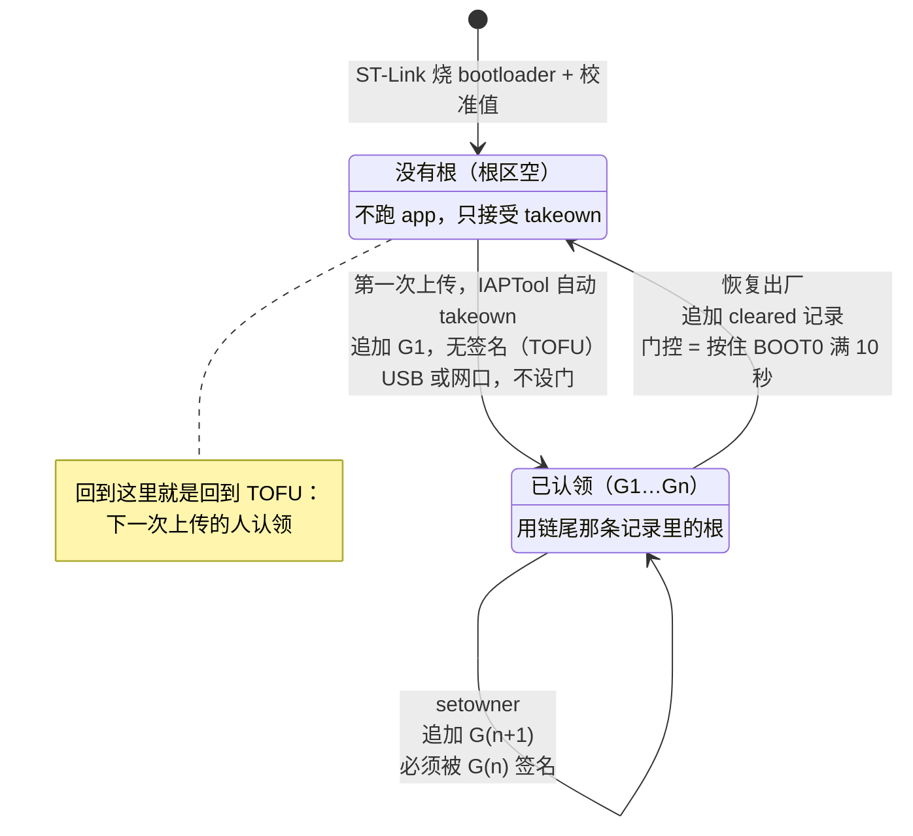
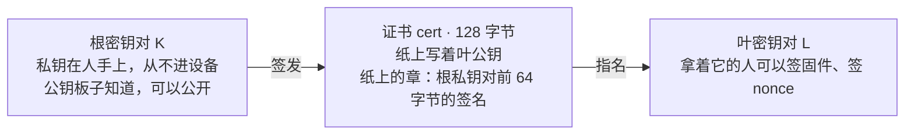
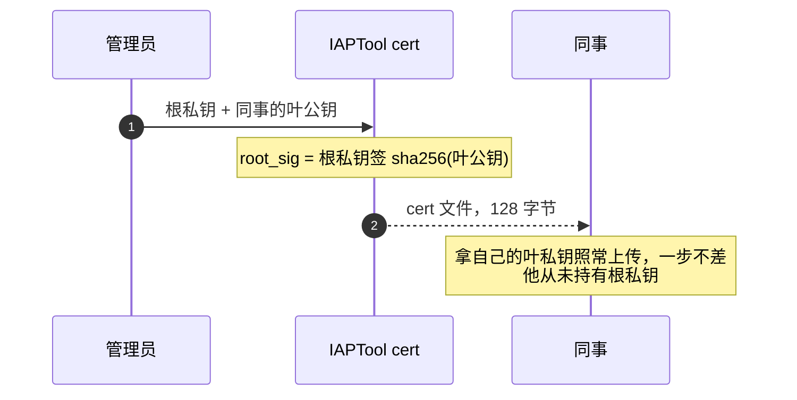
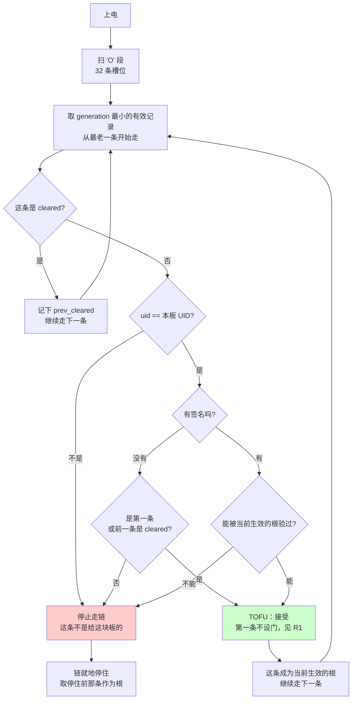
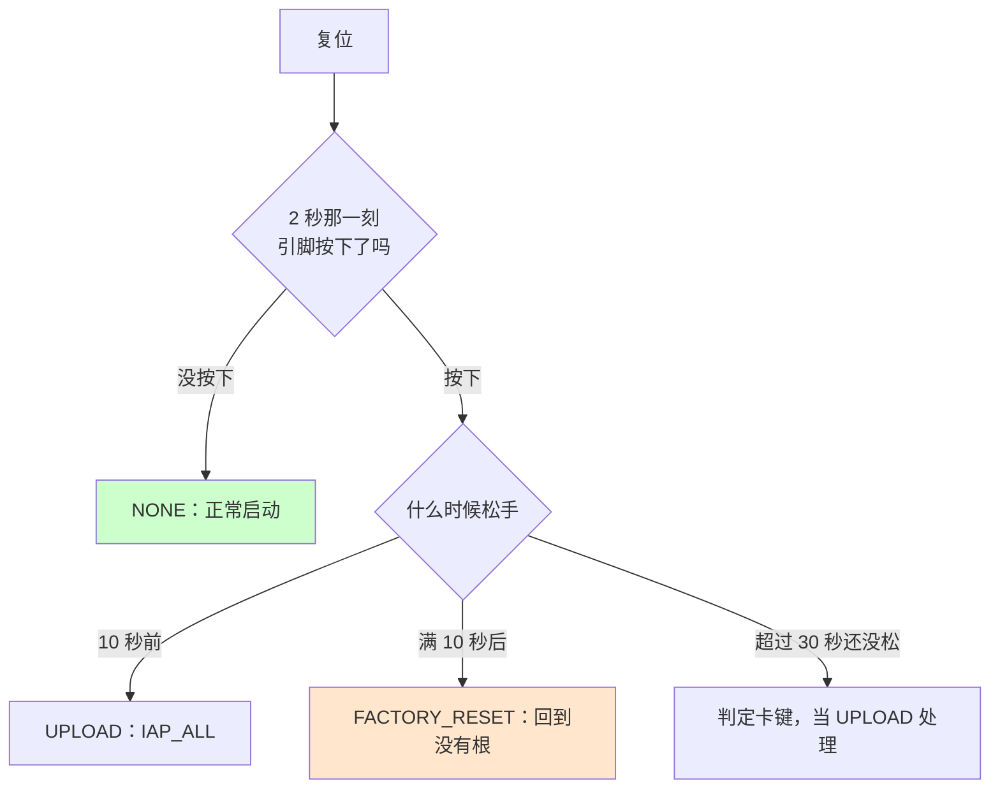

# M2 · 归属与信任

> ⚠️ **代码已按[决策 72](../tables/DECISIONS.md) 实施（未提交、未上板验收）**，见 [work/TODO.md](../../work/TODO.md)「出厂无根、第一次上传自动认领」。

**外面的人能让这块板做什么**：把它绑到自己的钥匙上，从此只有自己能往里装固件；
把这个权力交给别人；丢了钥匙时把板子收回来重新开始 —— **全程不需要 ST-Link，也不重编、不重写 bootloader**。

**这个模块管到哪为止**：从「这块板现在信哪把根」这个问题，到「这张证书是不是那把根签的」这个回答。
**拿到答案之后怎么装固件**不在这里，在 [M1 固件升级](M1-firmware-upgrade.md)。

---

## 1 · 信任根的一生


```mermaid
stateDiagram-v2
    direction TB
    [*] --> 没有根: ST-Link 烧 bootloader + 校准值

    没有根: 没有根（根区空）
    没有根: 不跑 app，只接受 takeown

    已认领: 已认领（G1…Gn）
    已认领: 用链尾那条记录里的根

    没有根 --> 已认领: 第一次上传，IAPTool 自动 takeown<br/>追加 G1，无签名（TOFU）<br/>USB 或网口，不设门
    已认领 --> 已认领: setowner<br/>追加 G(n+1)<br/>必须被 G(n) 签名
    已认领 --> 没有根: 恢复出厂<br/>追加 cleared 记录<br/>门控 = 按住 BOOT0 满 10 秒

    note right of 没有根
      回到这里就是回到 TOFU：
      下一次上传的人认领
    end note
```

**三个操作都只往根区追加，不擦除**；根区写满时由扇区 15 的回收压缩，见 [扇区 15 设计说明](M1/SECTOR-15.md)。

| | 操作 | 对根区做什么 |
|---|---|---|
| ① | 认领 `takeown` | 往空区追加 G1。**没有前任可以签它 = TOFU**。IAPTool 在上传时发现板子没有根就自动做这一步 |
| ② | 换 owner `setowner` | 追加 G(n+1)，**必须被 G(n) 签名**，否则 bootloader 忽略。不限次数，不碰 bootloader |
| ③ | 恢复出厂 | 追加一条 `cleared` 记录。链尾是 cleared → 回到没有根，回到 TOFU |

**② 是这套东西真正安全的原因**：攻击者即使能往 flash 写字节，写出来的记录也过不了 G(n) 的签名校验。

出货工具入口：IDE 上传（`IAPTool cdc` / `ether`，无根时自动认领），以及 `IAPTool getowner / takeown / setowner`。

### `getowner` 的线上契约

**板子回一个纯数字，没有别的** —— 当前生效那条记录的 `generation`。

⚠️ **`0 = 从没被认领过`，但反过来不成立**：**恢复出厂写的是一条 `OWNER_FLAG_CLEARED` 记录，
generation 照常递增**，所以一块刚恢复出厂的板子回的是非 0。
**线上没有任何字段能表达「已清空」，而且刻意不加**（2026-09-21 定）：

| 加字段的办法 | 为什么不做 |
|---|---|
| `getowner` 改回两个字段 | IAPTool 和 **6 个测试脚本**都用整串解析成数字，会一起挂 |
| 已清空时回 `0` | `setowner` 要用 generation 算下一条记录的签名前缀，回 0 就签错 |
| 新增一个查询命令 | 查过三处（产线、出厂态验收、6 个脚本），**没有一个调用者需要它** |

**由此得到两条工具侧的规矩**：

1. **「板子有没有根」问 `getpubkey`，不问 `getowner`** —— 没有根时 `getpubkey` 回 `none`（[IAP-PROTOCOL.md](M1/IAP-PROTOCOL.md)）。
   `takeown` 本身不做前置判断，由 `owner_slot_claim()` 决定；板子在「最后生效的是一条恢复出厂记录」时照样接受
2. **`getowner` 的输出要说清换主的两条路**（`setowner` 要当前主人的密钥 / 恢复出厂后下一次上传自动认领），
   而不是只说「Only firmware signed by that key will start」

见[恢复出厂之后 takeown 被工具拦下，因为线上没法表达「已清空」](../../maps/owner-revoke-and-boot-upgrade/issues/OWN-11-getowner-cannot-say-cleared.md)。

### 一把钥匙，两个问题

**整个系统里只有一种秘密：一把 ECDSA P-256 私钥，而且它永远不在设备上。** 板子持有的东西全是公开的 —— 一把根公钥，加上命令随手带来的证书。


```mermaid
flowchart LR
    K["根密钥对 K<br/>私钥在人手上，从不进设备<br/>公钥板子知道，可以公开"]
    C["证书 cert · 128 字节<br/>纸上写着叶公钥<br/>纸上的章：根私钥对前 64 字节的签名"]
    L["叶密钥对 L<br/>拿着它的人可以签固件、签 nonce"]
    K -- 签发 --> C
    C -- 指名 --> L
```

**绑定关系只有那个章** —— 没有目录、没有注册表、没有名字匹配。

板子只用这一条链回答两个问题：

| 问题 | 在哪一步问 | 怎么答 |
|---|---|---|
| **谁能上传** | 进上传模式 + 会话授权 | 他递上一张**根认可的证书**，并且用那张证书**指名的私钥签了一个新鲜 nonce** ⇒ 证明他握着某个被信任根授权过的私钥。**不是**证明他握着共享密钥 —— 板子没有共享密钥 |
| **哪个镜像能跑** | 启动验签 + 传输后验签 | **同一张证书**的叶公钥签过这个镜像。每次启动重问一遍，不是烧完问一次 —— flash 会退化，也可能事后被改 |

**证书买到的到底是什么**：让这两个问题**随时间指向不同人的密钥**，而板子不需要学任何新东西。简单模式下 **L 就是 K**（自签证书），团队模式下每个同事一把、管理员不交出根私钥 —— **板子对这两种情况没有分支**。

### 发证书：全程不碰板子


```mermaid
sequenceDiagram
    autonumber
    participant A as 管理员
    participant T as IAPTool cert
    participant C as 同事
    A->>T: 根私钥 + 同事的叶公钥
    Note over T: root_sig = 根私钥签 sha256(叶公钥)
    T-->>C: cert 文件，128 字节
    Note over C: 拿自己的叶私钥照常上传，一步不差<br/>他从未持有根私钥
```

⚠️ **这条流程完全不碰板子。** 板子从第一版就懂证书链，它只问「我信任的根，签过眼前这张纸吗」—— 纸上写的公钥是不是根自己，板子不关心，**所以没有自签特例分支**。

⚠️ **也可以直接把根私钥拷给同事** —— 能用，但想收回其中一个人的权限时只能换根，等于所有人一起重来。**人多就用证书，不要拷私钥。**

### 四条规则，各自挡住什么

| | 内容 | 挡住 | 挡不住 |
|---|---|---|---|
| **R1** | **第一次认领不设门**，USB 或网口都行（决策 72） | — | **在用户之前连上出厂板的人**：他先认领，用户上传失败后长按 BOOT0 恢复出厂再来 |
| **R2** | 换 owner 必须由当前 owner 根签名 | 已认领板子被夺走，**包括有 flash 写权限的代码** | — |
| **R3** | 恢复出厂必须物理动作，之后回到没有根 | 远程把别人的板子降级回无主 | 有物理接触的人恢复出厂后接管 |
| **R4** | 撤销只针对叶子编号，**永不能撤到一个有效根都不剩** | 把自己撤成永久变砖 | — |

**R1 挡不住的那条可以接受**：没有根的板子什么都不跑，抢先认领的人拿到的只是一块空板，用户恢复出厂就能收回。

**R3 挡不住的那条必须接受** —— 反过来不给恢复出厂，客户丢了根就是永久变砖，而他恰恰没有 ST-Link。

**R4 不是假想。** ESP32 Secure Boot v2 的 aggressive revoke 是真实反面教材，Espressif 自己的文档写着签名校验失败触发撤销时
"could also brick the device permanently if all the keys are revoked"。

### 一切的起点：出厂没有根

出厂只烧 bootloader 和校准值，**板子上没有任何根**；bootloader 代码里也不编根（决策 72）。

| 状态 | 板子做什么 |
|---|---|
| 没有根 | 不跑 app、不收上传，**只接受 `takeown`** |
| 用户第一次在 IDE 里上传 | IAPTool 取本机私钥（没有就生成），`takeown` 写进公钥，再签名上传 |

**理由**：用户拿到板子不用按键、不用 ST-Link、不用重编 bootloader 就用上自己的根；
也不再有一把人人都能签固件的公开根。

### 双模式：简单和授权链走同一条代码路径

板子**从第一版就懂证书链**，工具默认发**自签证书**（叶 = 根，K 给自己作证）。
用户体验等同单密钥；要切授权链时一条命令，**板子一个字节都不用改**。

```
简单模式（K 给自己作证）              授权链（K 签 L）
板子里: K_pub                        板子里: K_pub  ← 一个字节没变
   │ 验证书签名                          │ 验证书签名
   ▼                                     ▼
cert{ pubkey=K_pub, sig=K签 }        cert{ pubkey=L_pub, sig=K签 }
   │ 取出 K_pub                          │ 取出 L_pub
   ▼                                     ▼
镜像签名 = K 签                       镜像签名 = L 签
```

让这件事成立的三个机制，缺一条就不成立：

1. **板子里的公钥从一开始就当「根」看**，不是当「固件签名者」看 —— 升级时 K 原地升格为根，它没变，所以板子不用动
2. **简单模式也走验证书的路径**，只是那张证书自签。板子的检查恒为「这张纸的章，是我认的根能核对的吗」，**没有自签特例分支**
3. 工具**每次上传都把证书一起发**

**第 2 条是全部价值**：简单模式不是「绕过验证」，而是「验一张恰好自签的证书」，所以**不存在高级分支没人走、悄悄烂掉**。

**代价要有意识地买**：那张自签证书在安全上不增加任何东西，纯粹是 128 字节（`iap_cert.h` 的 `IAP_CERT_SIZE`）+ 一次验签，唯一作用是保住升级通道。

**客户不需要额外建根** —— 第一次上传时 IAPTool 生成的那把就是他的根，
简单模式下他只是同时也用它直接签固件。「升级到授权链」不是建新根，
而是**停止用根直接签，改用根签发的叶子来签**。

**绑定关系只有一样东西：根私钥对证书的签名。** 没有目录、没有注册表、没有名字匹配。
板子的代码两种情况完全一样，它只问「这张纸是 K 签的吗」—— 纸上写的公钥是不是 K 自己，板子不关心。

⚠️ 升级之后那张自签证书**仍然有效**（它还是 K 签的），所以**根依然可以直接签固件**。
这不是缺陷 —— 根持有者本来就是最终权威 —— 但别指望「升级后根就不能直接签了」。

### 这和 UEFI Secure Boot 是同构的

独立推出来的，事后才发现撞上了。**建议直接借用 UEFI 的术语**，读者有现成心智模型。

| 这里 | UEFI |
|---|---|
| 根区为空 → 只接受认领 | **Setup Mode**（没有 Platform Key，谁都能写） |
| T1-14 认领 | 写入 PK → 进 **User Mode** |
| 换 owner 必须被当前 owner 签名 | 改 PK 必须被 PK 签名 |
| 追加 cleared 记录，物理门控，回到没有根 | 删除 PK 回 Setup Mode，需进固件设置界面 |

| 避开 | 原因 |
|---|---|
| Android 的「**追加**一把根」（OEM 根 + 用户根并存） | Android 的 OEM 根私钥保密，多信任一把不掉安全性。**我们出厂没有根，只有用户那一把** |
| ESP32 的 aggressive revoke | 见上面 R4 |

恢复出厂的物理存在由固件在交权前判定，抄 Chromebook。⚠️ **Chromebook 背后有 TPM，这块板子没有**：这里的物理存在只是「固件在交权前读了一次引脚」，能接触到板子的人本来就能按，见上面 R3。

## 2 · 生效的那把根是怎么选出来的

照 `$BOOT/IAPServer/owner_slot.c` 的 `resolve_chain()` 画。


```mermaid
flowchart TD
    A[上电] --> B[扫 'O' 段<br/>32 条槽位]
    B --> C[取 generation 最小的有效记录<br/>从最老一条开始走]
    C --> D{这条是 cleared?}
    D -->|是| E[记下 prev_cleared<br/>继续走下一条]
    D -->|否| F{uid == 本板 UID?}
    F -->|不是| G[停止走链<br/>这条不是给这块板的]
    F -->|是| H{有签名吗?}
    H -->|没有| I{是第一条<br/>或前一条是 cleared?}
    I -->|是| J[TOFU：接受<br/>第一条不设门，见 R1]
    I -->|否| G
    H -->|有| K{能被当前生效的根验过?}
    K -->|不能| G
    K -->|能| J
    J --> L[这条成为当前生效的根<br/>继续走下一条]
    E --> C
    L --> C
    G --> M[链就地停住<br/>取停住前那条作为根]

    style G fill:#ffcccc
    style J fill:#ccffcc
```

### ⚠️ `generation` 不是用来选赢家的

**生效的那把根靠从最老一条沿链走出来，不是取 generation 最大的那条。**

「最大的获胜」是个洞：一块已被 T1-14 认领的板子上，**任何能追加记录的人都可以写一条
generation 更高的无签名记录把板子夺走**。权威必须来自链，不来自「谁排最后」。

| 这一条记录 | 要不要签名 |
|---|---|
| 第一条 | 可以没有 —— 那是初次认领（TOFU），不设门，见 R1 |
| cleared 记录 | 可以没有 —— 恢复出厂同样靠物理门控；**要求现任 owner 签名会让丢了私钥的板子变砖** |
| 紧跟在 cleared 之后的一条 | 可以没有 —— 板子已经回到 TOFU，这是又一次「第一条」 |
| 其余任何一条 | **必须由当前生效的那把根签名**，不是板子内置的那把 |

**验不过的一条会让整条链就地停住，不是跳过它继续走** —— 跳过等于让攻击者废掉一环，
就能让后面的环（在别的 owner 手下写的）静默生效。

**uid 检查排在签名/TOFU 分支之前，两边都管。** TOFU 的全部意义就是没有签名可查，
所以 uid 是「这块板的首次认领」和「别人的首次认领、字节拷过来的」之间唯一的东西。

### 记录格式（v4，两段定长）

owner 区 8192 字节切成两段，各自定长、各自追加：

| 段 | 区内偏移 | 一条多大 | 几条 | 装什么 |
|---|---|---|---|---|
| **`'O'` 所有权** | 0 | **160 字节** | **32** | 认领、换主、恢复出厂 |
| **`'R'` 作废** | 5120 | **32 字节** | **96** | 被作废的叶公钥前缀，一条一个 |

5120 + 3072 = 8192，正好占满。**两段不混排** —— 混排时一条坏记录会让它后面所有记录的
边界都算错，分段把这种传染关在一段之内。两段的比例按频率差划：换主人一生几次，
作废一生几十次（[决策 58](../tables/DECISIONS.md)）。

#### `'O'` 记录（160 字节）

```
偏移  长度  字段            说明
  0     1   type            'O' = owner 记录，0xFF = 空
  1     1   reserved0       0（v2 的 `slots` 留下的空位，保住后面字段的偏移）
  2     2   format_ver      4
  4     4   generation      单调递增。⚠️ **不是「最大的获胜」**，见上
  8     4   flags           bit0 = cleared
 12    64   root_pubkey     secp256r1 X‖Y；cleared 记录里全 0
 76    12   uid             本板的 HAL_GetUIDw2‖w1‖w0；cleared 记录里全 0
 88    64   prev_sig        上一代根对前 88 字节的签名
                            T1-14 和 cleared 都是全 0（靠物理动作门控）
152     8   reserved
                            160 字节 = 5 × 32 字节 flash word
```

#### `'R'` 记录（32 字节）

```
偏移  长度  字段            说明
  0     1   type            'R' = 作废记录，0xFF = 空
  1     1   reserved0       0
  2     2   format_ver      4
  4    12   uid             本板的 HAL_GetUIDw2‖w1‖w0
 16    16   leaf_prefix     被作废叶公钥的前 16 字节
                            32 字节 = 1 × 32 字节 flash word
```

**`'R'` 记录里没有签名，也没有 generation。** 签名在写入时验完即丢，不进 flash ——
这正好让一条记录压进一个 flash word，同时解掉 `generation` 带来的
[第二次撤销写得进去但不生效](../../maps/owner-revoke-and-boot-upgrade/issues/OWN-06-second-revocation-is-written-but-never-takes-effect.md)。

`_Static_assert` 锁死两个尺寸。**整除关系是硬要求** —— H7 一次编程一个 256 位字，
一条不是整数个字的记录没法在不读-改-写邻居的情况下追加。

#### 写入验签，读取只查结构

**`'O'` 和 `'R'` 故意不对称**（[决策 59](../tables/DECISIONS.md)）：

| | 启动时 | 写入时 |
|---|---|---|
| `'O'` | **每次重新验签**，沿链走 | 验当前根的签名 |
| `'R'` | **只查结构**（`type` / `format_ver` / `uid`），不验签、不看 generation | 验当前根对那 32 字节的签名 |

**为什么这个不对称是安全的，见 [决策 59](../tables/DECISIONS.md)** —— 一句话：
两者被伪造之后的收益差着一个数量级。

#### `setowner --wipe`：把两段清空重写

`'R'` 段满了之后，**唯一能把名额拿回来的动作是回收一次扇区 15**。`setowner --wipe`
就是为此存在的：板子照 [扇区 15 的回收流程](M1/SECTOR-15.md) 擦写一次，根区只留新主人那一条记录。

| | 平时 `setowner` | `setowner --wipe` |
|---|---|---|
| 板子做什么 | `'O'` 段追加一条 160 字节记录 | 回收扇区 15，根区清空后只写新主人那一条 |
| 掉电 | 最多留一条废记录，照常启动 | 按扇区 15 回收的掉电规则处理，bootloader 不受影响 |
| 回收名额 | 不回收 | **两段全空** |

⚠️ **板子绝不自己清空 `'R'` 段。** 剩 8 条时只提示，动作由操作者显式要求 ——
撤销记录是用户的决定，不能被一次日常换根悄悄丢掉。

⚠️ **写回去那条记录是没有签名的，而且必须没有。** 链上每一环都由前一环授权，
清空把前面那些全丢了 —— 带签名写回去的话，下次启动没有任何东西能验它，
`resolve_chain()` 会拒掉，板子回到没有根。不带签名写回去，它读起来就是一条首次认领（TOFU）。

**这没有削弱任何东西**：签名是「允许擦」的凭证，在动第一个字节之前就验过了，
而且它覆盖 generation 和本板 uid，所以抓到的命令既不能重放到这块板的以后，
也不能搬到别的板上。

generation **延续**清空前那条生效记录 +1，不从 1 重开。

#### 两条容量规则

| | 规则 |
|---|---|
| **重复作废同一个叶** | **幂等**：写之前扫一遍 `'R'` 段，前缀已存在就一个字节都不写，回 `OK already revoked`。这同时就是防重放 —— 重放一百次也只占一个 word |
| **`'R'` 段 96 条用满** | 回 `Refused`，一个字节不写。**剩 8 条时启动日志开始提醒**，引导去 `setowner --wipe` |
| **`'O'` 段 32 条用满** | 下一次换主时自动回收扇区 15，只留当前生效的那条 owner 记录；换根因此不限次数 |

⚠️ **换根不腾空名额。** 换根让旧根签发的叶全部失效（所以**不再需要**逐个撤），
但那些 `'R'` 记录仍占着 flash —— 读取不验签，板子无从分辨哪条属于哪一任根。
**真正回收撤销名额只有 `setowner --wipe`**（见上）。

#### 字段设计的理由，改格式之前必须知道

| 字段 | 为什么是这样 |
|---|---|
| `uid` 落在签名覆盖范围内（`'O'` 是 `OWNER_SIGNED_PREFIX_LEN = 88`，`'R'` 是整条 32 字节） | 签名管不到的字段谁都能改。这也是它放在 `prev_sig` 之前、而不是塞进偏移 152 的 `reserved` 的原因 |
| `'O'` 的签名覆盖 `generation` | 挡重放。一条被抓到的记录，如果 generation 不在签名范围内，就能被重放进后面的槽 |
| `'R'` 的签名覆盖**整条记录**，包括恒为 0 的 `reserved0` | 记录里没有签名字段要排除，所以没有理由只签一部分。「签的就是板子要写的那几个字节」这条规则在这里可以做到一个不差 |
| `format_ver` 从第一版就存在 | 有了它，以后的格式变更是一次升级，不是一次破坏性迁移 |
| **没有兼容路径** | `record_is_structurally_valid()` 见到 `format_ver != 4` 直接判无效。v2 缺 uid、v3 的 `'R'` 是 160 字节还带签名和 generation —— 布局整个变了，而现场没有已认领的板子，所以这是硬切不是迁移 |

⚠️ **升到 v4 要重烧 bootloader 并重新认领。** 旧记录一条都不认。决策 72 把根区搬到扇区 15 时同样不迁移旧记录。

⚠️ **签名必须覆盖板子最终写进去的那几个字节，一个不差。** `uid` 那 12 字节是**板子自己从硬件 UID 填进记录的**，
不是工具送过来的 —— 上位机构造签名时必须预先算出板子将要写成什么样。差一个字节，板子重算时当场验不过。

### 根区为什么在扇区 15

H743 的擦除粒度是**整个 128K 扇区**。根区写满必须擦一次才能回收，所以它不能和 bootloader 同扇区 ——
那样每次回收都要重写 bootloader。

| 候选 | 结论 |
|---|---|
| 扇区 0 尾部（决策 72 之前的位置） | ❌ 回收要擦扇区 0，等于重写 bootloader，掉电就起不来 |
| 一个或两个专用扇区 | 可行，但 app 少 128–256 KiB |
| **扇区 15，并入它现有的「读出 → 擦 → 写回」回收** | ✅ **不多占 flash**；擦除期间根区暂存在备份 SRAM |

地址和回收步骤只写在 [扇区 15 设计说明](M1/SECTOR-15.md)。

⚠️ **扇区 0 从此只放 bootloader 代码**，`STM32H743IIKX_FLASH.ld` 的 `FLASH LENGTH` 不再需要为 owner 区让出 8K。

### 没有根时不告警，而是什么都不跑

决策 72 之前出厂板信一把公开根，所以每次启动要告警「任何人都能刷写」。
现在出厂板没有根：**不跑 app、不收上传，串口只提示「等待第一次上传认领」**。公开根指纹常量和 `report_root_trust()` 的告警一起删除。

### 这些东西住在哪

| 东西 | 住在哪 | 谁读 | 谁写 | core 要改吗 |
|---|---|---|---|---|
| **owner 根记录链** | 扇区 15 根区（[SECTOR-15.md](M1/SECTOR-15.md)） | boot；core 只读（`owner_root_ro.c`） | boot | 读取地址要跟着改 |
| 撤销状态 | 同上 | 同上 | boot | 同上 |
| 回收期间的暂存 | 备份 SRAM（[ARCHITECTURE.md](../repo/ARCHITECTURE.md) 的共享资源表） | boot | boot | 不用 |
| 证书 | 扇区 15 的 M 记录里 | boot | boot | 不用 |
| 用户的根私钥 | **PC 上**，见下一节 | IAPTool | IAPTool | 不用 |

**证书为什么可以和「会被擦的东西」同住**：它只需要验证*当前那个* app，
回收时最后一条 M 记录和根区一起被暂存、写回。

### 私钥放在哪

**板子上没有任何秘密**，只有用户根的公钥。私钥只在 PC 上：

| 事 | 做法 |
|---|---|
| 默认位置 | `<用户配置目录>/openplc/keys/fw_signing_key.pem`（`$TOOL/sign.go` 的 `userKeyLocation()`；Windows 上是 `%AppData%\openplc\keys\`）。不在板卡包目录里，升级板卡包不会删掉它 |
| 生成 | 第一次上传时本机没有就生成，**打印路径** |
| 读取 | 每次上传都**打印读的是哪个路径** |
| 换电脑 | 用户自己把根私钥拷到新电脑的默认位置 |
| 多人合用 | 根持有者用 `IAPTool cert` 给同事签发叶证书，见上面「发证书」 |
| 上传被拒 | 提示上面两条：拷根私钥，或向根持有者要叶证书 |

bootloader 原来的 `IAPServer/keys/` 目录（`fw_pubkey.inc`、`fw_signing_key.TEST_ONLY.pem`、`rotate_keys.sh`）随决策 72 整个删除。

### 两条实现上的硬规矩

**验签必须用 `owner_slot_root()`；它在没有根时返回「无」，调用者一律当作拒绝。** 编译进去的 `fw_public_key` 决策 72 之后不存在。

**core 侧有一份只读镜像**：`core:libraries/OpenPLC_IAP/src/owner_root_ro.{c,h}`，
把 owner 记录链的解析抄了一份出来，给需要知道「当前信任哪把根」但不写记录的 app 代码用。
**它的常量必须和 `$BOOT/IAPServer/owner_slot.h` 完全一致**，这条由跨仓镜像检查守着。

### BOOT0 手势：一次按压，三个结果

**恢复出厂不是另起一个手势，是现有那次按压的自然延长。** 十秒离 2 秒的判定点足够远，没人会因为「多按一会儿以防万一」而误触。

| 时刻 | 这一刻发生什么 | 此时松手的结果 |
|---|---|---|
| **0 s** | 复位，**系统指示灯快闪 2 秒**，串口打一行 ⁺ | — |
| **2 s** | **判定点：这一刻读一次引脚** | 没按下 ⇒ `NONE`，正常启动，按启动验签的结果决定跳 app 还是留在 bootloader |
| 1.5–10 s | 已进上传模式 | `UPLOAD` ⇒ `IAP_ALL`，CDC + 以太网全开 |
| **10 s** | **指示灯常亮 = 已武装** | `FACTORY_RESET`：追加一条 cleared 记录 ⇒ 回到没有根 |
| **30 s** | **判定卡键**（按键卡死或线短路） | 仍未松手 ⇒ 也当 `UPLOAD` 处理 |


```mermaid
flowchart TD
    R[复位] --> D{2 秒那一刻<br/>引脚按下了吗}
    D -->|没按下| N[NONE：正常启动]
    D -->|按下| U{什么时候松手}
    U -->|10 秒前| UP[UPLOAD：IAP_ALL]
    U -->|满 10 秒后| FR[FACTORY_RESET：回到没有根]
    U -->|超过 30 秒还没松| TO[判定卡键，当 UPLOAD 处理]
    style FR fill:#ffe6cc
    style N fill:#ccffcc
```

⚠️ **判定是「2 秒那一刻按键是否按下」，不是「按住了 2 秒」。** 指示灯快闪期间根本不看引脚 —— 全程按住只是**确保覆盖那一瞬间**的实用办法。

⁺ **开机不动任何继电器、DO、AO**：接了负载的输出每次上电都会被动作一次（[决策 71](../tables/DECISIONS.md)）。

⚠️ **按下的那一刻决定就定了**，后面发生什么都改不了它，只能**再加上一个恢复出厂**。

⚠️ **用声音不用灯**：这板子没有通用 LED，而且通常装在柜子里没人看得见。

⚠️ **顺序有讲究**：`owner_slot_factory_reset()` **必须在 `server_decide()` 之前调** —— 否则这次启动的日志会描述**刚被扔掉的所有权**，而这恰恰是唯一肯定有人在读日志的那次启动。

### 定下来的取舍

| | 结论 |
|---|---|
| 保留多大 | **8K**，`'O'` 32 条 + `'R'` 96 条 |
| 恢复出厂怎么触发 | **复位后按住 BOOT0 满 10 秒，看到指示灯常亮后松手**。不是另起一个手势，是现有 2 秒那次按压的自然延长 |
| 要不要上 WRP | **厂商不上，留给客户自己决定**（见第 6 节） |
| 认领要不要绑 UID | **绑。** 没有它，一块已认领板子的记录字节整段拷到另一块空白板上会被当成首次认领接受 |
| 会话认证走不走证书 | **走。** 板子上从此不存任何共享密钥。app 侧代价实测 +4.3KB，占可用 app 空间不到 0.3% |
| 证书 `serial` 谁分配 | **发证方本地的计数器**，文件就在根私钥旁边（`<key>.pem.certserial`）。⚠️ **这条 2026-09-20 已定要整个删掉**，见下 |

**自签证书不吃流水号，固定用 `0xFFFFFFFF`。** 编号当初留在这里，是为了「将来撤销时能点名」。

> ⚠️ **2026-09-20 起这个理由不成立了。** 撤销定成**按叶公钥点名，不按编号** ——
> `serial` 在板子侧没有任何作用（`iap_cert_verify()` 只把它算进签名，从不比对），
> **已定整个删掉**，证书 132 → 128 字节。决定和理由在
> [撤销记录点名的是序号还是公钥](../../maps/owner-revoke-and-boot-upgrade/issues/OWN-01-revoke-by-serial-or-by-pubkey.md)。
> **以下两条描述的是删除之前的现状。**

- 上传不碰计数器文件。那个文件在私钥旁边，对 Arduino 安装来说就在板卡包目录里 —— 一个上传流程本不该写入的地方
- **流水号写不进去时只报警告，不当错误** —— 一个没能持久化的流水号，比「拒绝签发证书」这件事小得多。⚠️ 正是这条让「换台电脑就静默撞号」成为可能，也正是**按编号撤销被否掉的原因**

## 3 · 功能表

**一行一条需求，紧挨着写明谁证明它。** 判据和跑法不挤进这张表，在下一节。

| # | 阶段 | 要做到什么 | 谁证明 | 状态 |
|---|---|---|---|---|
| **R2-01** | 根从哪来 | **出厂没有根；用户第一次经 USB 或网口上传时自动生成密钥并认领**，不按键、不用 ST-Link、不重编 bootloader | `T2-28`–`T2-32` `T2-35` `T2-36`（`T2-07` 已作废） | 🟡 |
| **R2-02** | 换成自己的 | 换根不限次数，不需要 ST-Link，也不改、不重写 bootloader | `T2-01`–`T2-05` `T2-09` `T2-10` `T2-12`–`T2-14` `T2-33` `T2-34`（`T2-06` `T2-08` 已作废） | 🟡 |
| **R2-03** | 授权别人 | 板子从第一版就懂证书链，简单模式走同一条验证路径 | `T1-18d`–`T1-18f` `T1-16` ¹ `T2-11` ² | ✅ |
| **R2-04** | 收回授权 | 撤销叶子证书，且**永不能撤到一个有效根都不剩** | `T2-15`–`T2-27` ⁶ | ✅ |

**共 4 条，都有测试。** `R2-04` 仍标 🟡 的原因见 ⁸。

² **`T2-11` 2026-09-20 新增，补的是 `R2-03` 最大的一块空白**：`T1-18d`–`T1-18f` 跑在 **bootloader 替身**（真 bootloader 代码编成的 PC 程序）上，
覆盖的是**工具的**判断；`T1-16` 在 PC 上跑真实 bootloader 源码，覆盖的是**板子的判断逻辑**。
**两者中间那段 ——「真板子收下一张委托证书并据此执行固件」—— 在此之前一条用例都没有**，只有一份
没编号、没退出码的手工步骤。

¹ **这三条用例跨两个模块。** `T1-18d`–`T1-18f`（委托证书由本板的根签发 / 签发根不对 / 证书覆盖别人的密钥）
属于一族七种情况，**另外四种在 [M1 固件升级](M1-firmware-upgrade.md) 的 `T1-18a`–`T1-18c` `T1-18g`**，
一起注册在 `$TEST/host/fakeboard/run_cases.py` 里。
`T1-16`（拿真实 bootloader 源码跑板子侧的判断逻辑）同样两边都用。
**一个测试只有一个编号** —— 这里引用 M1 的编号，不另起一套。

> ⚠️ **`R2-01` 2026-09-30 按决策 72 改写**：原需求「客户自己编译时能把自己的根编进去」由 `T2-07` `T2-10` 证明，那条路随公开根一起取消。

> ⚠️ **`R2-04` 2026-09-19 重开**：原先写着「等真实需求」，那个理由到期了 ——
> 用户确认**员工离职换人是真实场景**（客户自己给同事授权，持证的人几人到十几个，换人频率不定）。
>
> **在那之前唯一可用的撤销手段是 `setowner` 换根**：旧根签发的所有叶子当场全部失效，
> **包括已经装在板子上的固件**，它下次启动会被拒、停在 bootloader 等重传；代价是管理员的
> 根私钥每次都要换，而且现场每块板都要被触达一次。
>
> **按单张证书精确撤销 2026-09-20 已经实现并在真板子上跑通**（`T2-15`–`T2-20`），
> 设计见 [撤销叶证书 + bootloader 原地升级](../../maps/owner-revoke-and-boot-upgrade/map.md)。
>
> ⚠️ **撤销的语义 2026-09-20 改成「只管未来」，2026-09-22 实施** ——
> 被撤的叶签的固件**照常启动**，那把叶再上传才被拒。换根（`setowner`）**不跟着改，仍然作废已装固件**。
> 两者为什么故意不一致，见 [DECISIONS.md 第 60 条](../tables/DECISIONS.md)。
> 上面那句「2026-09-20 已经跑通」记的是**改动前**的行为，`T2-15` 的判据随之反转。
>
> **于是现场少了一个信号**：被撤的人签过的固件还在跑，客户看不出哪几块板该重传。
> `getapprevoked` 命令就是补这个 —— 逐块问，板子答 `yes` / `no` / `none`。
> 见 [DECISIONS.md 第 63 条](../tables/DECISIONS.md)。


⚠️ **`T2-07` 的判据为什么不是「槽空就告警」** —— 自己编译固件的客户，owner 槽同样是空的，板子却是安全的。`owner_slot.c` 的 `report_root_trust()` 刻意只看**编进去的根是不是那把公开的**。所以这条用例要同时看见两件事：`Owner slot: empty` 在，告警不在。

## 4 · 测试怎么跑

**按需求顺序排** —— `R2-02` 的六条占满 `T2-01`–`T2-06`，因为另外三条需求没有本模块自己的用例。

这张表里命令前没写仓名的，都是 `$TEST` 的命令。

| # | 对应需求 | 测什么 | 判据 | 跑法 | 条件 | 状态 |
|---|---|---|---|---|---|---|
| `T2-01` | `R2-02` | 认领把没有根的板子绑到一把新密钥上 | 无根板子上 `takeown` 不按键回 `OK`；`getpubkey` 返回新密钥；复位后仍然认得；**跑完那把 `.pem` 仍然存在，且不在系统临时目录下** ⁹ | `python tools/run_takeown.py --key <new.pem>` | 真板子 | 🟡 决策 72 后未上板 |
| `T2-02` | `R2-02` | 已有根的板子拒绝第二次认领（反向用例） | 回 `Refused`，`getpubkey` **一字节不变** | `python tools/run_takeown.py --key <另一把.pem> --expect-refused`；整轮里是路径 3-a | 真板子 | 🟡 决策 72 后未上板 |
| `T2-03` | `R2-02` | 换 owner：现任签名才算数 | 正确签名 → `OK` 且 generation +1；坏签名 → `Refused` 且什么都没变；**跑完新主人那把 `.pem` 仍然存在，且不在系统临时目录下** ⁹ | `python tools/run_setowner.py --current-key a.pem`（加 `--bad-signature` 跑负向） | 真板子 | ✅ |
| `T2-04` | `R2-02` | 无签名的高 generation 记录**夺不走**板子 | 扫描器看得见那条记录，但 `getpubkey` 仍返回原主人 | `python tools/inject_owner_record.py --key <hex> --also-unsigned 9` | 真板子 | ✅ |
| `T2-05` | `R2-02` | 恢复出厂回到没有根 | 复位后按住 BOOT0 超过 10 秒 → 板子打 `FACTORY RESET DONE`；之后 `getpubkey` 回 `none` | `python tools/run_five_paths.py --only 2`（接在路径 1 之后） | **真板子 + 人按住 BOOT0 十秒** | 🟡 决策 72 后未上板 |
| `T2-06` | `R2-02` | ~~「信任公开根」的告警不能失灵~~ | 决策 72 取消公开根和这条告警，检查脚本已删 | — | — | ⛔ 已作废 |
| `T2-07` | `R2-01` | ~~换成自己的根之后，公开根告警不再出现~~ | 决策 72 取消公开根和编进 bootloader 的根，这条告警不再存在 | — | — | ⛔ 已作废 |

| `T2-08` | `R2-02` | ~~公开根告警是常驻的~~ | 同 `T2-07` | — | — | ⛔ 已作废 |
| `T2-09` | `R2-02` | 恢复出厂会让板上**原有的 app 失效** | 恢复出厂后普通复位，日志出现 `App signature invalid or absent`，且**不出现** `APP Mod`；`getpubkey` 回 `none` | `python tools/run_five_paths.py --only 2`（路径 2-b） | **真板子 + 人按住 BOOT0 十秒** | 🟡 决策 72 后未上板 |
| `T2-10` | `R2-02` | `setowner` 换根之后**旧根签的固件装不进去** | 上传被拒，**且 app 区一字节未动**（读 flash 比对，不看日志） | `python tools/run_old_root_image_is_refused.py --old-key <旧根.pem> --current-key <新根.pem>`；整轮里是路径 4-c | 真板子 + ST-Link | 🟡 决策 72 后未上板 |
| `T2-11` | `R2-03` | **真板子**收下一张委托证书并据此执行固件 | 同事用叶私钥 + 根签发的证书上传 → 成功 + 复位后正常启动 | `python tools/run_delegated_cert_on_real_board.py` | 真板子 | ✅ |
| `T2-12` | `R2-02` | 换根之后**旧叶签的 app 下次启动被拒** | `setowner` 换根 → 复位 → `App signature invalid or absent`，停在 bootloader | 见下 ³ | 真板子（**不需要按 BOOT0** —— `setowner` 靠现任签名授权，见下） | ✅ |
| `T2-13` | `R2-02` | 换根之后旧叶**再上传**被拒 | 上传失败，**且 app 区一字节未动** | 同上 ³ | 真板子（**不需要按 BOOT0** —— `setowner` 靠现任签名授权，见下） | ✅ |
| `T2-14` | `R2-02` | 换根之后**新根签发的新叶能传能起** | 上传成功 + 复位后正常启动。**这是 `T2-12`/`T2-13` 的正向对照，不可省** | 同上 ³ | 真板子（**不需要按 BOOT0** —— `setowner` 靠现任签名授权，见下） | ✅ |

| `T2-15` | `R2-04` | 撤销**不碰已经装上的固件**（只管未来）。⚠️ **2026-09-22 判据已反转** —— 反转前测的是「回溯作废」，那条 2026-09-20 的 ✅ 记的是旧行为 ¹⁴ | `revoke` 那张叶 → 复位 → **app 照常启动**，日志里没有 `App signature invalid or absent` | 见下 ⁴ | 真板子（**不需要按 BOOT0** —— 撤销靠现任签名授权） | ✅ |
| `T2-16` | `R2-04` | 被撤的叶**再上传也被拒** | 上传失败，**且 app 区一字节未动**（读 flash 比对，不看日志） | 同上 ⁴ | 真板子 + ST-Link | ✅ |
| `T2-17` | `R2-04` | **撤销不连坐**：没被撤的叶照常上传并启动 | 同一个根签发的另一张叶上传成功 + 复位后正常启动。**这是 `T2-15`/`T2-16` 的正向对照，不可省** ⁵ | 同上 ⁴ | 真板子 | ✅ |
| `T2-18` | `R2-04` | 坏签名的撤销**记不进去** | 板子回 `revoke refused: signature does not verify against the current owner`，且 generation 不变、`owner_slot_is_revoked` 仍答否 | 同上 ⁴（`--bad-signature`） | 真板子 | ✅ |
| `T2-19` | `R2-04` | **连续作废两个不同的叶，两个都生效** | 启动日志 `2 leaf(s) revoked`；两个叶各自上传都被拒；**第三张未被作废的叶照常传起** | `python tools/run_revoke_leaf.py --second-leaf` ⁷ | 真板子 | ✅ |
| `T2-20` | `R2-04` | 重复作废同一个叶是**幂等**的 | 第二次回 `OK already revoked`，且 `N/96 revoke slot(s) free` **一个槽都没少** | 同上 ⁷ | 真板子 | ✅ |
| `T2-21` | `R2-04` | **当前生效的根撤不掉自己**（代码里叫 `R4`） | 喂一块假 owner 记录区、跑**真实**的 core 侧 `owner_root_ro.c`：第一条 `'R'` 记录点名当任根 → **根没被撤**；**紧跟其后的两条照常生效**（R4 跳过那一条，不中断整段扫描）；没被点名的叶不算被撤 ⁸ | `$CORE_REPO/tests`：`ctest --preset local` | 主机侧（要 gcc/clang） | ✅ |
| `T2-22` | `R2-04` | **`'R'` 段快满时启动日志要提醒** | 剩 9 条时**不出现**任何提醒；写到剩 8 条时出现 `Only 8 revocation slot(s) left`，且文案里点名 `setowner --wipe`（只有它腾空名额）¹¹ | `$BOOT/tests`：`ctest --preset local -R T2-22-T2-23` | 主机侧（要 gcc/clang） | ✅ |
| `T2-23` | `R2-04` | **第 97 条作废被拒，且一个字节没写** | 96 条全部写入且逐条读回都是「已撤销」；第 97 条 `owner_slot_revoke()` 返回 false，**假 flash 的写入字节计数不变**，`'R'` 段 3072 字节逐字节和拒绝前相同，当任根也没变 ¹¹ | 同上 ¹¹ | 主机侧（要 gcc/clang） | ✅ |
| `T2-26` | `R2-04` | **板子报得出「我这个 app 的签名者被撤了」** —— 第 60 条让它照常启动之后，这是现场唯一的信号 | 三支都判，前两支**同一段代码判**：撤销装机固件那张叶 → 答 `REVOKED`；`T2-17` 装上没被撤的叶签的镜像 → 答不是 `REVOKED`；板上无可运行固件 → 答「没有」 ¹⁶ | 随 `python tools/run_revoke_leaf.py` 一起跑；第三支手工 ¹⁶ | 真板子 | ✅ |
| `T2-27` | `R2-04` | **撤销点名当任根时被忽略** —— `R4` 的 bootloader 侧那份实现，即「永不能撤到一个有效根都不剩」 | 造一条点名当任根的 `'R'` 记录 → `owner_slot_is_revoked(当任根)` 答否、当任根不变；**同时**点名别的键那条照常生效 ¹⁵ | `$BOOT/tests`：`ctest --preset local -R T2-27` | 主机侧（要 gcc/clang） | ✅ |
| `T2-25` | `R2-04` | **`setowner --wipe` 在真板子上回收名额** | 一块已认领、有 6 个叶被撤销的板子：`--wipe` 换根 → 板子回收扇区 15（不碰扇区 0） → 复位后 `getowner` 报 generation 2、新根，启动日志 `96/96 revoke slot(s) free, 0 leaf(s) revoked` ¹² | `IAPTool setowner <ip> --current-key=<a.pem> --new-key=<b.pem> --wipe` | 真板子 | 🟡 决策 72 后未上板 |
| `T2-24` | `R2-04` | **`setowner --wipe` 擦之前先判，擦之后名额全回来** | generation 不对 / 签名不对 → 拒绝且**输出缓冲一个字节没动**；正确的那次 → 回收要写回的内容里只有那一条记录（**签名被剥掉**）、没有作废记录；写进擦过的区再重扫 → 根是新主人、generation 延续、**`96/96 revoke slot(s) free`**、清空前那条作废不再生效 ¹¹ | `$BOOT/tests`：`ctest --preset local -R T2-24` | 主机侧（要 gcc/clang） | ✅ |
| `T2-28` | `R2-01` | **出厂板第一次上传就被认领**，本机一把密钥都没有 | 替身（出厂态）`getpubkey` 答 `none`：工具在默认位置生成私钥并打印路径，`takeown` 那把公钥，再照常上传；替身日志里认领的公钥 = 生成的那把，且 bootloader 验过整个镜像 | `python host/fakeboard/run_cases.py`（`claim-new-key`；selfcheck 的 `T1-18a`–`T1-18g` 那一步一起跑） | bootloader 替身（经网口；USB 那条的认领逻辑由主机 Go 单测覆盖，真串口没跑） | ✅ |
| `T2-29` | `R2-01` | **默认位置已有私钥时复用，不重新生成** | 认领的公钥 = 那把已有的，文件逐字节不变，随后照常上传 | 同上（`claim-reuse-key`） | bootloader 替身 | ✅ |
| `T2-30` | `R2-01` | **板子属于别人的根时，提示两条出路** | 输出里有本机私钥路径、`IAPTool pubkey`、`IAPTool cert`：拷根私钥过来，或向根持有者要叶证书 | 同上（`other-owner`） | bootloader 替身 | ✅ |
| `T2-31` | `R2-01` | **没有根的板子谁都不信，`takeown` 不设门** | 空区 → `owner_slot_root()` 为空、启动行说 `no root`；`setowner` 和 `revoke` 被拒且**一个字节没写**；`takeown` 被接受、根就是那把、generation 1；第二次 `takeown` 被拒、根不变 | `$BOOT/tests`：`ctest --preset local -R T2-31` | 主机侧（要 gcc/clang） | ✅ |
| `T2-32` | `R2-01` | **恢复出厂回到没有根，可以再认领** | 恢复出厂后 `owner_slot_root()` 为空；随后 `takeown` 被接受，generation 接在恢复出厂那条之后 | `$BOOT/tests`：`ctest --preset local -R T2-32` | 主机侧（要 gcc/clang） | ✅ |
| `T2-33` | `R2-02` | **连续换根不限次数** | 连续 40 次 `setowner`：`'O'` 段写满时触发回收，最后生效的是第 40 把、generation 41，换根前记下的作废仍然生效 | `$BOOT/tests`：`ctest --preset local -R T2-33` | 主机侧（回收用桩代替，只清根区；真回收见 `T2-34`） | ✅ |
| `T2-34` | `R2-02` | **扇区 15 回收中途断电** | 在回收的 7 次 flash 操作之前逐个断电：暂存完好 → 下次启动做完回收，根、作废、固件 metadata 都回来；电池没电或暂存被改一位 → 擦除之前断的不受影响，擦除之后断的一律**没有根**、没有 metadata，绝不会信一把原来没有的根。另验出厂扇区（只有校准值）不擦只打标记、旧布局扇区保校准值重建。擦除后、写回校准值前断电时校准值丢失，靠工装副本 | `$BOOT/tests`：`ctest --preset local -R T2-34` | 主机侧，跑**真实**的 `bootloader_state.c` `bkp_stash.c` `owner_slot.c`（flash 和备份 SRAM 用 RAM 代替；备份 SRAM 在 VBAT 下保持要上板验） | ✅ |
| `T2-35` | `R2-01` | **出厂板经 USB 第一次上传就被认领**（真板子） | IAPTool 输出 `This board has no root yet` 和 `Claimed.`，私钥生成在它打印的默认位置且文件存在；随后 v1 装上并启动 | `python tools/run_five_paths.py --only 1 --cdc <COM>`（先跑路径 0） | 真板子 + USB 线 | 🟡 决策 72 后未上板 |
| `T2-36` | `R2-01` | **恢复出厂后经网口上传再次被认领**，用的是另一把新生成的私钥 | 同 `T2-35`，经以太网；认领的私钥和路径 1 那把不同 | `python tools/run_five_paths.py --only 2`（路径 2-c） | 真板子 + 人按住 BOOT0 十秒 | 🟡 决策 72 后未上板 |

**共 36 条，其中 `T2-06` `T2-07` `T2-08` 已作废（公开根和它的告警随决策 72 取消）。** `T2-01` `T2-02` `T2-05` `T2-09` `T2-10` `T2-25` 的判据已按决策 72 改写，`T2-35` `T2-36` 是新增的真板子用例；这 8 条都还没在新固件上跑过。

`T2-05` `T2-09` `T2-36` 要人按住 BOOT0 十秒（恢复出厂），其余不用；`T2-21`–`T2-24` `T2-27` `T2-31`–`T2-34` 在主机上跑，`T2-28`–`T2-30` 在 bootloader 替身上跑，都不需要板子。

⚠️ **2026-09-20 改正一处**：`T2-12`–`T2-14` 最初登记时误标成「要人按 BOOT0」，核实后是错的 ——
它们跑的是 `setowner`，`IAP_server.c:251` 注释原文写明「No BOOT0 here, deliberately: the current
owner's signature IS the authorisation」。**只有认领本身（`T2-01`/`T2-09` 那次 `takeown`）需要物理在场**，
认领之后的换根、发证、上传全部走签名，不需要人到板子跟前。

✅ **`T2-08`–`T2-14` 七条 2026-09-20 首次在真板子上全部通过**（此前只是脚本写好、一次没跑过）。
其中 `T2-09` 需要人按 BOOT0；`T2-10` 第一次报 FAIL，原因是传给它的镜像和板上已装的
**是同一个文件**，正向对照因此无法从字节上确认写入 —— **那条判据拦住了一次「看起来过了其实没验到」**。

⚠️ **`T2-08`–`T2-14` 是 2026-09-20 新增的七条**，判据出处是
[五条路径里「测安全性」各指什么](../../maps/five-paths-e2e-test/issues/E2E-02-what-does-security-mean-per-path.md)。

✅ **`T2-15`–`T2-18` 2026-09-20 在真板子上全部通过**（generation 1、一个叶被撤）。
✅ **2026-09-22 在 v4 上整批重跑，六条全过。** 一次作废正好花一个 32 字节 word
（`96/96 → 95/96 → 94/96`），重复作废**一个槽都不花**，而 `'O'` 段全程停在 `31/32` ——
作废不再吃所有权槽位，这正是 v4 要解决的事。
关键证据：启动日志 `Owner slot: 49/51 slot(s) free, 1 leaf(s) revoked` +
`** App signature invalid or absent - staying in bootloader **`；被撤叶上传被拒且
app 区 256 KiB 的 SHA-256 前后一致；未被撤的叶照常传起。
⚠️ **`IAPTool revoke` 当时退出码是 1** —— 那是工具回读逻辑的缺陷，不是板子的行为，
见 [../../work/TODO.md](../../work/TODO.md)。**用例判的是板子做得对不对，不是工具的退出码。**

⚠️ **`T2-15`–`T2-18` 是点名撤销的四条**，判据出处是
[撤销叶证书 + bootloader 原地升级](../../maps/owner-revoke-and-boot-upgrade/CHANGE-LIST.md) 的 G 表。
它们测的是**按叶公钥点名**的撤销，和 `T2-12`–`T2-14` 的**换根连坐**是两件事：
换根干掉旧根签发的**全部**叶子，点名撤销只干掉**一张**。

³ `T2-12`–`T2-14` 是一条剧情的三段，共用同一套前置（**板子已认领，且板上跑着当前根签发的叶证书签的 app**），
所以由同一个驱动编排。跑法见 [HOW-TO-RUN-TESTS.md](../engineering/HOW-TO-RUN-TESTS.md)。

⁴ `T2-15`–`T2-18` 同样是一条剧情，由 `python tools/run_revoke_leaf.py` 编排。
前置和 `T2-12`–`T2-14` 一样（**板子已认领，且板上跑着当前根签发的叶证书签的 app**）。
⚠️ **撤销要求板子已认领** —— `owner_slot_revoke()` 第一件事就是拒掉未认领的板（`owner_slot.c`），
因为没有 owner 就没有人能签那条撤销记录。

⁵ 没有 `T2-17`，「板子拒了被撤的叶」和「这板子谁都拒」是同一个观测结果。
它也是把板子留在可用状态的那一步，所以 `T2-15`/`T2-16` 失败了它照跑。

⁷ **`T2-19` 是这次缺陷漏网的直接原因** —— `T2-15`–`T2-18` 四条全绿，
却没有任何一条作废**第二次**，而一块板当时只能作废一次（见
[第二次撤销写得进去但不生效](../../maps/owner-revoke-and-boot-upgrade/issues/OWN-06-second-revocation-is-written-but-never-takes-effect.md)）。
⚠️ **bootloader 侧 `resolve_chain()` 的改动在主机侧零覆盖** —— `T1-16` 的 owner 槽是桩，
`T2-21` 跑的是 core 侧那份镜像，所以这两条**只能真板子验**。

⁶ **`R2-04` 的后半句由 `T2-21`（core 侧镜像）和 `T2-27`（bootloader 侧）两份实现各自证明**，见 ⁸。
2026-09-22 转 ✅ —— 反转后的 `T2-15` 和新增的 `T2-26` 当天都在真板子上跑过。

⁹ **`T2-01` 那把新生成的私钥，以及 `T2-03` 换给新主人的那把，都是当时唯一能签固件的东西。**
它原先落在系统临时目录，清理一次板子就只能重烧 bootloader 才能再用，所以改到
`$TOOL/Output/owner-keys/<时间戳>/`（`Output/` 不进 git）。判据查文件在不在，
**不查脚本打印了什么** —— 工具不能自己证明自己。

¹⁰ **2026-09-21 先坏后好。** 当天先测出不通过： 前半截成立（恢复出厂做成了，回落到公开根），**后半截「再 `takeown` 能成功」过不去** —— `IAPTool` 的前置检查把 generation ≠ 0 一律当成已认领，而恢复出厂写的是一条 generation 照常递增的「已清空」记录。板子那边是对的，拦人的是工具。**当天改掉工具那处前置判断之后重跑，恢复出厂 → 重新认领走通，generation 5 → 6。** 见[恢复出厂之后 takeown 被工具拦下，因为线上没法表达「已清空」](../../maps/owner-revoke-and-boot-upgrade/issues/OWN-11-getowner-cannot-say-cleared.md)。

⁸ **`R4` 的两份实现现在都有覆盖**：core 侧那份由 `T2-21` 盖，bootloader 的
`owner_slot.c` 那份 2026-09-22 起由 `T2-27` 盖（主机台子直接编真实的 `owner_slot.c`）。
（`T1-16` 的 owner 槽是**桩**，`stubs/owner_slot_stub.c`。）

¹⁶ **`none` 那一支手工验，因为这条剧情造不出「板上没有可运行固件」**（它自始至终装着 app）。
⚠️ **手工那次抓到一个真缺陷**：第一版拿 metadata 记录判断有没有 app，而 metadata 住扇区 15、
熬得过 app 被擦除 —— 空板子因此拿到一张「没问题」的健康证明。改成问启动判定
（`bootloader_state_app_is_valid()`）。

¹⁵ **控制项不可省。** 只验「当任根撤不掉」，一个对什么都答「没撤销」的读取器照样通过 ——
写这条用例时第一版正是这样绿的（记录写在扫描之后，`owner_slot.c` 缓存扫描结果，根本没读到）。

¹² **`T2-25` 是 `T2-24` 的上板对照**，判据同 `ACCEPTANCE-CHECKLIST.md` 的 `CHK-B8`。
真板子上跑到的、主机跑不到的那部分：扇区 0 真的被擦掉重写了一次，而板子自己的 bootloader
就住在那里。板子当天的记录：`** owner area will be rewritten with one unsigned record at
generation 2: 1 owner record(s) and 6 revocation(s) dropped **`。
⚠️ 顺带印证了换根会作废已装固件 —— 换完之后那个 app 立刻变成 `App signature invalid or absent`。

¹³ **判定 2026-09-22 才有脚本和退出码。** 在那之前这条用例是四条命令加肉眼看日志，
所以没人说得出它上一次是什么时候过的。⚠️ 脚本**只判定，不换根** —— 换根那三步是破坏性的，
把它们塞进判定脚本里，就没法在不换根的情况下重新判一次。

¹⁴ **`T2-15` 那个 ✅ 不能顺延。** 反转前它验的是「撤销之后 app 起不来」，
反转后要验的是「撤销之后 app 照常起来」—— **同一块板上，一次通过正好是另一次的失败**，
所以状态退回 🟡 等真板子重跑。

⚠️ **它拒绝只凭「告警消失」就通过**：已认领的板子同样不告警，那是另一回事。
必须同时看见 `Owner slot: empty` 在、告警不在，而且要先看见一条**必然会打印**的行
（`Bootloader state:`）—— 否则没抓到的日志和「板子没说」长得一模一样。

¹¹ **`T2-22`–`T2-24` 在主机上跑，不上板，这是刻意的** —— `T2-22`/`T2-23` 要把 96 个作废名额
全部用掉，而那些名额**只有擦掉扇区 0 才能回收**，在唯一一块板子上做一次就再也做不了
第二次；`T2-24` 判的是「擦之前那一步判断对不对」，判错的代价是板子无主且无从恢复。
主机侧跑的是**真实的 `owner_slot.c`**，配一个按 H7 规则（32 字节对齐、只能写一次、
不得越界）行事的假 `Flash_If_Write()`；根密钥当场用 uECC 生成，作废和换主逐条真签真验。
**测不到的是**：真的擦一次扇区 0、擦写中途掉电、以及启动时这些日志真的出现在串口上。

⚠️ **这个数 2026-09-20 之前写着「共 6 条」** —— `T2-07`（换成自己的根之后公开根告警不再出现）
是后补的，补完没有回头改小结。

⚠️ **`T2-01` `T2-03` 的动作走出货工具**（`IAPTool takeown` / `setowner`），**判据向板子要**（原始 TCP `getowner` / `getpubkey`）——
测的是客户真正会走的那条路，不是一个重新实现。
`T2-04` 是例外：出货工具做不出坏签名，所以那条在用例里手工拼记录。

⚠️ **委托证书分三段测**：`T1-18d`–`T1-18f` 用 bootloader 替身测**工具的**判断（替身是真 bootloader 代码，跑在 PC 上），
`T1-16` 用真实 bootloader 源码测**板子的**判断，中间那段 —— 真板子收下委托证书并据此执行固件 —— 是 `T2-11`。


⚠️ **`T2-07` 的判据为什么不是「槽空就告警」** —— 自己编译固件的客户，owner 槽同样是空的，板子却是安全的。`owner_slot.c` 的 `report_root_trust()` 刻意只看**编进去的根是不是那把公开的**。所以这条用例要同时看见两件事：`Owner slot: empty` 在、告警不在。**只看告警没了是不够的** —— 日志没抓到也会是 0 行。

## 5 · 为什么这里没有「证据日期」和「最近结果」

状态一列的规矩见 [M1 §5](M1-firmware-upgrade.md)。
## 6 · 这个模块的边界

> **根区的安全上限 = 「这块板子上能不能跑任意代码」。**

| 状态 | 能不能跑任意代码 |
|---|---|
| **出厂状态（没有根）** | **不能。** 什么都不跑，只接受认领。但**第一次认领先到先得**（R1） |
| **已认领之后** | **不能。** 跑代码要先过签名，签名要 owner 私钥。从这一刻起 R2 是真保证 |

**挡不住什么**（写出来，因为不写就会有人以为挡得住）：

- **出厂板的第一次认领先到先得**：记录里 12 字节 `uid` 在签名覆盖范围内，所以已认领板子的记录整段拷到别的板上会被拒 —— 但出厂状态下谁先上传谁先认领
- **没上 flash 写保护（WRP）**，所以跑起来的 app 能写任何扇区，包括根区。WRP 在 RDP 0/1 下软件自己就能清除，只有 RDP 2 才冻结（RM0433 §4.5.2），而 RDP 2 会永久封死调试口、bootloader 也写不了扇区 15 —— **所以厂商不上，留给客户自己决定**
- **有物理接触的人可以恢复出厂后接管**（R3 挡不住的那条），这是刻意接受的

⚠️ **ST-Link 只重烧 bootloader 不再重置所有权** —— 根区在扇区 15，不在扇区 0。整片擦除才会连根区一起清掉，之后板子回到没有根。

**两条明确不做的**，理由在 [DEFERRED-DESIGNS.md](../tables/DEFERRED-DESIGNS.md)：

| 曾经的需求 | 为什么不做 |
|---|---|
| 产线给每块板发唯一密钥，取代固定密码 | 会话认证改走证书之后，板子里从此不存共享密钥，**产线预配随机密钥这条路没有存在的必要了** |
| flash 写保护（WRP）禁止 app 写 bootloader 区和根区 | 见上：RDP 0/1 下挡不住，RDP 2 又太锋利，留给客户 |

**和其他模块的关系**：

| 关系 | 去哪看 |
|---|---|
| 拿到「信哪把根」的答案之后，固件怎么装进去 | [M1 固件升级](M1-firmware-upgrade.md) |
| 「网络上来的命令板子凭什么相信它」—— 挑战应答的机制 | [M1 固件升级](M1-firmware-upgrade.md)（`CHALLENGE-AUTH` 归在那边） |
| 根区和校准值、metadata 共用扇区 15 | [扇区 15 设计说明](M1/SECTOR-15.md) |

> **引用别的模块一律只写指针，不抄内容。** 这是「一个事实只有一个家」的落地方式，
> 引用规矩见 [M1 §6](M1-firmware-upgrade.md)。
