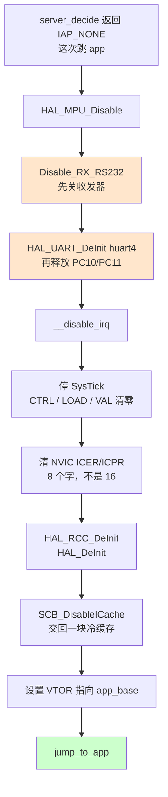

# M3 · 应用运行环境

**外面的人能让这块板做什么**：自己写的 sketch 跑起来之后，能用板子的资源 ——
64 MB 外部内存、诊断串口、看得见的引脚 —— 而且**不会被 bootloader 留下的状态坑到**。

**这个模块管到哪为止**：从 bootloader 决定「这次跳进 app」的那一刻，
到 app 拿到一块什么状态的板子，以及它能用到哪些封装好的东西。
**怎么把 app 装进去**不在这里，在 [M1 固件升级](M1-firmware-upgrade.md)。

---

## 1 · 交权那一刻，app 拿到的是什么

照 `$BOOT/IAPServer/IAP_server.c` 的 `server_jump_to_app()` 画，不是照文档画。

**四条写死在代码里、改动前必须知道的事**：

| 这一步 | 为什么是这样 |
|---|---|
| **`Disable_RX_RS232()` 必须在 `HAL_UART_DeInit()` 之前** | `MspDeInit` 会把 PC10（MAX3221 的数据输入）留成浮空，而**浮空输入接在还带电的收发器上，会把它捡到的任何东西驱到线上**。顺序反了就是往总线上灌垃圾 |
| **`HAL_MPU_Disable()`** | bootloader 的 MPU 区描述的是它自己的 lwIP 缓冲区，对 app 毫无意义；而那层 4 GB 无访问覆盖会**直接挡掉外部 SDRAM**。一条寄存器写，不像外设 de-init 那样有东西会忘 |
| **NVIC 清 8 个字不是 16** | 256 个 IRQ 是 ARMv7-M 架构上限，循环超过 8 就写进了寄存器组之间的保留填充区 |
| **`SCB_DisableICache()`** | app 不能继承装着 bootloader 指令的缓存行。I-cache 关着时它是空操作，`.ioc` 里一旦打开就立刻正确 |

> ⚠️ **这里没有 `MX_USB_DEVICE_DeInit()`，是因为这条路上 USB 从来没被初始化过。**
> `server_decide()` 刻意把全部判断做在「一个外设都还没初始化」之前，
> 让 USB、以太网、FMC 在跳 app 这条路上**原封不动** ——
> **「从来没初始化」不会出错，而一份 de-init 清单要靠人手维护，会悄悄烂掉。**

## 2 · 功能表

**一行一条需求，紧挨着写明谁证明它。** 判据和跑法不挤进这张表，在下一节。

| # | 阶段 | 要做到什么 | 谁证明 | 状态 |
|---|---|---|---|---|
| **R3-01** | 交权前 | 启动时自检 SDRAM，失败时把根因直接打出来 | `T3-01` | ✅ |
| **R3-02** | 交权那一刻 | 交权给 app 时把外设留在冷板子状态 | 手工 | ✅ |
| **R3-03** | app 拿到的资源 | app 能用板载 64MB SDRAM，**且通过封装好的 API**，用户不碰链接脚本、不用自己清零 | `T3-02` | ✅ |
| **R3-04** | 引脚可见性 | FMC 占用的 39 个脚在变体头里**有名字、看得见**，用户不会误碰 | P4 + P2（查表自洽与不分叉，非「不会误碰」） | 🟡 |
| **R3-05** | 串口不被抢 | core 的诊断串口不会被用户 sketch 掐掉 | `T3-03` | ✅ |
| **R3-06** | 串口对外 | RS232 端子 C05/C06 收发正常 | `T3-04` | ✅ |

**共 6 条。其中 4 条有测试用例直接测它，2 条没有。**

| 「谁证明」是什么 | 条数 | 哪些 |
|---|---|---|
| 有 `T3-xx` 用例直接测 | **4** | `R3-01` `R3-03` `R3-05` `R3-06` |
| 纯手工 | **1** | `R3-02` |
| 只有静态检查 | **1** | `R3-04` |

> 静态检查算不算证据，判据见 [M1](M1-firmware-upgrade.md)。
> `P4` 测的是变体头自洽、`P2` 测的是它和 `fmc.c` 不分叉 —— 都不是「用户不会误碰」，
> 所以 `R3-04` 是 🟡。⚠️ **运行时拦截被否决过**，`digitalWrite(PE7,…)` 仍然编得过，这是刻意的。

**`R3-02` 的「手工」和 M1 那十条是同一种**：有人当时操作过并判定通过，
但步骤和判据没有写在任何地方 —— 这个 ✅ 复现不了。
它的设计理由记在 `docs/tables/DECISIONS.md` 第 4 条。

## 3 · 测试怎么跑

**编号按需求顺序排** —— `T3-01` 证明 `R3-01`，往下顺推，跳过没有用例的那两条。

| # | 对应需求 | 测什么 | 判据 | 跑法 | 条件 | 状态 |
|---|---|---|---|---|---|---|
| `T3-01` | `R3-01` | 启动时 SDRAM 自检 | 日志出现 `SDRAM staging buffer OK (2 MiB at C0000000)`；坏了则出 `** SDRAM SELF-TEST FAILED at offset ... **` 并点名偏移 ¹ | `python tools/flash_bootloader.py` 自动判 | 真板子 | ✅ |
| `T3-02` | `R3-03` | `OpenPLC_SDRAM` 封装 | 19 条断言全过，并测出清零速率 ² | `python tools/run_sdram.py` | 真板子 | ✅ |
| `T3-03` | `R3-05` | 诊断串口不被 sketch 掐掉 | `Serial4.begin()` 之后 `Serial_Test` 仍然收得到，5/5 回显 ³ | `python tools/run_m5.py`（自己编译、烧写、发字节、验回显） | 真板子 | ✅ |
| `T3-04` | `R3-06` | RS232 端子收发 | 往端子 C05/C06 发字符，每个字节原样回显 | `$TOOL:TestCase/onboard/rs232/SerialPort` | 真板子 | ✅ |

**共 4 条。全部要真板子，没有一条能在主机侧跑。**

¹ **自检失败不改变任何控制流。** 板子仍然安全 —— 上传会在 CRC 那步失败、app 区不受影响。
这行日志的作用只是**把根因直接说出来**，否则 SDRAM 坏掉的症状会表现成
「上传总是 Checksum Failed」，查错方向完全跑偏。
⚠️ **它只在停在 bootloader 时才跑。**

² 清零 64 MB 约 701 ms（91 MB/s），**所以封装里才有 `allocUninitialized()`** ——
把「要不要清零」交给调用者决定，而不是每次都付这 701 ms。

³ **修之前的后果比「静默掐掉接收」严重得多**：`Serial4.begin()` 会直接**挂死 app、
板子失联、只能 ST-Link 救**。修法是把 `Serial_Test` 挪到 USART3（同样两个引脚，AF7 而非 AF8）。

## 4 · 为什么这里没有「证据日期」和「最近结果」

状态一列的规矩见 [M1 §5](M1-firmware-upgrade.md)。
## 5 · 这个模块的边界

**保证什么**：app 拿到的是一块外设从没被初始化过的板子；SDRAM 可用且有封装好的 API；
诊断串口抢不走；FMC 占的脚在变体头里有名字。

**不保证什么**（写出来，因为不写就会有人以为保证了）：

- **`R3-04` 只保证「看得见」，不保证「碰不到」** —— 需求原文本来写的是「碰不到」，
  按实际改写成了「看得见」。**运行时拦截被否决了**，`digitalWrite(PE7, …)` **仍然编得过，
  这是刻意的**。硬件事实见 `docs/hardware/HARDWARE-FACTS.md`
- **SDRAM 自检只在 bootloader 阶段跑** —— app 跑起来之后没有任何东西再查它
- **`R3-02`（冷板子状态）的证据是手工的** —— 没有自动化测试盯着它。
  bootloader 将来多初始化一个外设而忘了在交权时处理，**不会有任何东西报警**

**和其他模块的关系**：

| 关系 | 去哪看 |
|---|---|
| app 怎么被装进去的、装完怎么决定跳不跳 | [M1 固件升级](M1-firmware-upgrade.md) |
| 谁有资格装 —— 信任根、证书链、owner 槽 | [M2 归属与信任](M2-ownership.md) |
| 产线上逐路测这些端口 | [M4 产线工装](M4-production-fixture.md) |

> **引用别的模块一律只写指针，不抄内容。** 这是「一个事实只有一个家」的落地方式，
> 引用规矩见 [M1 §6](M1-firmware-upgrade.md)。

## 7 · 这个模块的细节文档

主文档是骨架，下面这些是深度。**它们在 `M3/` 子目录里，一个事实只有一个家 —— 这里是指针，不是摘要。**

| 文档 | 讲什么 |
|---|---|
| [CONSTRAINTS.md](M3/CONSTRAINTS.md) | 一条总原则：不论用户在 app 里怎么用这颗芯片，设计都必须依然正确 |
