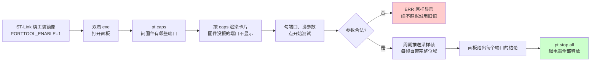

# M4 · 产线工装

**外面的人能让这块板做什么**：硬件工程师烧一个固件、双击一个 exe，
就能**逐路测板上每个端口** —— 数字输入输出、继电器、模拟量、温度、RS232、RS485 ——
不用写一行代码，也不用记任何协议。

**这个模块管到哪为止**：从烧进工装固件，到面板上每个端口给出一个结论。
**逐板出厂要检查哪几项**不在这里，那是工程约束层的出厂检查单（`CHK-C1`–`CHK-C7`）。

---

## 1 · 一次工装会话是什么形状

> **完整的协议时序图在 `docs/modules/M4/PORTTOOL-FLOW.md` 的「A.7 一次完整会话的时序」**
> —— 八条命令、四类应答行、热改参数、交权给 CAN 深度诊断那条不归路，都在那里。
> **这里不抄一份**：那份文档是这套协议的家，抄过来就会分叉。

**三条铁律**（从固件那条「不许假通过」来的，上位机必须跟着守）：

| | 规矩 |
|---|---|
| 1 | **参数给了但写错，拒绝启动，并把原因说清楚** —— 不静默沿用旧值。沿用了就是在读别的引脚，**而面板上看不出来**。上位机必须**原样显示 ERR 文本**，不要归纳成「启动失败」 |
| 2 | **`!` 帧永远带完整位域** —— 一条采样自己就说得清来自哪个脚，不依赖上位机记得当初选了什么 |

## 2 · 功能表

| # | 阶段 | 要做到什么 | 谁证明 | 状态 |
|---|---|---|---|---|
| **R4-01** | — | 硬件工程师能烧一个固件、双击一个 exe，就逐路测板上每个端口 | `T4-01` `T4-02` | 🔨 |

**共 1 条。**

> ⚠️ **`🔨` 这个符号没有定义。** `docs/tables/STATUS.md` 开头只定义了六个状态符号
> （✅ ⚠️ 🟡 ❌ ⬜ ⛔），`🔨` 是第七个，从来没写下它是什么意思。
> 这里**原样照抄**，不替它发明含义 —— 读的人现在没有办法判断它和 🟡 差在哪。
> **这个符号要么补进定义表，要么换成已定义的一个。**

`R4-01` 是这张表里唯一一条**还在做**的需求，期一、期二已完成：
八个会话（`din` `dout` `relay` `ain` `aout` `temp` `rs232` `rs485`）、
14 个交权目标、`pt.echo` 回环、逐路参数、浏览器面板、自动回环应答、多 COM 对端绑定。
**期三是 CAN / KNX / SD 的硬件层抽取 + 产线。**

## 3 · 测试怎么跑

**编号按「先协议后界面」排** —— 协议契约不成立的话，面板测什么都没意义。

| # | 对应需求 | 测什么 | 判据 | 跑法 | 条件 | 状态 |
|---|---|---|---|---|---|---|
| `T4-01` | `R4-01` | 端口工装的**协议契约** | C harness 拿真实固件源码跑，产出能力表并逐项比对 ¹ | `cd host/porttool_caps && python build.py`（要 gcc/clang） | 主机侧 | ✅ |
| `T4-02` | `R4-01` | 面板在**真浏览器**里点一遍 | 10 组断言，含「改了参数就不给结论」「卡片上不许剩协议词」「看门狗真的在续期」 ² | `cd host/porttool_panel && python run.py --port sim`（模拟板）或 `--port COMx`（真板子），都要 playwright + Chrome | 主机侧 ³ / 真板子 | ✅ |

**共 2 条。**

¹ 判据贴着代码放在 `$TOOL:TestCase/host/porttool_caps/PORTTOOL-CAPS-TEST.md`，**没有搬进文档仓**。

² 完整的十条判据在 `docs/engineering/HOW-TO-RUN-TESTS.md` 的 `T4-02` 行，**这里不抄**。
其中第 ⑧ 条是 2026-09-11 用户实测撞出来的：勾 DO3、占空比改成 50，1.4 秒出一个假失败 ——
**改了参数就不该给结论，要说清哪一项和方案不一样。**

³ ⚠️ **`--port sim` 跑得过不等于真板子跑得过。**
模拟板**自己扮演所有对端**，所以「绑对了适配器才闭合链路」这件事在模拟板上永远成立 ——
**只有真工位能证明它。** 覆盖不到的还有**真外观**：颜色、间距好不好看只能人看。

## 4 · 为什么这里没有「证据日期」和「最近结果」

状态一列的规矩见 [M1 §5](M1-firmware-upgrade.md)。
## 5 · 这个模块的边界

**测得了什么**：八个会话端口 + 14 个一次性目标，2026-09-08 在真板子上跑过 ——
SDRAM 三项、SD 认卡、以太网 PHY、CAN 内外回环、RS232 自回环、温度、DI、高侧、继电器逐路、AO。

**测不了什么**（写出来，因为不写就会有人以为测了）：

- **三条一直没在真环境验过**：USB-RS232 驱动要在干净机器上插真适配器、
  整套没上过真板、VNQ5160K-E 的 PWM 上限**数据手册查不到**，要示波器
- **交权给 CAN 深度诊断是一条不归路** —— 进去之后**只有复位才能回到工装**
- **`🔨` 状态本身说不清还差多少**（见功能表下面那条警告）

**和其他模块的关系**：

| 关系 | 去哪看 |
|---|---|
| 工装镜像怎么烧进去、为什么它不受 120K 限制 | [M1 固件升级](M1-firmware-upgrade.md) |
| 这些端口给 app 用的时候是什么样 | [M3 应用运行环境](M3-app-runtime.md) |
| 逐板出厂要检查哪七项 | 工程约束层的出厂检查单 `CHK-C1`–`CHK-C7` |

> **引用别的模块一律只写指针，不抄内容。** 这是「一个事实只有一个家」的落地方式，
> 引用规矩见 [M1 §6](M1-firmware-upgrade.md)。

## 7 · 这个模块的细节文档

主文档是骨架，下面这些是深度。**它们在 `M4/` 子目录里，一个事实只有一个家 —— 这里是指针，不是摘要。**

| 文档 | 讲什么 |
|---|---|
| [PORTTOOL-FLOW.md](M4/PORTTOOL-FLOW.md) | 工装的控制模型与逐端口测试规程，**含完整的协议时序图** |
| [PRODUCTION-FRAMEWORK.md](M4/PRODUCTION-FRAMEWORK.md) | 产线测试框架：方案文件的结构与步骤序列 |
| [PROD-CONFIG-ITEMS.md](M4/PROD-CONFIG-ITEMS.md) | 产测配置项总表 |
| [BOARD-BRINGUP-CASES.md](M4/BOARD-BRINGUP-CASES.md) | 板级点亮用例：接什么线、看什么现象算通 |
