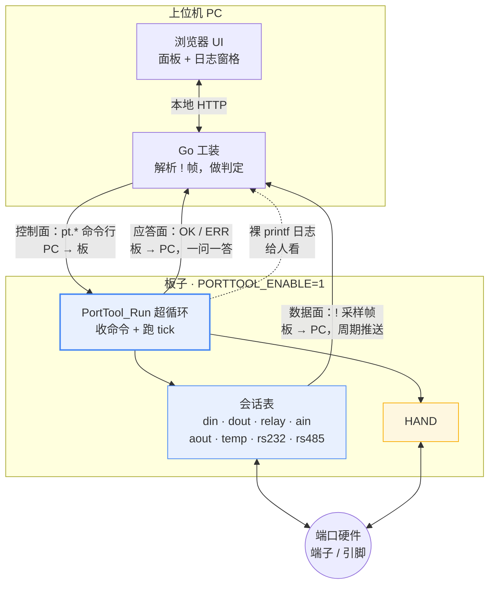
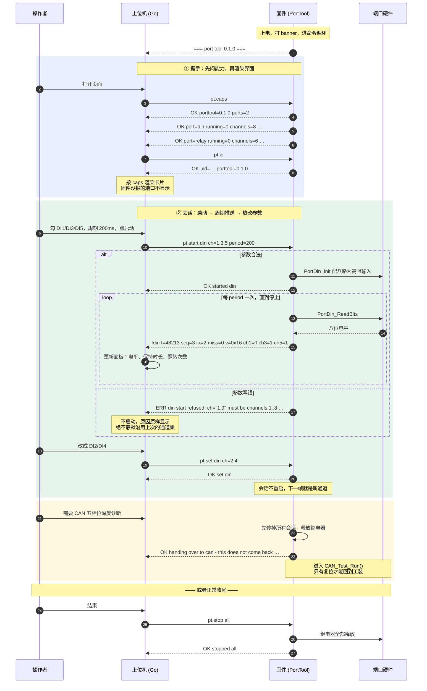
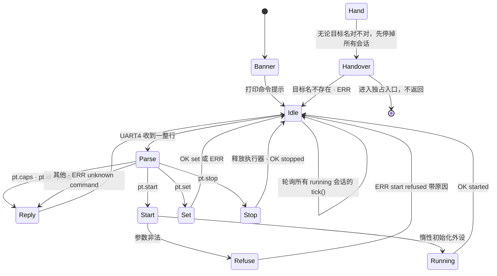
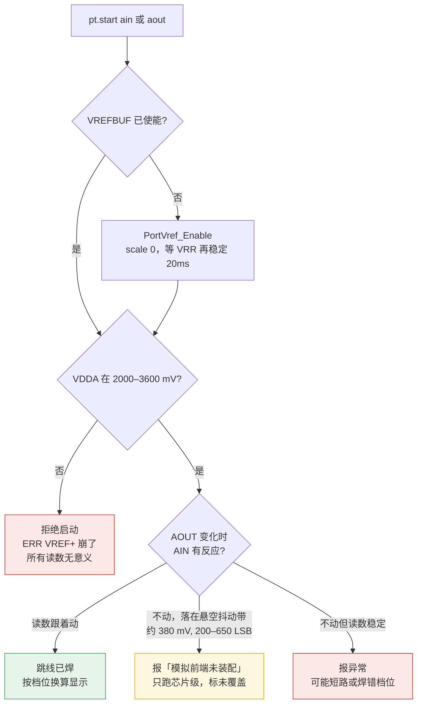
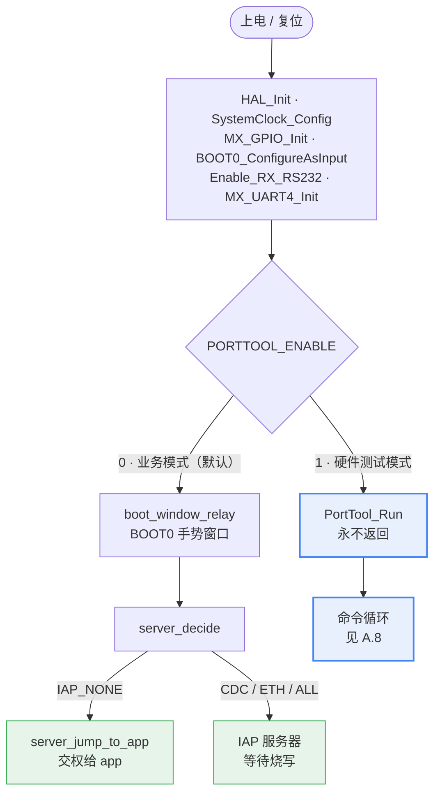
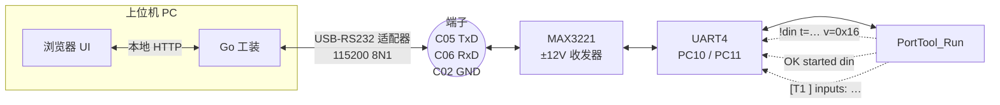
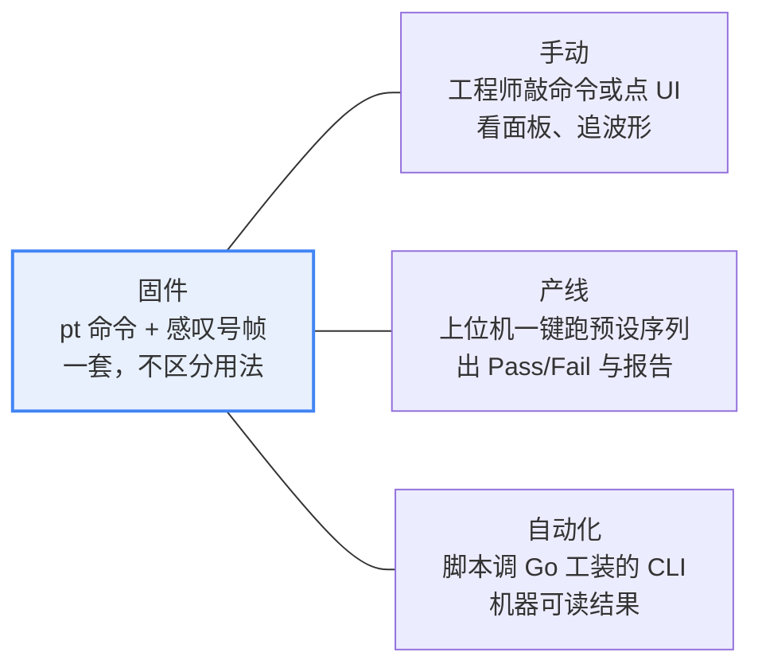
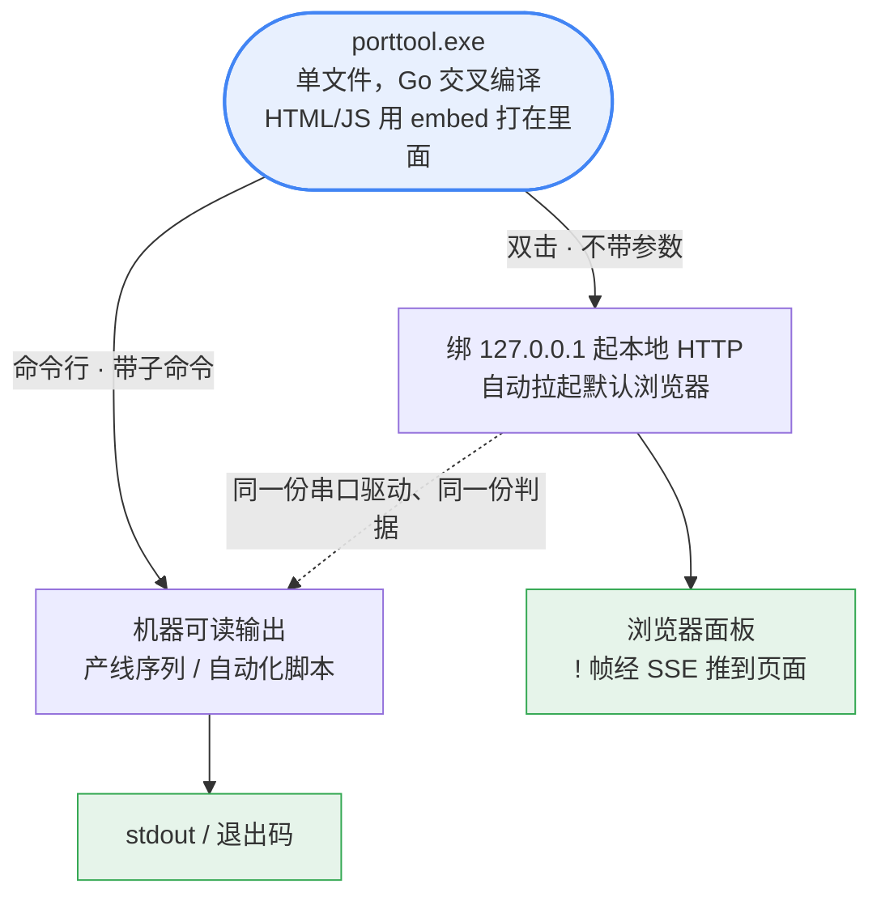

# 端口测试工装 —— 控制模型与逐端口测试规程

**总分两部分。** [A 部分](#a-总--上位机怎么控制板子)讲**上位机和板子之间的完整契约**：控制什么、怎么控制、如何响应、响应什么 —— 只看这一部分就够写上位机。[B 部分](#b-分--每个端口怎么测)讲**每一个端口具体怎么测**：怎么接、敲什么、看到什么算过、哪些坑会让判据静默失效。[C 部分](#c-附--镜像开关物理连接用法)是环境与前提。

代码在 `TestCase/porttool/`（固件侧）和 `$TOOL` 的 `internal/pt*` + `cmd/porttool`（上位机侧）。形态与分发方式见 [C.4](#c4-上位机怎么分发怎么起来)。**待办不在本文** —— 见 `$PROD/work/TODO.md` 和 `$PROD/maps/INDEX.md`。

> 本文描述固件 **`0.5.0`** 的现状。取舍理由在 [DECISIONS.md 第 9–15 条](../tables/DECISIONS.md)。⚠️ **原来这里指着 C.5「还没做的 — 三期计划」，那一节 2026-09-15 已删** —— 还没做的现在在 `$PROD/work/TODO.md` 和各张图里。
引脚事实以 [HARDWARE-FACTS.md](../hardware/HARDWARE-FACTS.md) 为准，本文不重复推导，只引用结论。
专用镜像（一次烧一个用例）的接线细节在 [BOARD-BRINGUP-CASES.md](BOARD-BRINGUP-CASES.md)，B 部分链过去，不抄。

> 图是 Mermaid，渲染成 SVG，可任意缩放。VSCode 装 Markdown Preview Mermaid Support，或直接在 GitHub 上看。

---
---

# A 总 —— 上位机怎么控制板子

## A.1 一张图：一条串口，两个平面

上位机和板子之间只有**一条 115200 8N1 的 RS232**。这条线上跑两个方向、三种行。



**判定和序列全在上位机** —— 固件只报原始采样，一个字都不判。改判据不用重烧固件。

## A.2 控制什么 —— 两类控制对象

板子上能被控制的东西有两类，**行为完全不同，上位机必须分开对待**：

| | ✅ **会话** | 🎯 **一次性动作** |
|---|---|---|
| 是什么 | 一个可启停的周期采样器，`porttool_port_t` 结构（porttool.h:52-77（`$BOOT/TestCase/porttool/porttool.h`）） | 一个跑完就返回、把量到的数写成一行 `OK` 的函数 | 一个独占的传统 bring-up 测试入口函数 |
| 现有几个 | **13 个**：`din`、`dout`、`relay`、`ain`、`aout`、`temp`、`rs232`、`rs485`、`can`、`knx`、`eth`、`usb`、`sd` | **8 个**：见 [A.3](#a3-怎么控制--全部-8-条命令) 的 `pt.run` 表 |
| 怎么启动 | `pt.start <port> [k=v …]` | `pt.run <target>` |
| 能并存吗 | **能**，多个会话同时跑，主循环轮流 tick | 跑的时候独占 CPU，跑完就还回来 |
| 参数能热改吗 | **能**，`pt.set` 不重启会话 | **不收参数**，尺度编在固件里并写进应答 |
| 怎么退出 | `pt.stop <port>` 或 `pt.stop all` | 自己就结束了 |
| 输出什么 | `!<port> …` 结构化帧，机器可解析 | 散文若干行 + **一行 `OK <target> k=v …`** |
| 主机能判吗 | **能** | **能** —— 产线序列就是拿这一类搭的 |
| 副作用 | `stop` 负责恢复（继电器全释放） | 自己按需初始化用到的外设 |

⚠️ **`pt.caps` 里两类各占自己的行**（`kind=session` / `kind=run`），但**一块硬件只占一行** —— 见 [DECISIONS.md 第 17 条](../tables/DECISIONS.md)。

**惰性初始化**：外设只有在 `pt.start` 到达时才配置（各个会话自己的 `*_inited` 标志），没启动过的端口保持复位状态。

## A.3 怎么控制 —— 全部 8 条命令

**一行一条，`\r` 或 `\n` 结尾，不回显。**单行上限 192 字节（`PORTTOOL_LINE_MAX`），超长整行丢弃并回 `ERR line too long` —— 不截断成另一条含义的命令。空行忽略。

派发在 porttool.c:191-233（`$BOOT/TestCase/porttool/porttool.c`）。

| 命令 | 参数 | 干什么 | 前置条件 | 不满足会怎样 |
|---|---|---|---|---|
| `pt.caps` | 无 | 报固件版本 + 每个会话端口的通道数与当前参数 | 无 | — |
| `pt.id` | 无 | 报 MCU 96 位 UID + 工装版本 | 无 | — |
| `pt.list` | 无 | 报哪些会话正在跑 | 无 | — |
| `pt.start` | `<port> [k=v …]` | 启动一个会话 | 端口名存在；**所有给出的参数都合法** | `ERR no such port` / `ERR <port> start refused: <原因>`，**会话不启动** |
| `pt.set` | `<port> k=v …` | 改一个**正在跑**的会话的参数 | 端口名存在 **且正在跑**；参数合法 | `ERR no such port` / `ERR <port> is not running` / `ERR <port> set refused: <原因>` |
| `pt.stop` | `<port>` 或 `all` | 停会话并恢复副作用 | 端口名存在（`all` 总是合法） | `ERR no such port` |
| `pt.echo` | `<port> <数>` | **把板子刚发的那个数原样送回去**，板子在此基础上累加。这是需求 R4 的回环 | 端口存在、**正在跑**、且 `loop=ctrl` | `ERR no such port` / `ERR <port> is not running` / `ERR <port> takes its echo on its own link, not on this one` |
| `pt.run` | `<target>`，**或不带参数** | 不带参数 = 列出全部一次性动作；带参数 = 跑一次、**回到命令循环**、用一行 `OK <target> k=v …` 报出量到的数 | 目标名存在 | `ERR no such run target "<name>" - run pt.run with no argument to list them` |

**`pt.run` 现有八个目标**（`TestCase/porttool/porttool_run.c` 里的表），按硬件归成四组：

| 目标 | 报什么 | 注意 |
|---|---|---|
| `sdram.probe` | `base` `size` `ready` `databus` `addrbus` | 自己按需 `MX_FMC_Init()` —— 工装镜像跑在 Phase 1，那里 FMC 还没起来 |
| `sdram.sweep` | `ready` `patterns` `words_each` `mismatches` `first_bad` `bad_pattern` `write_ms` `verify_ms` | **整片 64 MiB 四种花样**，产线要的那个「压力测试零错误」。⚠️ 几十秒，方案里的 `timeout_ms` 要留够 |
| `sd.probe` | `detected` `ready` `blocks` `block_size` `mib` `v2x` `class` | `detected=0` 是没插卡，`detected=1 ready=0` 是接口 |
| `sd.integrity` | `mounted` `wrote` `read_back` `identical` `bytes` 两个 CRC `fresult` | 一轮 4 KiB |
| `rtc.read` | `init` `clk` `date` `time` | 自己按需 `MX_RTC_Init()`。**只读不写** —— 备份域里住着 iap_auth 的 nonce 计数器 |
| `led.blink` | `pin` `pulses` `half_ms` `observed=unknown` | PE2 闪六次。**没有回读，`observed` 永远是 unknown**，看没看见是人的判断 |


> ⚠️ **`pt.run` 的结果主机能判**（[DECISIONS.md 第 22 条](../tables/DECISIONS.md)：判定一律在上位机）。
>
> ⚠️ **`pt.run` 的应答里是量到的数，不是结论。** 没有任何目标打 PASS 或 FAIL。限值住在上位机的方案文件里，这才是「改一个限值不用重烧板子」成立的原因。
>
> ⚠️ **它执行的检查会先打自己的散文**（例如 `SDRAM_TEST: data bus OK …`），**然后**才是那一行 `OK`。上位机必须按「裸日志行不结束应答」来读 —— 这正是 `ptproto` 的四类行分流本来就做的事。⚠️ `pt.run` **不停掉正在跑的会话**，中间可能夹着 `!` 采样帧。
>
> ⚠️ **`pt.echo` 对 `loop=link` 的端口是被拒绝的**，这是刻意的。那些端口从**被测链路**上取回复；在控制口上答它，会让计数器在那条链路已经死掉的情况下照样往上涨 —— 那正是这套工装不许产生的假通过。取舍见 [DECISIONS.md 第 9 条](../tables/DECISIONS.md)。


### 参数语法

`k=v`，空格分隔，值可以用双引号包住（引号内的 `=` 不会被当成下一个参数）。解析器在 porttool_cmd.c（`$BOOT/TestCase/porttool/porttool_cmd.c`）。三种值类型：

| 类型 | 写法 | 合法范围 | 例 |
|---|---|---|---|
| 通道掩码 | 逗号分隔的十进制 | `1..<channels>`，**不能为空集** | `ch=1,3,5` |
| 无符号整数 | 纯十进制数字 | 见各端口 | `period=200` |
| 枚举 | 裸字符串 | 见各端口 | `mode=square` |
| **逐路取值** | `<路>:<值>` 逗号分隔 | 路 `1..<channels>`，值见各端口，**同一路不能出现两次** | `duty=1:20,5:75` |

**逐路取值的参数同时接受单值写法**（`duty=100` = 所有选中路都设成 100），因为命令行和文档里原本就是那么写的。解析器是共用的 `PortCmd_GetPairs()`。

⚠️ **拒绝就是「什么都没变」。**参数解析先写进临时变量，整行都合法才提交 —— 所以一条在第三个参数上被拒的命令，前两个参数也没有生效。不这样的话「命令被拒」和「状态没动」就不是同一件事，而面板上看不出差别。

**没给的参数保持上次的值**，给了但写错**拒绝整条命令** —— 见 [A.6 铁律 1](#a6-三条铁律)。

## A.4 如何响应 —— 四类行，看第一个字符就能分

**串口上回来的每一行都属于且只属于以下四类之一。**上位机按第一个字符分流，不需要状态机。

| 行首 | 类别 | 何时出现 | 谁消费 |
|---|---|---|---|
| `OK ` | 成功应答 | 每条命令之后，**可能多行**（`pt.caps` / `pt.list` / `pt.run` 无参） | 上位机，配对到刚发的命令 |
| `ERR ` | 失败应答 | 命令被拒 | 上位机，**原文显示给人**，不要改写 |
| `!` | 采样帧 | 会话周期到点，**与命令无关地异步冒出来** | 上位机解析，进面板 |
| 其他 | 裸日志 | 开机 banner、检查自己打的散文 |

### 每条命令的确切应答

照 porttool.c（`$BOOT/TestCase/porttool/porttool.c`） 的 `printf` 抄的，格式串不要自己猜。

```text
pt.caps
  OK porttool=0.5.0 ports=17 lines=45
  OK port=din kind=session blk=D term=D02-D09 channels=8 loop=ctrl params=ch,period running=0
  OK vals=din ch=1,2,3,4,5,6,7,8 period=200
  OK limits=din ch:1..8 period:50..
  OK port=relay kind=session blk=B term=B01-B12 channels=6 loop=ctrl params=ch,mode,on,period running=0
  OK vals=relay ch=1,2,3,4,5,6 mode=hold on=1:0,2:0,3:0,4:0,5:0,6:0 period=2000
  OK terms=relay B01+B02,B03+B04,B05+B06,B07+B08,B09+B10,B11+B12
  OK port=can kind=session blk=C term=C07,C08 channels=1 loop=link params=baud,mode,period running=0 targets=can,can.soak,can.scope,can.echo
  OK port=sdram kind=run blk=- term=U6 channels=1 loop=none runs=sdram.probe,sdram.sweep,sdram.crc
  OK port=led kind=run blk=- term=- channels=1 loop=none runs=led.blink
  …
    ^ 表头声明 lines=<n>，后面**恰好**跟 n 行。**行数不等于 1 + ports** ——
      一个端口可能占 2~3 行（port= 形状、vals= 当前取值、terms= 端子标签），
      而以后还会有更多。**上位机读固定行数，不要靠「读到没有了」判断结束** ——
      这条链上没有结束标记，而正在跑的会话会把 ! 帧插到回复中间。

  为什么形状和取值分两行：**一个逐路参数就塞不进 192 字节**。dout 光
  `duty=1:0,2:0,…,8:0` 就占 31 个字符，合成一行是 195 字节 —— 超了。
  超了会被截断，而**被截断的 caps 行就是面板永远不会渲染的那个参数**。
  这条是 2026-09-07 由用例 H4 的行长检查当场抓出来的。

pt.id
  OK uid=00340041XXXXXXXXXXXXXXXX porttool=0.5.0

pt.list
  OK running=din          <- 每个在跑的一行
  OK running=relay
  OK running=none         <- 一个都没跑时的唯一一行

pt.start din ch=1,3,5 period=200
  OK started din
  ERR no such port "dinn"
  ERR din start refused: ch="1,9" must be channels 1..8 separated by commas
  ERR din start refused: period="abc" is not a number

pt.set din ch=2,4
  OK set din
  ERR din is not running

pt.stop din  /  pt.stop all
  OK stopped din
  OK stopped all

  …共 14 行

  OK handing over to can - this does not come back, reset the board to return to the port tool
  （之后是那个测试自己的裸 printf，再也不回命令循环）

（未知命令）
  ERR unknown command "pt.foo"
```


## A.5 响应什么 —— 采样帧的字段

```text
!<port> t=<ms> <字段…>
```

`t` 是 `HAL_GetTick()`，板子开机以来的毫秒数，**会在 49.7 天回绕**。生成在 porttool.c:39-49（`$BOOT/TestCase/porttool/porttool.c`），整帧上限 192 字节。

### `!din`

```text
!din t=48213 seq=3 rx=2 miss=0 v=0x16 ch1=0 ch3=1 ch5=1
```

| 字段 | 含义 |
|---|---|
| `v` | **八位全量位域**，端子序 bit0 = DI1 … bit7 = DI8。**无论选了哪几路都是全的** |
| `ch<n>` | 只有 `ch=` 选中的那几路，值 0/1，和 `v` 对应位一致 |

### `!relay`

```text
!relay t=48213 seq=3 rx=2 miss=0 mode=square ch1=1 ch2=0
```

| 字段 | 含义 |
|---|---|
| `mode` | `hold` 或 `square` |
| `level` | 这一拍**命令的**电平。`square` 模式下每帧翻转一次 |
| `ch<n>` | 选中的那几路，**每路自己的电平**（`on=1:1,2:0,3:1` 设，和 dout 的 `duty=` 共用 `ch:值` 解析器）。`mode=square` 下每半周期每路各自翻转，所以起始时电平不同的一组会保持那个花样来回翻 |

> ⚠️ **没有单独的 `level=` 字段。**六路各自独立，一个数只在它们恰好一致时才是对的，其余时候是静默的错。这是 0.2.0 相对 0.1.0 的破坏性改动（[DECISIONS.md 第 12 条](../tables/DECISIONS.md)）。

> ⚠️ **`!relay` 报的是「驱动成什么」，不是「触点真的动了没有」** —— 继电器是 HF41F 干接点，板上没有回读。要证明触点动作必须靠外部回路或人耳，见 [B.2](#b2-relay--继电器输出会话-)。

### 每一帧都带的回环三个字段

```text
!<port> t=<ms> seq=<n> rx=<n> miss=<n> <该端口自己的字段…>
```

| 字段 | 含义 | 上位机拿它干什么 |
|---|---|---|
| `seq` | 本帧发出的数 | 显示计数 |
| `rx` | 板子最近一次**真正收回来**的数 | `seq - rx` 恒为 1 就是闭环正常 |
| `miss` | 连续没等到有效回复的拍数 | 一直涨 = 回程断了 |

**上位机每收到一帧就回一次 `pt.echo <port> <seq>`**（`loop=ctrl` 的端口），板子在收回来的数上加一继续。

⚠️ **三条容易读错的**：

1. **没回复时 `seq` 不动。**只有 `miss` 涨。一个还在往上爬的 `seq` 会让断掉的回环看起来是活的，所以宁可让它停住。
2. **过期回复算 miss，不算闭合。**收回来的数和当前 `seq` 不相等，说明它回答的是更早那一帧。
3. **第一帧的 `miss` 是 0。**那一拍上位机还没机会回复，判它 miss 会让每个健康的回环都从 1 起步。

⚠️ **`loop=ctrl` 的端口，这三个数不是该端口的判据。**它们只说明控制口和循环还活着。DI 的判据永远是 `v=` 位域，AOUT 的判据永远是端子上的电流。面板必须把它们和读数分区显示（[DECISIONS.md 第 9 条](../tables/DECISIONS.md)）。

### `!dout`

```text
!dout t=51200 seq=3 rx=2 miss=0 mode=hold freq=1000 ch1=20 ch5=75
```

| 字段 | 含义 |
|---|---|
| `mode` | `hold` 或 `blink` |
| `freq` | 定时器**实际落在**的频率，不是请求的那个（预分频是整数） |
| `ch<n>` | 选中那几路**此刻正在驱动的占空比**，百分比。`blink` 的暗半周期里这里是 0，不是设定值 —— 帧要说的是引脚上现在是什么 |

### `!ain`

```text
!ain t=48213 seq=1 rx=0 miss=0 vdda=3287 ok=1 ch1=21850/2071 ch2=530/50
```

| 字段 | 含义 |
|---|---|
| `vdda` | 用 VREFINT 量出来的 VDDA，毫伏 |
| `ok` | **1 = VDDA 量到了且落在合理带内**。`ok=0` 时这一帧所有读数都没有意义 |
| `ch<n>` | `原始码/引脚毫伏`。**是 MCU 引脚上的值，不是端子上的值** |

⚠️ **端子换算不在固件里算**，因为它取决于板子焊成了哪个档位 —— 那是一次性的焊接选择，固件读不回来。上位机做换算，并且要说清自己假设的是哪个档。

⚠️ **`ok=0` 时读数照样报。**藏起来的话就没有东西可诊断了 —— 而板上没有基准芯片，VREFBUF 没使能时 ADC 会返回 `0x8000` 这类**看起来完全像真数据**的值。所以判据是 `ok`，不是读数本身。

### `!aout`

```text
!aout t=48213 seq=1 rx=0 miss=0 ch1=500/488/4883 ch2=1500/1465/14648
```

| 字段 | 含义 |
|---|---|
| `ch<n>` | `请求值/量化后的值/预期微安`。三个都报：只报请求会藏掉几毫伏的量化误差，只报量化值会让面板看起来没理会输入 |

⚠️ **微安那个数是「应该是多少」，不是测量值** —— 板上没有任何通道能读回那个电流。**万用表串在回路里才是唯一的判据**，这个端口存在的意义就在这里。

⚠️ **它只在跳线 JP3/JP4 开路时成立。**闭合的话 VREF 经 40k2 灌进 XTR111 的求和节点，输出变成 4–20 mA live-zero（DAC 设 0 时已有约 4.85 mA）。那也是固件读不回来的焊接选择，所以这个数假设开路。

### `!temp`

```text
!temp t=48213 seq=1 rx=0 miss=0 vdda=3287 ok=1 ch1=738/238 ch2=751/251
```

| 字段 | 含义 |
|---|---|
| `ch<n>` | `毫伏/十分之一摄氏度`。用十分之一度而不是整度，是为了让缓慢漂移看得见，同时不让浮点数上串口 |

板上两个 LM50：ch1 在短路保护上，ch2 在高侧开关上。**它们不是端子**，接不了外部东西 —— 值得看的是 DO 驱动带载发热，所以它是独立会话而不是 dout 上的一个字段：正好在别的端口被大力驱动时最该看它。

## A.6 三条铁律

从现有代码那条「不许假通过」来的，上位机必须跟着守：

1. **参数给了但写错，拒绝启动，并把原因说清楚** —— 不静默沿用旧值。沿用了就是在读别的引脚，而面板上看不出来（porttool_din.c:30-32（`$BOOT/TestCase/porttool/porttool_din.c`） 的注释就是这条）。上位机**必须原样显示 ERR 文本**，不要归纳成「启动失败」。
2. **`!` 帧永远带完整位域** —— 一条采样自己就说得清来自哪个脚，不依赖上位机记得当初选了什么。

## A.7 一次完整会话的时序



## A.8 固件主循环



**采样周期下限 50 ms**（`PORTTOOL_PERIOD_MIN_MS`）：115200 ≈ 11.5 KB/s，而 `printf` 是阻塞的，周期太小会把主循环拖死。小于 50 的请求被**静默夹到 50**，不报错 —— 上位机想知道实际周期就读 `pt.caps` 回来的 `period=`。

---
---

# B 分 —— 每个端口怎么测

图例：**✅ 会话**（`pt.start`，可并存可启停） · **🎯 一次性动作**（`pt.run`） · **⬜ 未实现**

**通用前置**（每一项都成立，下面不重复）：`PORTTOOL_ENABLE=1` 的镜像，ST-Link 烧进去，USB-RS232 适配器接端子 **C05(TxD) / C06(RxD) / C02(GND)**，115200 8N1。见 [C.2](#c2-物理连接一条串口两种行)。

## B.1 `din` —— 数字输入（会话 ✅）

Klemmblock D，Upper Deck。代码 porttool_din.c（`$BOOT/TestCase/porttool/porttool_din.c`） + port_din.c（`$BOOT/TestCase/common/port_din.c`）。

| | |
|---|---|
| **测什么** | 八路数字输入的**电平**、**保持时长**、**翻转次数**。前级是 LM339 比较器 + 分压，耐 24 V 现场电平 |
| **端子 / 引脚** | D02–D09 → `PC6 PB5 PB6 PB7 PH10 PH11 PI5 PI6`（bit0 = DI1 起算） |
| **怎么接** | 要么不接（验高阻输入本身），要么把 24 V 现场信号接上。也可以**从 DO 引一根 8 芯线过来**（DO 输出 24 V，DI 耐 24 V，一根线覆盖 16 个通道）。完整接线见 [BOARD-BRINGUP-CASES.md](BOARD-BRINGUP-CASES.md) 的 Digital In 行 |
| **敲什么** | `pt.start din ch=1,3,5 period=200`<br/>参数：`ch=` 1..8 逗号分隔（默认全 8 路）、`period=` 毫秒（默认 200，下限 50）<br/>热改：`pt.set din ch=2,4`　停：`pt.stop din` |
| **看到什么算过** | `!din` 帧的 `v=` 位域跟着外部驱动变；DI\<n\> 拉高时对应 bit 为 1，拉低为 0，**和实际驱动逐位一致** |
| **坑** | ⚠️ MCU 侧有外部 10k 上拉，固件配 `GPIO_NOPULL`，**不开内部上拉**。<br/>⚠️ **「恒读 0」和「恒读 1」是两个不同故障**（[HARDWARE-FACTS.md:152](../hardware/HARDWARE-FACTS.md)）：恒 0 = 有 24 V 但那一路没接线；恒 1 = **整个 24 V / 模拟供电没上来**。上位机必须分开报，不能都说成「低电平」 |

**同一组引脚上还没做的**：编码器 1–4（`TIM3 / TIM4 / TIM5 / TIM8` 的 CH1+CH2，正交计数与方向）⬜

## B.2 `relay` —— 继电器输出（会话 ✅）

Klemmblock B，Lower Deck。代码 porttool_relay.c（`$BOOT/TestCase/porttool/porttool_relay.c`） + relay.c（`$BOOT/Core/Src/relay.c`）。

| | |
|---|---|
| **测什么** | 六路继电器的**吸合 / 释放**，以及**方波连续翻转**（老化、听咔哒声、示波器看触点） |
| **端子 / 引脚** | B01–B12 → `PI8 PI10 PI11 PG7 PG3 PD3`（HF41F 干接点） |
| **怎么接** | 判「驱动到了」：量 MCU 引脚或 Lower Deck T2–T7 的栅极。<br/>判「触点真的动了」：某一路触点串电压源 + 限流电阻，探头量电阻两端。详见 [BOARD-BRINGUP-CASES.md](BOARD-BRINGUP-CASES.md) 的继电器行 |
| **敲什么** | 保持某个电平：`pt.start relay ch=1,2 mode=hold on=1`<br/>连续方波：`pt.start relay ch=1,2,3,4,5,6 mode=square period=2000`<br/>参数：`ch=` 1..6（默认全 6 路）、`mode=hold` 或 `square`（默认 hold）、`on=0` 或 `1`（hold 时的电平，默认 0）、`period=` 方波**半周期**毫秒（默认 2000，下限 50） |
| **看到什么算过** | `mode=square` 下每 `period` 听到一次咔哒 + 收到一帧 `!relay`，`level` 在 0/1 之间交替；串了负载的那一路，探头上电压跟着翻 |
| **坑** | ⚠️ **`!relay` 只报驱动意图，不报触点状态** —— 板上没有回读通道。<br/>⚠️ **`pt.start` 会先把六路全部释放再驱动选中的**（`relay_release_all()` 后 `relay_drive()`），所以重启会话 = 未选中的路必定回到释放态。<br/>⚠️ 自动判通断需要把电送过触点再被某个输入检测到，但 **DI 只有 8 路、DO 有 14 路**，占不过来。第一期靠人听咔哒 |

## B.7 `rs232` —— 自动发自动收（会话 ✅）

Klemmblock C。代码 porttool_rs232.c（`$BOOT/TestCase/porttool/porttool_rs232.c`）。

| | |
|---|---|
| **测什么** | 端子 C05/C06 这条通道**持续**双向通 —— 不是开机时通一次 |
| **端子 / 引脚** | C05 TXD / C06 RXD → `PC10 · PC11`，`PB10` = MAX3221 EN |
| **怎么接** | 就是工装自己那条线，GND 接 C02 / C11 / C12 |
| **敲什么** | `pt.start rs232 period=3000`。参数只有 `period=` |
| **看到什么算过** | `!rs232` 帧的 `seq − rx` 恒为 1、`miss` 保持 0。`rxlines=` 跟着涨说明接收方向一直在过真流量 |
| **坑** | ⚠️ **`loop=self`，不是 `loop=ctrl`。**回环确实走控制口，但对这个端口来说那正是重点：字节双向穿过端子、MAX3221 和 PC10/PC11。**别的端口那个计数器只说明控制口活着；这里它就是判据。**<br/>⚠️ 面板上**没有**那个进去就没有命令循环了，只能按复位键。命令行敲得到，那是刻意的行为而不是一次点击 |

## B.8 `rs485` —— RS485 链路回环（会话 ✅）

Klemmblock C。代码 porttool_rs485.c（`$BOOT/TestCase/porttool/porttool_rs485.c`） + port_rs485.c（`$BOOT/TestCase/common/port_rs485.c`）。

**这是第一个真正的 `loop=link`** —— 回环走被测的那对差分线，所以这个计数器是**那对线的判据**，不像 `loop=ctrl` 只说明控制口活着。

| | |
|---|---|
| **测什么** | A/B 差分对双向通：板子发一个数，从**同一对线**上收回来，在此基础上累加 |
| **端子 / 引脚** | C10 / C11 (A/B) → `PD5 TX · PD6 RX · PD4 DIR`，USART2 |
| **怎么接** | **必须有对端。**USB-RS485 适配器 A 接 **A10**（J11-3）、B 接 **A11**（J11-2）。对端把收到的那行原样送回去 —— 上位机的链路应答器，或 `$TOOL/TestCase/tools/rs485_echo.py` |
| **敲什么** | `pt.start rs485 baud=115200 period=3000`。`baud=` 只收 9600 / 19200 / 38400 / 57600 / 115200 |
| **看到什么算过** | `!rs485` 的 `seq − rx` 恒为 1、`miss` 保持 0。`junk=` 保持 0（有数说明线上有东西但不是应答） |
| **坑** | ⚠️ **`pt.echo` 对这个端口是被拒绝的**（`ERR rs485 takes its echo on its own link, not on this one`）。在控制口上答它会让计数器在这对线已经死掉时照样往上涨 —— 那是这套工装绝不允许的假通过。<br/>⚠️ **半双工，而且是一条网络**：`PD4` 同时驱动 /RE 和 DE，发送时接收器是关的，**板子听不到自己**。没有对端就永远闭合不了 —— 那是接线不对，不是会话有问题。<br/>⚠️ **状态仍然从控制口上报。**上位机在一个地方读所有端口的状态；用 RS485 汇报 RS485 的健康，恰好在最需要的时候读不到。<br/>⚠️ 同一块硬件还有一个深度入口（五项引脚级诊断），它挂在**同一张卡**上，`pt.caps` 的会话行带 `targets=rs485` |

## B.4 模拟量 —— 三个会话 ✅

Klemmblock D，Upper Deck 与板载。三个会话：`ain`（porttool_ain.c（`$BOOT/TestCase/porttool/porttool_ain.c`））、`aout`（porttool_aout.c（`$BOOT/TestCase/porttool/porttool_aout.c`））、`temp`（porttool_temp.c（`$BOOT/TestCase/porttool/porttool_temp.c`）），共用层是 `TestCase/common/port_adc.c` / `port_dac.c` / `port_vref.c`。

**敲什么**：`pt.start ain period=500` · `pt.start aout ch=1,2 mv=1:500,2:1500` · `pt.start temp period=1000`。

⚠️ **三个都在启动时先过 VREFBUF 这道闸**：使能不了就**拒绝启动**，而不是启动后报一堆看起来像真数据的数。帧格式与各自的坑见 [A.5](#a5-响应什么--采样帧的字段)。

| 端口 | 端子 | 引脚 | 测什么 | 换算 |
|---|---|---|---|---|
| Analog IN 1 | D12 | `PC3_C · ADC3_INP1` | 原始码 + 引脚 mV，**电压档** | 端子 V = 引脚 mV × 4.0089 |
| Analog IN 2 | D13 | `PA6 · ADC1_INP3` | 原始码 + 引脚 mV，**电流档** | 端子 µA = 引脚 mV × 1000 / 124 |
| Analog OUT 1 | D14 | `PA4 · DAC1_OUT1` | 设定电流 | `Iout = Vin × 10 / 1024`；设 500 / 1500 mV 应读到 **4.883 / 14.648 mA** |
| Analog OUT 2 | D15 | `PA5 · DAC1_OUT2` | 同上 | 同上 |
| AOUT 故障反馈 | — | `PI4 / PE3` | XTR111 开路 / 过载报警 | — |
| 板载温度 ×2 | — | `PA0 · ADC1_CH16`（短路保护）<br/>`PA3 · ADC1_CH15`（高侧开关） | LM50 | `T = (mV − 500) / 10`，合理带 −25…+100 °C |

**怎么接**：可调电压源接 Analog In 1（J3-4）或 In 2（J4-1），地接 Analog GND（J4-4 / J4-5）；电流表串在 Analog Out → 表 → Analog GND 的回路里。

### 模拟量启动前必须先过这道闸



> ⚠️ **四个会静默毁掉判据的坑**（[HARDWARE-FACTS.md:154-222](../hardware/HARDWARE-FACTS.md)）：
> 1. **VREFBUF 不使能** → ADC 读出 `0x8000` / `0x4000` 这类**看起来像真数据**的值。板上没有基准芯片
> 2. **模拟跳线 JP1–JP9 出厂全开路** → `PC3_C` 和 `PA6` 彻底悬空，读到的只是悬空脚。**焊上去不可逆**
> 3. **`SYSCFG_PMCR.PC3SO` 复位默认闭合** → 数字单元加载该节点，读数差约 16%。模拟采样一律置开
> 4. **AOUT 的电流公式只在 JP3 / JP4 开路时成立** —— 那两个跳线把 VREF 经 40k2 灌进 XTR111 的 VIN 求和节点，闭合后变成 4–20 mA live-zero（DAC 设 0 时已有约 4.85 mA）

## B.6 `dout` —— 数字输出（会话 ✅）

Klemmblock A，Lower Deck。代码 porttool_dout.c（`$BOOT/TestCase/porttool/porttool_dout.c`） + port_dout.c（`$BOOT/TestCase/common/port_dout.c`）。

| | |
|---|---|
| **测什么** | 八路 24 V 输出的**开关**与**各自独立的 PWM 占空比** |
| **端子 / 引脚** | A03–A10 → `PB13 PB0 PH15 PE4 PA8 PA9 PI7 PE5`，前级 U3/U4 两颗 VNQ5160K-E 智能高侧开关，各管四路 |
| **怎么接** | 万用表或示波器量端子。一种省事的接法是一根八芯线把 A03–A10 接到 D02–D09（DO 出 24 V、DI 耐 24 V）。⚠️ **它是工位的夹具选择，不是面板里的用例**（[DECISIONS.md 43](../tables/DECISIONS.md)） |
| **敲什么** | 逐路占空比：`pt.start dout ch=1,5 duty=1:20,5:75 freq=1000`<br/>全部开：`pt.start dout duty=100`<br/>翻转给 DI 看：`pt.start dout ch=1,2,3,4,5,6,7,8 mode=blink duty=100 period=500`<br/>参数：`ch=` 1..8、`mode=hold|blink`、`duty=` 单值或逐路（0..100 %）、`freq=` 1..2000 Hz（默认 1000）、`period=` blink 半周期毫秒 |
| **看到什么算过** | 端子电压随占空比变；`blink` 下 DI 会话的 `v=` 位域跟着 DO 翻转逐位对应 |
| **坑** | ⚠️ **软件 PWM，不是硬件定时器通道。**八路引脚确实都在定时器通道上，但**两两共用一个比较单元**（DO1/DO5 = TIM1_CH1 及其互补输出、DO2/DO6 = TIM1_CH2、DO3/DO7 = TIM8_CH3、DO4/DO8 = TIM15_CH1），硬件方案只能给 4 个独立占空比。理由见 [DECISIONS.md 第 10 条](../tables/DECISIONS.md)。<br/>⚠️ **中断跑在 TIM7 上**，频率 = `freq × 100`，所以 `freq` 封顶 2000 Hz（中断 200 kHz）。<br/>⚠️ **VNQ5160K-E 的 PWM 上限没有数据手册可查** —— 它是智能高侧开关，内部有电荷泵和保护逻辑。`freq` 刻意放开就是为了让工程师扫频量出来，**实测结果要补进 [HARDWARE-FACTS.md](../hardware/HARDWARE-FACTS.md)**。<br/>⚠️ **`pt.

## B.5 其余未实现的端口 ⬜

这些还没有任何入口，列在这里是为了说清**工装当前覆盖不到哪里**。怎么测的规程等实现时再写。

### Klemmblock A —— 数字输出（Lower Deck）

| 端口 | 端子 | 引脚 | 要测什么 |
|---|---|---|---|
| ~~Digital Out 1–8~~ | ~~A03–A10~~ | — | **已实现，移到 [B.6](#b6-dout--数字输出会话-)** |

前级是 **VNQ5160K 智能高侧开关**，输出 24 V。DI 耐 24 V，所以 **DO→DI 线束互接是可行的一种接法**，一根 8 芯线覆盖 16 个通道 —— 但那是工位自己决定的夹具（[DECISIONS.md 43](../tables/DECISIONS.md)）。

### Bridge 板自带接口

| 端口 | 引脚 | 要测什么 |
|---|---|---|
| USB-C（仅 Device） | `PA11 / PA12` | 枚举出 CDC 串口 |
| 以太网 | RMII + LAN8742A | 拿到 IP、链路速率、丢包 |
| RTC 电池 | VBAT + 32.768 kHz | 走时、备份域是否失效 |
| 状态 LED | `PE2`（高亮低灭） | 目视 |

### Junction Link —— DIN 导轨扩展口（J4，20 pin）

| 端口 | 引脚 | 要测什么 |
|---|---|---|
| UART4 | `PH13 TX · PH14 RX` | TX↔RX 短接自环 |
| SPI2 | `PI1 SCK · PI3 MOSI · PC2_C MISO · PI0 NSS` | MOSI↔MISO 短接自环 |
| SPI6 | `PG13 SCK · PG14 MOSI · PB4 MISO` | 同上 |
| I2C2 | `PH4 SCL · PH5 SDA · PH6 SMBA` | 需要从设备（一颗 24C02 即可） |
| Debug Trigger | `PC7` | 逻辑分析仪触发点 |

> ⚠️ `PH13 / PH14` 也是 **UART4**，和 RS232 端子的控制台共用同一个外设 —— **同一个 UART 只有一个句柄槽，最后一次 `begin()` 赢**。扩展口上用 UART4 就会顶掉工装自己的控制通道。

---
---

# C 附 —— 镜像开关、物理连接、用法

## C.0 一条范围规矩：**工装镜像里没有 bootloader 这件事**

**用户 2026-09-08 强调过两次。** 工装是一个独立的镜像，ST-Link 整片烧、自己有链接脚本（`FLASH` 拿满 2048K）。所以：

- **不许用「反正产线那一站会烧 bootloader」来论证任何测试怎么做。** 2026-09-08 我用这条理由把 USB 测试推到主机侧看 CDC 枚举，被驳回 —— 那是把 bootloader 拉进了工装的世界。
- 工装要测某个外设，就**在工装镜像里把那个外设跑起来**。尺寸不再是理由（见 [DECISIONS.md 第 14 条](../tables/DECISIONS.md) 的 2026-09-08 补充）。
- 反过来也成立：工装镜像里的东西不进 bootloader，`PORTTOOL_ENABLE` 就是那道墙。

## C.1 `PORTTOOL_ENABLE` 怎么把业务线整条绕开

这个宏决定这块板是业务模式还是硬件测试模式。**默认 0。**



**测试模式下 `PortTool_Run()` 永不返回**，所以 BOOT0 手势、启动决策、跳 app、IAP 服务器**一个都不执行**。

调用点在 main.c（`$BOOT/Core/Src/main.c`） 的 `USER CODE BEGIN SysInit` 块里，紧跟 `MX_UART4_Init()` 之后 —— UART4 起来了，工装要的就只有这个，它既是命令通道也是日志。位置和写法跟旁边那排 `#if KNX_TEST_ENABLE` 完全一样，并且**并进了同一条互斥 `#error`**：这些入口没有一个会返回，所以同时只能开一个。

> ⚠️ **`PORTTOOL_ENABLE` 不在任何构建配置里，要在 CubeIDE 的工程属性里手工加**（2026-09-07 定，[DECISIONS.md 第 14 条](../tables/DECISIONS.md)）。**忘了改回 0 就发出一个开不了机的 bootloader** —— 那块板永远到不了 IAP 服务器，USB 和以太网都升不了级。所以 `PORTTOOL_ENABLE=1` 时编译会打一条 `#warning` 把这件事写进构建日志。
不涉及烧写工具、不涉及授权 —— ST-Link 直接烧固件，开串口看结果。

`PORTTOOL_ENABLE=0` 时 `TestCase/porttool/` 的每个 `.c` 整个函数体都被宏关掉，**一个字节都不进镜像**（工程没开 `--gc-sections`，只靠「不调用」省不下 Flash）。

## C.2 物理连接：一条串口，两种行



⚠️ **端子是真 ±12V，必须用 USB-RS232 适配器，接 TTL 适配器可能烧掉**（[HARDWARE-FACTS.md:17](../hardware/HARDWARE-FACTS.md)）。
⚠️ **这条通道被工装占用，所以工装测不了 RS232 端子本身** —— 见 [B.3.3](#b33-rs232--rs232klemmblock-c)。
⚠️ `PB10` 拉低 = MAX3221 整片关断，printf 一个字节都出不来。`main.c` 在 `MX_UART4_Init()` 前已 `Enable_RX_RS232()`。

## C.3 三种用法，固件只有一套



**判定和序列全在上位机** —— 固件只报原始采样。改判据不用重烧固件，产线和研发用同一份固件。

## C.4 上位机怎么分发、怎么起来

**一个 exe，两种模式。**2026-09-04 拍板，见 [DECISIONS.md 第 7、8 条](../tables/DECISIONS.md)。

> **和 IAPTool 的关系**（2026-09-07 定）：两者住在 `$TOOL` 同一个 Go module 里，共享 `internal/`（serialx 的开口与重试 · logx · config · buildinfo），`compile_tool.sh` 一次产出 **`IAPTool.exe` 和 `PortTool.exe` 两个文件**。
>
> 这不和上面那句冲突 —— 「一个 exe 两种模式」说的是 **PortTool 自己**既是面板又是 CLI，不是说这两个工具要合成一个。受众不同：硬件工程师的工具里不该出现固件签名和 `takeown`。
>
> **面板上的文字是中文、大白话；固件 printf、`OK`/`ERR` 应答、两个 exe 的 stdout 仍然是英文**（[DECISIONS.md 第 11 条](../tables/DECISIONS.md)）。



**零安装是硬约束**：拷一个文件过去就能跑，目标机器上不装运行时、不装 Python、不解压 DLL、不要管理员权限。**浏览器不算安装** —— Win10/11 自带 Edge，它是唯一一个「已经在那儿、且不需要我们分发或保证」的 UI 运行时，选它就是为了这个。

**两种模式必须共用同一份判定代码** —— [C.3](#c3-三种用法固件只有一套) 那三种用法共用一份固件，上位机拆成两个程序会立刻出现两边判据不一致。

> ⚠️ **三件还没验证的，都得在一台干净机器上才试得出来**：
> 1. **USB-RS232 适配器的 COM 驱动** —— 它装在操作系统里，不在 exe 里，**这是唯一一个真的可能要装东西的地方**。选型要挑 Windows 自带或 Windows Update 能自动装上的芯片
> 2. **SmartScreen** —— 从网络下载的未签名 exe 首次运行会被拦。真要消掉需要 Authenticode 代码签名证书，**和 `$TOOL` 里那套固件签名是两回事**
> 3. **防火墙** —— 显式绑 `127.0.0.1` 而不是 `0.0.0.0`，理论上不会弹窗要管理员，没实测过
